# Customer Estimates and Customer Invoices — Technical Documentation (Master)

> Auto-generated from numbered module files. Regenerated: 2026-07-10 01:24.

---

# Customer Estimates and Customer Invoices — Documentation Package

## Output Location

`D:\ATLAS\Admin Portal V1\Invoices and Estimates\Technical`

## Primary Feature Entry Point

| Item | Value |
|------|-------|
| Route | `/MgtJobSalesOrder/SaleEstimated/{JobKey}` |
| Controller | `ProjectRCS\Controllers\MgtJobSalesOrderController.cs` |
| Action | `SaleEstimated(Guid id)` |
| View | `ProjectRCS\Views\MgtJobSalesOrder\SaleEstimated.cshtml` |
| View Model | `ProjectRCS\Models\DashboardJobClass.cs` → `DashboardClass` |

## Documentation Status

| # | File | Status | Evidence Basis |
|---|------|--------|----------------|
| 00 | `00_README_AND_STATUS.md` | Complete | This file |
| 01 | `01_Executive_Technical_Summary.md` | Complete | Controller, view, setup class, DB scripts |
| 02 | `02_Source_Boundary_and_Evidence_Inventory.md` | Complete | Full workspace trace |
| 03 | `03_SaleEstimated_Action_and_View_Deep_Dive.md` | Complete | Line-by-line SaleEstimated |
| 04 | `04_JavaScript_and_Frontend_Logic.md` | Complete | Inline JS + FormScripts |
| 05 | `05_Admin_Portal_Backend_Controllers.md` | Complete | All traced controller actions |
| 06 | `06_Customer_Estimate_Workflows.md` | Complete | Verified estimate paths |
| 07 | `07_Customer_Invoice_Workflows.md` | Complete | Verified invoice paths |
| 08 | `08_Approval_Deposit_and_Status_Logic.md` | Complete | Deposit + approval code |
| 09 | `09_Email_PDF_and_Notification_Logic.md` | Complete | MailToCustomers/MailToAdmin |
| 10 | `10_File_Attachment_and_Blob_Storage_Logic.md` | Complete | BlobFileService, uploads |
| 11 | `11_External_API_and_Web_Service_Integrations.md` | Complete | Email API, File API, portals |
| 12 | `12_Database_Documentation.md` | Complete | `D:\CURSOR\Database\June_2026_19\` |
| 13 | `13_Status_Transitions_and_Side_Effects.md` | Complete | Job/accounting status code |
| 14 | `14_Validation_Error_and_Exception_Handling.md` | Complete | Controller + JS validation |
| 15 | `15_Authentication_Authorization_and_Session.md` | Complete | `GlobalClass.SystemSession` |
| 16 | `16_Configuration_and_Environment_Dependencies.md` | Complete | `Web.config` keys |
| 17 | `17_Diagrams.md` | Complete | Evidence-based Mermaid only |
| 18 | `18_Read_Only_SQL_Verification.md` | Complete | SELECT-only queries |
| 19 | `19_Debugging_Guide.md` | Complete | Developer troubleshooting |
| 20 | `20_Regression_Test_Plan.md` | Complete | Test scenarios |
| 21 | `21_Risks_Technical_Debt_and_Open_Questions.md` | Complete | Code review findings |
| 22 | `22_Final_Traceability_Matrix.md` | Complete | Feature traceability |
| 23 | `23_AUDIT_REPORT_AND_CORRECTIONS.md` | Complete | 2026-07-09 evidence audit |
| 24 | `24_Branch_Coverage_ManageEstimate.md` | Complete | Priority 1 — full branch |
| 25 | `25_Branch_Coverage_EmailEstimateToCustomer.md` | Complete | Priority 2 — full branch |
| 26 | `26_Branch_Coverage_Sales.md` | Complete | Priority 3 — full branch |
| 27 | `27_Branch_Coverage_Index.md` | Complete | Priority 4 — Index + CreateInvoiceNew |
| 28 | `28_Branch_Coverage_ProcessInvoice.md` | Complete | Priority 5 — accounting flow |
| 29 | `29_Branch_Coverage_Additional_Branches.md` | Complete | Priority 6 — all other branches |
| 30 | `30_Complete_Branch_Map.md` | Complete | Master branch map + matrix |
| 31 | `31_Verification_Pass4_Deep_Trace_Report.md` | Complete | Dead code, exclusions, verified rules |
| — | `Customer_Estimates_and_Invoices_Technical_Documentation.md` | Complete | Combined master |
| 25 | `Customer_Estimates_and_Invoices_Technical_Documentation.html` | Generated | Pandoc from master |
| 26 | `Customer_Estimates_and_Invoices_Technical_Documentation.pdf` | See instructions | Requires PDF engine |

## Evidence Methodology

1. Read `SaleEstimated` action and view in full.
2. Traced every AJAX URL, `@Html.ActionLink`, modal, and script reference.
3. Followed each controller action to DB operations and external calls.
4. Cross-referenced database scripts at `D:\CURSOR\Database\June_2026_19\`.
5. Marked unverified items explicitly — no inferred behavior in main sections.

## Pass 4 Verification Outcomes (2026-07-10)

See **`31_Verification_Pass4_Deep_Trace_Report.md`** for full evidence.

| Item | Outcome |
|------|---------|
| `GetAllEstimateResponse` return bug | **Confirmed** — returns `temp.ToList()` after mutating `obj` |
| `SentToAppAgent == "11"` | **Confirmed active** — set in `Sales.cshtml:459`, read on SaleEstimated load |
| Store manager survey after invoice email | **Confirmed** — `EmailInvoiceToCustomer` POST §1630–1687 |
| `RespondedByCustomer` values 0/1/2/null | **Confirmed** — see module 08 |
| Already-approved estimate edit | **Confirmed** — approval **reset** on edit, not blocked (`SaveCustomerEstimate`) |
| Approve on behalf / DNE | **Confirmed** — 80% warnings are UI-only; not enforced in `SaveAcceptedEstimate` |
| Customer auto-login links | **Confirmed** — GUID-based, no URL expiry |
| MailToCustomers logging | **Confirmed gap** — no App Insights/log4net in mail layer; errors in `DataReturn.mess` / UI flash |
| Job Ops API / Legacy WS from SaleEstimated | **Excluded** — not called from this feature |
| Dead JS on SaleEstimated (`#GoToEstimate`, `LetsSee`, etc.) | **Excluded** from feature docs — listed in module 31 only |
| `crm.EstimateApproval` | **Excluded** — table exists in DB but unused in Admin Portal estimate flow |
| `ApproveEstimateBelowMarkupController` | Branch-only (ManageEstimate), not SaleEstimated hub |

## How to Read This Package

1. Start with `01_Executive_Technical_Summary.md` for orientation.
2. Use `30_Complete_Branch_Map.md` for **100% branch coverage map** from SaleEstimated.
3. Use branch files `24`–`29` for deep dives per branch (21-item template each).
4. Use `02_Source_Boundary_and_Evidence_Inventory.md` for the full inventory tables.
5. Use `03` + `04` for hub page-level debugging.
6. Use `06`–`08` for business workflows.
7. Use `22_Final_Traceability_Matrix.md` + `30` for end-to-end mapping.
8. Use `Customer_Estimates_and_Invoices_Technical_Documentation.md` as the single-file reference.

## Source Projects Inspected

| Project | Path | Role |
|---------|------|------|
| Admin Portal Legacy | `D:\RFI Projects In New Framework\Admin Portal` | Primary |
| Database Scripts | `D:\CURSOR\Database\June_2026_19\` | Schema/SP/functions |
| Email Service API | `D:\Projects\RFI\WEB API Version 2\Email Service API` | Outbound email |
| File Storage API | `D:\RFI PROJECTS\RFIFileandStorageManagement` | Blob storage |
| Email App (rcsappmailer) | `D:\RFI PROJECTS\Email App` | Token/prep approval links |
| Customer Portal | `D:\RFI Projects In New Framework\Customer Portal` | Customer approval |
| Vendor Portal | `D:\RFI Projects In New Framework\Vendor Portal` | Vendor estimate entry |
| Legacy Web Service | `D:\RFI PROJECTS\Legacy RFI webservice` | Customer portal data (indirect) |


---

# 1. Executive Technical Summary

## What SaleEstimated Does

`MgtJobSalesOrder/SaleEstimated` is the **job-level hub** for customer estimates and customer invoices in Admin Portal Legacy (ProjectRCS). It does not create or edit line items directly on this page. Instead it:

1. **Lists** all active `JobSalesInvoice` records for a job (estimates and invoices) in a main grid with inline HTML previews.
2. **Lists** customer estimate responses from `JobSalesInvoiceEstimateStatus`.
3. **Lists** prior estimate/invoice emails sent (`EmailInvoiceEstimate`).
4. **Routes** users to create/edit flows (`ManageEstimate`, `Index`, `Sales`, vendor-conversion controllers).
5. **Orchestrates** manager prep review, deposit management, email-to-customer gating, accounting status dropdown, and invoice deletion/unpaid marking.

**Source:** `MgtJobSalesOrderController.SaleEstimated` (lines 740–774), `SaleEstimated.cshtml`.

## Where It Lives

| Layer | Location |
|-------|----------|
| Controller | `ProjectRCS\Controllers\MgtJobSalesOrderController.cs` |
| View | `ProjectRCS\Views\MgtJobSalesOrder\SaleEstimated.cshtml` (~1453 lines) |
| Setup/helper | `ProjectRCS\DatabaseInteraction\JobSalesEstimateSetup.cs` |
| Deposit JS | `ProjectRCS\FormScripts\ManageCustomerVendorDeposit.js`, `ManageDepositInvoice.js` |
| Deposit partial | `ProjectRCS\Views\Shared\Partials\_PartialVendorCustomerDeposit.cshtml` |
| Tab menu partial | `ProjectRCS\Views\Shared\_tabmenu.cshtml` |

## View Model (`DashboardClass`)

Populated in `SaleEstimated` action:

| Property | Source | UI Section |
|----------|--------|------------|
| `MainObj` | `Job` via `utility.GetMyJob` | Job name + job status label |
| `FirstGrid` | `setup.FillInvoiceList(id)` | Main invoice/estimate table (`example4`) |
| `EstimateList` | `setup.GetAllEstimateResponse(id)` | Estimate Response table (`example3`) |
| `UploadList` | `setup.FillInvoiceEmailSentList(id)` | Email Sent table (`example5`) |
| `NewEstimateKey` | `Guid.NewGuid()` | New estimate scratch key |
| `JobStatusKey` | `job.AccountingStatusKey` | Accounting Status dropdown |
| `IsNewTemplate` | `JobSalesTemplate` / `JobSalesTemplateForWorkDescription` | Template button styling |
| `ConfirmMessege` | `GlobalClass.estimateConfirmMessege` (flash) | Alert modal on load |

## What Is Contained Directly in SaleEstimated (~85%)

Verified on-page capabilities:

- Accounting status change (`Utility/UpdateAccountingStatus`)
- Add New Estimate (`GoToEstimateNew` → `ManageEstimate` or vendor-estimate modal)
- Add New Invoice (`CheckForDepositInvoice` → `Index` or vendor-invoice modal)
- Configure Invoice/Estimate link
- Template link (`MgtJobInvoiceTemplate/Index`)
- Per-row: Send for Manager Review (estimate `Prep` / invoice `PrepInv`)
- Per-row: Send SVC Manager for Deposit Approval
- Per-row: Email to customer (estimate/invoice) with deposit gate
- Per-row: Preview, Edit, Remove, Accounting, Mark unpaid
- Per-row: Manage Deposit
- Estimate Response grid (viewed flag, go to estimate, preview)
- Email sent history + resend link
- Modals: prep estimate, prep invoice, delete invoice, vendor estimate selection, vendor contact email, mark unpaid, deposit (partial)

## What Branches Out (~15%)

| Branch | Entry from SaleEstimated | Primary Target |
|--------|--------------------------|----------------|
| Create/edit estimate lines | Add New Estimate, Edit | `ManageEstimate`, `NewCustomerEstimateController` |
| Create/edit invoice lines | Add New Invoice, Edit | `Index`, `Sales`, `NewCustomerEstimateController` |
| Vendor estimate → customer estimate | Vendor buttons in modal | `MgtVendorEstimateToCustomerEstimate`, `MgtVendorInvoice/EIndex` |
| Vendor invoice → customer invoice | `CreateInv()` | `MgtVendorInvoiceToCustomerInvoice/CreateInvoiceNew` |
| Email compose | Email buttons | `EmailEstimateToCustomer`, `EmailInvoiceToCustomer` views |
| Preview/PDF | Preview links | `Preview`, `PreviewEstimates`, `PreviewInvoice`, etc. |
| Accounting | Accounting link | `ProcessInvoice` |
| Customer approval on behalf | Inline button in grid HTML | `ApproveCustomerEstimate` |
| Customer portal response | Estimate Response grid | `JobEstimateResponse/EstimateViewed`, Customer Portal |
| Resend old email | Email Sent grid | `ShowOldCustomerEstimateInvEmail/Index` |
| Deposit persistence | Manage Deposit | `MgtDepositManagement`, `NewCustomerEstimate` |

## External APIs and Services

| Service | Used From SaleEstimated Flow | Config Keys |
|---------|------------------------------|-------------|
| Email Service API | Estimate/invoice/prep/deposit emails | `EmailApiBaseUrl`, `EmailApiKey` |
| File Storage API | Job file view, email attachment archival | `FILESERVEURL`, `RFIEXTERNALAUTHKEY` |
| Customer Portal | Estimate approval links in emails (downstream) | `CustomerAutoLoginToEstimate` |
| Vendor Portal | Create estimate on behalf of vendor | `vendorloginfromadminWIthTaskOptions` |
| Email App (rcsappmailer) | Prep approval + token estimate response | `approvecustomerestimate`, `customerEstimateApproval` |


## Major Database Objects

| Object | Role |
|--------|------|
| `JobSalesInvoice` | Header for both estimates (`IsEstimate=1`) and invoices (`IsEstimate=0`) |
| `JobSalesInvoiceDetail` | Line items (Rate, Qty, Amt, CostIncurred, etc.) |
| `JobSalesInvoiceEstimateStatus` | Customer accept/decline/resubmit responses |
| `EmailInvoiceEstimate` / `EmailInvoiceEstimateDetail` | Sent email log + attachments metadata |
| `DepositApprovalFromSVCmanager` | SVC manager deposit approval gate |
| `VendorDepositSet` | Vendor deposit amounts |
| `JobSalesInvoicePartialPay` | Deposit invoices / partial payments |
| `JobSalesOrderToVEstimate` | Customer estimate ↔ vendor estimate link |
| `Job`, `Customer`, `CustomerContact`, `SalesStatus`, `AccountStatus` | Job context and status |

## Downstream Workflows Affected

| Workflow | Trigger on SaleEstimated | Side Effect Location |
|----------|--------------------------|----------------------|
| Job status | Estimate prep checkbox | `Job.JobStatusKey` → status 24 (ESTIMATE PREPPED FOR REVIEW) |
| Accounting status | Dropdown change | `Job.AccountingStatusKey` via `Utility/UpdateAccountingStatus` |
| Action needed / highlights | Email send, customer response | Various helpers in email/approval flows |
| Notes/activity | Prep, deposit, delete, unpaid | `ManageJobMessegingSetup.SaveGeneralNote` |
| Vendor deposit bills | Deposit save after approval | `CustomerEstimateApprovalHelper`, `VendorDepositSet` |
| Dashboard estimate response highlight | Unseen responses | `JobHighlights` (HighlightKey 12 cleared on mark viewed) |

## Why This Feature Is Complex

1. **Single table dual role:** `JobSalesInvoice` stores estimates and invoices; UI distinguishes via `IsEstimate`, `MCEstimate`, `MutiEstiIdentifier`.
2. **Deposit gating:** Customer deposit, vendor deposit, SVC manager approval, and `CanSendEmailToCustomer` interact in `FillInvoiceList` (lines 244–302, `JobSalesEstimateSetup.cs`).
3. **Multi-option estimates:** Parent/child estimate rows via `MutiEstiIdentifier` / `MCEstimate`.
4. **Inline HTML generation:** Grid preview built server-side in `GetInlineInvoiceEstimate` / `GetInlineInvoice`.
5. **Distributed persistence:** Estimate save uses AJAX to `NewCustomerEstimateController`; invoice save uses `Index`/`Sales` POST with `GlobalClass.GlobalSales` session state.
6. **Multiple external services:** Email API, blob storage, three portals, email app token links.

## What a Developer Must Understand Before Changing It

1. **`InvoiceKey` is overloaded** — same GUID field used for estimates and invoices in `JobSalesInvoice`.
2. **Deposit flags on grid rows** (`IsDepositApproved`, `CanSendEmailToCustomer`, `data-smallest`) control email buttons — changing deposit logic requires `FillInvoiceList` + JS `EmailEstimateToCustomer`.
3. **`GlobalClass.StoreGuid`** is set before prep file uploads and email compose temp files.
4. **Session grid state** (`GlobalClass.GlobalSales`) is used in `Index`/`Sales`, not on SaleEstimated itself.
5. **Removing estimates** (`RemoveSalesInvoice`) cascades deposit/vendor-link cleanup.
6. **Any email change** must be traced through `MailToCustomers` / `MailToAdmin` → `EmailApiClient`.

## Session Gate

All `SaleEstimated` loads require `GlobalClass.SystemSession == true`. Failure returns `Error` view with logout redirect (`UserHome/Logout`).

**Source:** `MgtJobSalesOrderController.SaleEstimated`, lines 742–773.


---

# 2. Scope, Source Boundary, and Evidence Inventory

## 2.1 Source Areas Inspected

| Source Area | Path / Project | Used For | Found? | Notes |
|---|---|---|---|---|
| Admin Portal Legacy | `D:\RFI Projects In New Framework\Admin Portal` | Primary implementation | Yes | ProjectRCS |
| MgtJobSalesOrderController | `ProjectRCS\Controllers\MgtJobSalesOrderController.cs` | SaleEstimated + 40+ related actions | Yes | ~3072 lines |
| SaleEstimated action | `MgtJobSalesOrderController.SaleEstimated` | Page load | Yes | Lines 740–774 |
| SaleEstimated view | `ProjectRCS\Views\MgtJobSalesOrder\SaleEstimated.cshtml` | UI | Yes | 1453 lines |
| SaleEstimatedunformatted | `Views\MgtJobSalesOrder\SaleEstimatedunformatted.cshtml` | Alternate list view | Yes | Not primary entry; uses `FillInvoiceList` only |
| Related partial views | `_tabmenu.cshtml`, `_PartialVendorCustomerDeposit.cshtml` | Tabs, deposit modals | Yes | |
| Related JS | `ManageCustomerVendorDeposit.js`, `ManageDepositInvoice.js` | Deposit, invoice create gate | Yes | |
| Inline JS | `SaleEstimated.cshtml` lines 19–759 | Prep, email gate, modals | Yes | |
| External JS (CDN) | summernote, dropzone | Rich text, file drop | Yes | CDN URLs in view |
| Models | `DashboardClass`, `DashboardJobClass`, `EstimateClass`, `JobInvoiceUploadClass`, `EmailEstimateClass`, `JobSalesInvoiceClass` | View/API models | Yes | |
| JobSalesEstimateSetup | `DatabaseInteraction\JobSalesEstimateSetup.cs` | List fill, inline HTML, preview | Yes | |
| ManageJobMessegingSetup | `DatabaseInteraction\ManageJobMessegingSetup.cs` | Notes | Yes | Called from prep/deposit/delete |
| MailToCustomers | `Mailing\MailToCustomers.cs` | Customer emails | Yes | |
| MailToAdmin | `Mailing\MailToAdmin.cs` | Prep/deposit admin emails | Yes | |
| InvoiceCreator | `Helper\InvoiceCreator.cs` | PDF generation | Yes | |
| EmailApiClient | `Helper\EmailApiClient.cs` | Email API HTTP | Yes | |
| BlobFileService | `Helper\BlobFileService.cs` | File API HTTP | Yes | |
| web.config | `ProjectRCS\Web.config` | URLs, API keys | Yes | |
| MgtDepositManagementController | `Controllers\MgtDepositManagementController.cs` | Deposit modals | Yes | |
| NewCustomerEstimateController | `Controllers\NewCustomerEstimateController.cs` | Estimate save, deposit save | Yes | |
| MgtVendorEstimateToCustomerEstimateController | `Controllers\` | Vendor→customer estimate | Yes | |
| MgtVendorInvoiceToCustomerInvoiceController | `Controllers\` | Vendor→customer invoice | Yes | |
| JobEstimateResponseController | `Controllers\JobEstimateResponseController.cs` | Mark viewed | Yes | |
| ShowOldCustomerEstimateInvEmailController | `Controllers\` | Resend emails | Yes | |
| MgtDashBoardActionButtonsController | `Controllers\` | Prep file upload | Yes | |
| MgtMultipleJobMessegeController | `Controllers\` | Remove dropzone files | Yes | |
| Utility controller | `Controllers\UtilityController.cs` | UpdateAccountingStatus | Yes | Line 1210 |
| _Layout.cshtml | `Views\Shared\_Layout.cshtml` | Global wait/modal JS | Yes | `showPleaseWait`, `showMessageModal` |
| ApproveCustomerClass | `Models\ApproveCustomerClass.cs` | On-behalf approval branch | Yes | ApproveCustomerEstimate view |
| OnlyJobKey | `Models\OnlyJobKey.cs` | _tabmenu model | Yes | Tab navigation |
| ResendVendorActionEmail | `Mailing\ResendVendorActionEmail.cs` | emailType=5 vendor mail | Yes | SendVendorMails |
| ManageEstimate view | `Views\MgtJobSalesOrder\ManageEstimate.cshtml` | Estimate editor | Yes | Branch |
| Index view | `Views\MgtJobSalesOrder\Index.cshtml` | New invoice | Yes | Branch |
| Sales view | `Views\MgtJobSalesOrder\Sales.cshtml` | Edit invoice/estimate | Yes | Branch |
| ProcessInvoice view | `Views\MgtJobSalesOrder\ProcessInvoice.cshtml` | Accounting | Yes | Branch |
| Email views | `EmailEstimateToCustomer.cshtml`, `EmailInvoiceToCustomer.cshtml` | Email compose | Yes | Branch |
| ApproveCustomerEstimate view | `ApproveCustomerEstimate.cshtml` | On-behalf approval | Yes | Branch |
| Email Service API | `D:\Projects\RFI\WEB API Version 2\Email Service API` | Send email | Yes | Used by MailToCustomers/MailToAdmin |
| File/blob service | `D:\RFI PROJECTS\RFIFileandStorageManagement` | Blob storage | Yes | |
| Customer Portal | `D:\RFI Projects In New Framework\Customer Portal` | Customer approval | Yes | Via email links (not Legacy WS from Admin) |
| Vendor Portal | `D:\RFI Projects In New Framework\Vendor Portal` | Vendor estimate upload | Yes | `vendorloginfromadminWIthTaskOptions` |
| Email App | `D:\RFI PROJECTS\Email App` | Token/prep approval | Yes | |
| ApproveEstimateBelowMarkupController | `Controllers\ApproveEstimateBelowMarkupController.cs` | Below-markup approval | Yes | ManageEstimate branch only |
| Database scripts | `D:\CURSOR\Database\June_2026_19\` | Tables, SPs, functions | Yes | |

> **Out of scope for SaleEstimated hub:** Job Ops API and Legacy Web Service are used by other apps (chat, customer setup, Customer Portal). No HTTP calls from SaleEstimated-traced paths. See `31_Verification_Pass4_Deep_Trace_Report.md`.

## 2.2 Deposit Storage (Schema Naming)

Documentation or comments may refer to `CustomerDeposit` / `VendorDeposit` **tables** — those names **do not exist** in `db_tables.sql`. Deposits for this feature use:

| Concept | Actual objects |
|---------|----------------|
| Customer deposit amount / flag | `JobSalesInvoice.DepositAmount`, `JobSalesInvoice.Isdeposit`, `JobSalesInvoice.ReasonForNoDeposit` |
| Customer deposit invoices | `JobSalesInvoicePartialPay`, `JobOnDepositList` |
| Vendor deposits | `VendorDepositSet` |
| SVC approval gate | `DepositApprovalFromSVCmanager` |

`crm.EstimateApproval` exists in the database schema but has **no Entity Framework usage** in Admin Portal ProjectRCS. Customer approval for this feature uses `JobSalesInvoice.RespondedByCustomer` and `JobSalesInvoiceEstimateStatus`.

## 2.3 Cross-Page Behavior (Not Dead Code)

| Item | Setter | Reader | Purpose |
|------|--------|--------|---------|
| `localStorage.SentToAppAgent = "11"` | `Sales.cshtml:459` (invoice save without App Agent approval) | `SaleEstimated.cshtml:187–197` | Reopen `#ForPrepInv` invoice prep modal after returning from Sales |
| `localStorage.InvoiceKey` | `Sales.cshtml:462` | SaleEstimated prep handoff | Target invoice for prep |

---

## 2.4 Evidence Inventory Tables

### 3.1 UI Inventory (SaleEstimated.cshtml)

| UI Element | File | Type | Purpose | Related JS | Related Backend | Status |
|---|---|---|---|---|---|---|
| `_tabmenu` partial | SaleEstimated.cshtml:781 | Partial | Job tab navigation | — | `_tabmenu.cshtml` | Confirmed |
| Template link | :810–816 | Link | Invoice/estimate template config | — | `MgtJobInvoiceTemplate/Index` | Confirmed |
| Add New Invoice | :819 | Button | Start invoice creation | `CheckForDepositInvoice` | `MgtVendorInvoice/CheckForDepositInvoice`, `Index` | Confirmed |
| Add New Estimate | :820 | Button | Start estimate creation | `#GoToEstimateNew` | `ManageEstimate`, vendor modals | Confirmed |
| Configure link | :821 | Link | Sales order config | — | `ConfigureSalesOrder` | Confirmed |
| Accounting Status dropdown | :827 | Dropdown | Change job accounting status | `#JobStatusKey.change` | `Utility/UpdateAccountingStatus` | Confirmed |
| Main grid `example4` | :841–980 | DataTable | Invoice/estimate list | DataTable init | `FillInvoiceList` | Confirmed |
| Send for Manager Review | :900–905 | Button/link | Prep estimate or invoice | `.ProcessForPrep`, `.InvForPrep` | `Prep`, `PrepInv` | Confirmed |
| Send SVC Manager Deposit Approval | :909 | Button | Request deposit approval | `SendSVCManagerForDepositApproval` | `SendEmailToSVCManagerForDepositApproval` | Confirmed |
| Email to customer (estimate) | :920–925 | Button | Send estimate email | `EmailEstimateToCustomer` | `EmailEstimateToCustomer` | Confirmed |
| Email to customer (invoice) | :929–937 | Link/button | Send invoice email | — | `EmailInvoiceToCustomer` | Confirmed |
| Preview / Edit / Remove / Accounting | :944–966 | Links/buttons | Row actions | `RemoveInvoice`, `SetInvoiceToUnpaid` | Multiple actions | Confirmed |
| Manage Deposit | :974 | Button | Deposit workflow | `ManageCustomerDeposit` | `MgtDepositManagement`, `NewCustomerEstimate` | Confirmed |
| Approve on Behalf (inline) | In `EstimateDetail` HTML | Button | Admin approves for customer | `ApproveOnBehalfofTheCustomer` | `ApproveCustomerEstimate` | Confirmed |
| Estimate Response grid `example3` | :988–1081 | DataTable | Customer responses | — | `GetAllEstimateResponse` | Confirmed |
| MARK AS VIEWED | :1052 | Link | Mark response seen | — | `JobEstimateResponse/EstimateViewed` | Confirmed |
| Email Sent grid `example5` | :1087–1122 | DataTable | Sent email history | — | `FillInvoiceEmailSentList` | Confirmed |
| View/Resend | :1116 | Link | Resend prior email | — | `ShowOldCustomerEstimateInvEmail/Index` | Confirmed |
| `#DeleteInvoicePermission` modal | :1130–1162 | Modal | Manager-approved delete | `#SaveDelete` | `RemoveInvoice` | Confirmed |
| `#EstimateFromVendor` modal | :1163–1198 | Modal | Vendor est/inv selection | `CreateEst`, `CreateInv`, `CreateEstimateFromVendorEstimate` | Multiple | Confirmed |
| `#EstimateFromVendorChangeStat` modal | :1200–1222 | Modal | Vendor est status change | `#btnYes/NoEstimateFromVendorChangeStat` | `ChangeEstimateStatus`, `CreateNew` | Confirmed |
| `#ForPrepInv` modal | :1224–1270 | Modal | Invoice prep for review | `#InvoicePrepSend` | `PrepInv` | Confirmed |
| `#ForPrep` modal | :1272–1349 | Modal | Estimate prep for review | `#Process` | `Prep`, `PrepWhenVendorEstimateIsConnected` | Confirmed |
| `#alertmsg` modal | :1351–1362 | Modal | Success/error messages | `#closealert` | — | Confirmed |
| `#ModalMarkAsUnpaid` modal | :1364–1388 | Modal | Mark invoice unpaid | `SaveAsUnpaid` | `SetInvoiceToUnpaid` | Confirmed |
| `#ModalSendEstimateToVendor` modal | :1390–1434 | Modal | Email vendor for estimate | `#SendEstimate`, `#CreateEstimate` | `MgtNewDashboard/SendVendorMails` | Confirmed |
| `#ModalProcessing` modal | :1436–1447 | Modal | Processing wait | — | Deposit save redirects | Confirmed |
| `_PartialVendorCustomerDeposit` | :1450 | Partial | Deposit modals | `ManageCustomerVendorDeposit.js` | `NewCustomerEstimate`, `MgtDepositManagement` | Confirmed |
| `ModalAllDepositSet` | Partial:1–15 | Modal | Already-set deposit alert | `btnCloseModalVendorDepositAlreadySet` | — | Confirmed |
| `ModalDeposit` (First/Second/ThirdStep) | Partial:17–86 | Modal | Customer deposit wizard | `YESCustomerDeposit`, `NoCustomerDeposit`, `btnDepositSave` | `SaveVendorDepositCustomerDeposit` | Confirmed |
| `ModalVendorDeposit` | Partial:88–107 | Modal | Vendor deposit entry | `btnVendorDepositProceed`, override buttons | `GetVendorEstimatesForSpecificDeposit` | Confirmed |
| `ModalHowToDeposit` | Partial:109–158 | Modal | Accounting deposit help text | Close only | — | Confirmed — **no SaleEstimated trigger traced** |
| `modalmsg` | Partial:161–175 | Modal | Deposit attention messages | `btnClosemodalmsg` | — | Confirmed |
| Hidden `#CustomerInvoiceTotalForDepositCalc` | Partial:20 | Hidden | Deposit % calc base | Deposit JS | `GetCustomerEstimateTotalForDeposit` | Confirmed |
| Response grid Location link | :~1040 | Link | Location details | — | `MgtLocation/Details` | Confirmed |
| Response grid Job link | :~1045 | Link | Edit job | — | `MgtJob/EditJob` | Confirmed |
| Response grid Go to Estimate | :1068 | Link | Open estimate | — | `MgtJobSalesOrder/Sales/{InvoiceKey}` | Confirmed — **not ManageEstimate** |
| _tabmenu VB bubble AJAX | _tabmenu:67 | AJAX | Vendor bill count badge | — | `MgtJob/GetCountForTheVBbubble` | Confirmed |
| _tabmenu Service Request | _tabmenu:138 | AJAX | Universal service request modal | `LoadclsUniversalShowServiceRequest` | `MgtDashBoardActionButtons/GetServiceRequestForJob` | Confirmed |
| Hidden `#JobKey` | :800 | Hidden | Job identifier | All AJAX | SaleEstimated action | Confirmed |
| Hidden `#NewEstimateKey` | :766 | Hidden | New estimate GUID | `GoToEstimateNew`, vendor skip | Action sets `Guid.NewGuid()` | Confirmed |
| Hidden `#InvoiceKey` | :1144 | Hidden | Current invoice/estimate key | Multiple modals | — | Confirmed |
| Hidden `#EstimateKey` | :1340 | Hidden | Current estimate for prep | Prep flow | — | Confirmed |
| Hidden `#ConfirmMessege` | :802 | Hidden | Flash message | Document ready | `GlobalClass.estimateConfirmMessege` | Confirmed |
| Dropzone `#InvDropezone` | :1252 | Upload | Invoice prep files | Dropzone init | `MgtDashBoardActionButtons/UploadFiles` | Confirmed |
| Dropzone `#EstDropezone` | :1332 | Upload | Estimate prep files | Dropzone init | `MgtDashBoardActionButtons/UploadFilesEst` | Confirmed |

### 3.2 JavaScript Inventory

| Function / Handler | File | Trigger | Backend/API Call | UI Updated | Status |
|---|---|---|---|---|---|
| `EmailEstimateToCustomer` | SaleEstimated.cshtml:102 | Email button | Redirect or alert modal | Modal if blocked | Confirmed |
| `SendSVCManagerForDepositApproval` | :120 | SVC button | GET redirect | Full page | Confirmed |
| `RemoveInvoice` | :128 | Remove button | Opens delete modal | Modal | Confirmed |
| `ApproveOnBehalfofTheCustomer` | :137 | Inline button | GET redirect | Navigate | Confirmed |
| `#SaveDelete.click` | :144 | Delete modal save | `RemoveInvoice` JSON | Reload on success | Confirmed |
| Document ready init | :185 | Page load | `StoreGuid`, `GetJobFiles`, modals | Tables, prep notes | Confirmed |
| `#JobStatusKey.change` | :229 | Accounting dropdown | `Utility/UpdateAccountingStatus` | Alert | Confirmed |
| `.InvForPrep.click` | :262 | Invoice prep | `StoreGuid` | `#ForPrepInv` modal | Confirmed |
| `#InvoicePrepSend.click` | :271 | Send invoice prep | POST `PrepInv` | Alert modal | Confirmed |
| `.ProcessForPrep.click` | :322 | Estimate prep | `CheckIfConnectedToVendorestimate` | `#ForPrep` modal | Confirmed |
| `#Process.click` | :356 | Submit estimate prep | POST `Prep` or `PrepWhenVendorEstimateIsConnected` | Alert modal | Confirmed |
| `#GoToEstimateNew.click` | :613 | Add estimate | `CheckForVendorEstimate` | Modal or redirect | Confirmed |
| `CreateEstimateFromVendorEstimate` | :640 | Vendor button | Redirect `MgtVendorInvoice/EIndex` | Navigate | Confirmed |
| `GetJobFiles` | :649 | Page load / prep | `GetJobFilesForModal`, `GetvendorbillsForModal` | Checkbox file lists | Confirmed |
| `CheckForDepositInvoice` | ManageDepositInvoice.js:3 | Add invoice | `MgtVendorInvoice/CheckForDepositInvoice` | Modal or `GotoInvoice` | Confirmed |
| `GotoInvoice` | ManageDepositInvoice.js:74 | After deposit check | `CheckForVendorInvoice`, `GetAllTheVendorInvoice`, `Index` | Modal or redirect | Confirmed |
| `ManageCustomerDeposit` | ManageCustomerVendorDeposit.js:55 | Manage Deposit | `GetCustomerEstimateTotalForDeposit`, deposit chain | Deposit modals | Confirmed |
| `SaveVendordepositAndCustomerDepositInDatabase` | ManageCustomerVendorDeposit.js:576 | Deposit save | POST `SaveVendorDepositCustomerDeposit` | Redirect SaleEstimated | Confirmed |
| `SaveAsUnpaid` / `SetInvoiceToUnpaid` | SaleEstimated.cshtml:713–746 | Mark unpaid | `SetInvoiceToUnpaid` | Redirect | Confirmed |
| Dropzone success/remove | SaleEstimated.cshtml:26–92 | File upload | Upload/RemoveFile endpoints | localStorage count | Confirmed |
| `showPleaseWait` / `showPleaseWaitSendingEmail` | _Layout.cshtml | SVC/deposit/email waits | — | Global overlay | Confirmed |
| `showMessageModal` | _Layout.cshtml | Error/success dialogs | — | Modal | Confirmed |
| `YESCustomerDeposit` / `NoCustomerDeposit` | ManageCustomerVendorDeposit.js | Deposit wizard | — | Step visibility | Confirmed |
| `btnBackToVendor` | ManageCustomerVendorDeposit.js | Customer deposit step | — | Return to vendor modal | Confirmed |
| `isNumberKey` | ManageCustomerVendorDeposit.js | Deposit amount fields | — | Numeric validation | Confirmed |
| `hasVendorDepositValues` | ManageCustomerVendorDeposit.js | Vendor deposit proceed | — | Validation | Confirmed |
| `#VendorEstimates.click` | SaleEstimated.cshtml | Vendor est modal | `GetAllTheVendorEstimate` | Modal HTML | Confirmed |
| `#SendWithoutVendorEstimate.click` | SaleEstimated.cshtml | Skip vendor est | Redirect ManageEstimate | Navigate | Confirmed |
| `ApproveThisEstimate` / `GetEstimateFiles` | ApproveCustomerEstimate.cshtml | On-behalf branch | `SaveAcceptedEstimate`, file upload | Branch only | Confirmed |
| `LoadclsUniversalShowServiceRequest` | _tabmenu.cshtml | Tab menu | `GetServiceRequestForJob` | Service modal | Confirmed |

### 3.3 Backend Inventory (Primary)

| Controller/Service | Method/Action | File | Called By | Purpose | Status |
|---|---|---|---|---|---|
| MgtJobSalesOrderController | SaleEstimated | Controller:740 | Navigation | Load hub page | Confirmed |
| JobSalesEstimateSetup | FillInvoiceList | JobSalesEstimateSetup.cs:198 | SaleEstimated | Main grid data | Confirmed |
| JobSalesEstimateSetup | GetAllEstimateResponse | :24 | SaleEstimated | Response grid | Confirmed |
| JobSalesEstimateSetup | FillInvoiceEmailSentList | :162 | SaleEstimated | Email sent grid | Confirmed |
| MgtJobSalesOrderController | Prep / PrepInv | Controller:466,518 | Prep modals | Manager review email | Confirmed |
| MgtJobSalesOrderController | SendEmailToSVCManagerForDepositApproval | :776 | SVC button | Deposit approval | Confirmed |
| MgtJobSalesOrderController | RemoveInvoice | :2889 | Delete modal | Soft-delete invoice | Confirmed |
| MgtJobSalesOrderController | SetInvoiceToUnpaid | :2777 | Unpaid modal | Reverse payment | Confirmed |
| MgtJobSalesOrderController | ApproveCustomerEstimate | :1133 | On-behalf button | Approval UI | Confirmed |
| NewCustomerEstimateController | SaveVendorDepositCustomerDeposit | — | Deposit JS | Persist deposits | Confirmed |
| MgtJob | GetCountForTheVBbubble | _tabmenu.cshtml | Tab badge | Confirmed |
| MgtDashBoardActionButtons | GetServiceRequestForJob | _tabmenu.cshtml | Service request modal | Confirmed |
| MgtNewDashboardController | SendVendorMails (emailType=5) | #SendEstimate | Vendor estimate reminder email | Confirmed |
| MgtJobSalesOrderController | GetAllEstimateFileNew | ApproveCustomerEstimate | Approval file list | Confirmed |
| MgtJobSalesOrderController | UploadCustomerApprovalFiles | ApproveCustomerEstimate Dropzone | Approval uploads | Confirmed |
| MgtJobFileController | Delete | ApproveCustomerEstimate | Delete approval file | Confirmed |

### 3.4 External API/Web Service Inventory

| Service/API | Endpoint/Method | Called By | Purpose | Status |
|---|---|---|---|---|
| Email Service API | POST `/api/email/send-customer-email` | MailToCustomers | Customer estimate/invoice email | Confirmed |
| Email Service API | POST `/api/email/send-admin-email` | MailToAdmin | Prep/deposit emails | Confirmed |
| File Storage API | POST `/api/files/serve-blob` | BlobFileService, ShowImage | Read job files | Confirmed |
| File Storage API | POST `/api/files/upload-file` | BlobFileService | Archive email attachments | Confirmed |
| Vendor Portal | GET `vendorloginfromadminWIthTaskOptions` + params | `#CreateEstimate` | Vendor estimate entry | Confirmed |
| Customer Portal | GET `CustomerAutoLoginToEstimate/{ContactKey}?EstimateKey=` | Email templates | Customer approval | Confirmed |
| Email App | GET `approvecustomerestimate`, `customerEstimateApproval` | Email templates | Prep/token approval | Confirmed |

### 3.5 Database Inventory (Core)

| DB Object | Type | Used For | Called By | Status |
|---|---|---|---|---|
| JobSalesInvoice | Table | Estimate + invoice header | FillInvoiceList, all CRUD | Confirmed |
| JobSalesInvoiceDetail | Table | Line items | GetInline*, Save/Update methods | Confirmed |
| JobSalesInvoiceEstimateStatus | Table | Customer responses | GetAllEstimateResponse | Confirmed |
| EmailInvoiceEstimate | Table | Sent email log | FillInvoiceEmailSentList | Confirmed |
| DepositApprovalFromSVCmanager | Table | Deposit email gate | FillInvoiceList, SendEmailToSVCManager | Confirmed |
| VendorDepositSet | Table | Vendor deposits | FillInvoiceList, deposit save | Confirmed |
| JobSalesInvoicePartialPay | Table | Deposit invoices | FillInvoiceList, ProcessInvoice | Confirmed |
| JobSalesOrderToVEstimate | Table | Est↔vendor est link | PrepWhenVendorEstimateIsConnected | Confirmed |
| JobBill | Table | Vendor deposit bill check | FillInvoiceList | Confirmed |
| Job | Table | Job header/status | SaleEstimated action | Confirmed |
| AccountStatus | Table | Accounting status dropdown | SaleEstimated action | Confirmed |
| TempJobNoteFile | Table | Prep upload staging | MgtDashBoardActionButtons | Confirmed |
| TempFileStock | Table | Email compose uploads | MgtJobSalesOrder/UploadFiles | Confirmed |
| JobFile | Table | Job attachments | GetJobFilesForModal | Confirmed |
| dbo.GetEstimateStatus | SQL Function | Estimate status HTML | SPs (portal) | Confirmed |
| VendorEstimateDetail | Table | Vendor estimate line items | GetAllTheVendorEstimateForCustomerEstimatePREP | Confirmed |
| VendorEstimateDetail1 | Table | Vendor labor line items | Vendor estimate HTML in prep | Confirmed |
| StaffList | Table | CreatedBy display | FillInvoiceList | Confirmed |
| SalesChargeType | Table | Line item charge type FK | JobSalesInvoiceDetail | Confirmed |
| JobSalesTemplate | Table | New template flag | SaleEstimated IsNewTemplate | Confirmed |
| JobSalesTemplateForWorkDescription | Table | New template flag | SaleEstimated IsNewTemplate | Confirmed |


---

# 4. SaleEstimated Action and View Deep Dive

## 4.1 SaleEstimated Action Deep Dive

### Identity

| Attribute | Value |
|-----------|-------|
| File | `D:\RFI Projects In New Framework\Admin Portal\ProjectRCS\Controllers\MgtJobSalesOrderController.cs` |
| Method | `public ActionResult SaleEstimated(Guid id)` |
| Line range | 740–774 |
| HTTP method | GET |
| Route | `/MgtJobSalesOrder/SaleEstimated/{id}` |
| Parameter | `id` (Guid) — **JobKey** |

### Session / Auth

```csharp
if (GlobalClass.SystemSession) { ... }
else { return View("Error", new HandleErrorInfo(e, "UserHome", "Logout")); }
```

No role-specific check in this action — only session validity.

### View Model Creation

| Step | Code | Purpose |
|------|------|---------|
| 1 | `DashboardClass model = new DashboardClass()` | Page model |
| 2 | `model.NewEstimateKey = Guid.NewGuid()` | Pre-generated key for new scratch estimate |
| 3 | `model.UploadList = new List<JobInvoiceUploadClass>()` | Initialize |
| 4 | `model.EstimateList = setup.GetAllEstimateResponse(id)` | Estimate response grid |
| 5 | `model.UploadList = setup.FillInvoiceEmailSentList(id)` | Email sent grid |
| 6 | `model.MainObj = new DashboardJobClass()` | Job header |
| 7 | `Job job = utility.GetMyJob(id, db)` | Load job |
| 8 | `model.MainObj.JobKey = id` | Set job key |
| 9 | `model.MainObj.JobName = job.JobName` | Display name |
| 10 | `model.IsNewTemplate` | True if new template rows exist in `JobSalesTemplate` or `JobSalesTemplateForWorkDescription` |
| 11 | `model.MainObj.estimateStatus = job.JobStatus.TName` | Job operational status name |
| 12 | `model.FirstGrid = setup.FillInvoiceList(id)` | Main invoice/estimate grid |
| 13 | `model.JobStatusKey = job.AccountingStatusKey` | Accounting dropdown selected value |
| 14 | `ViewBag.JobStatusName` | `SelectList` from `AccountStatus` where `IsDelete == false`, ordered by `Jlevel` |
| 15 | Flash message | If `GlobalClass.estimateConfirmMessege` non-empty → `model.ConfirmMessege`, then clear global |

### Data Loaded — No Writes

This action performs **read-only** database access except clearing the flash message global.

### External Service Calls

**None** in `SaleEstimated` action itself.

### Error Handling

- Session expired → Error view
- `FillInvoiceList` catches exceptions internally and returns partial list (exception stored in local `fall` variable, not surfaced to UI) — **Source:** `JobSalesEstimateSetup.FillInvoiceList` lines 305–308

### Return

`return View(model)` → `SaleEstimated.cshtml`

### Action Step Table

| Code Block / Step | Purpose | Data Read/Written | Downstream Dependency | Risk |
|---|---|---|---|---|
| Session check | Auth gate | — | UserHome/Logout | Session timeout shows error page |
| GetMyJob | Job header | `Job`, navigations | Utility | Missing job → exception |
| GetAllEstimateResponse | Response grid | `JobSalesInvoiceEstimateStatus`, `JobSalesInvoice`, `SalesStatus` | Estimate response UI | Possible post-loop bug |
| FillInvoiceEmailSentList | Email history | `EmailInvoiceEstimate`, `JobSalesInvoice` | Resend links | |
| FillInvoiceList | Main grid | `JobSalesInvoice` + deposit/vendor tables | All row actions | Complex deposit logic |
| IsNewTemplate check | Button styling | `JobSalesTemplate*` | Template link CSS | |
| ViewBag JobStatusName | Accounting dropdown | `AccountStatus` | `Utility/UpdateAccountingStatus` | |
| ConfirmMessege | Flash alert | `GlobalClass` | Alert modal JS | Cleared after read |

---

## 4.2 SaleEstimated View Deep Dive

### Identity

| Attribute | Value |
|-----------|-------|
| File | `D:\RFI Projects In New Framework\Admin Portal\ProjectRCS\Views\MgtJobSalesOrder\SaleEstimated.cshtml` |
| Model | `ProjectRCS.Models.DashboardClass` |
| Layout | `~/Views/Shared/_Layout.cshtml` |
| ViewBag.Title | `"Invoice"` |

### External Assets

| Asset | Source |
|-------|--------|
| summernote CSS/JS | `cdnjs.cloudflare.com/ajax/libs/summernote/0.8.2/` |
| dropzone | `~/Scripts/dropzone/` |
| ManageCustomerVendorDeposit.js | `~/FormScripts/ManageCustomerVendorDeposit.js?v={ticks}` |
| ManageDepositInvoice.js | `~/FormScripts/ManageDepositInvoice.js` |
| _Layout.cshtml globals | `showPleaseWait()`, `showPleaseWaitSendingEmail()`, `showMessageModal()` |

### Layout / Tab Dependencies

| Dependency | File | Used On SaleEstimated For |
|------------|------|---------------------------|
| `_tabmenu` partial | `_tabmenu.cshtml` | Tab nav; AJAX `GetCountForTheVBbubble`, `GetServiceRequestForJob` |
| `_PartialVendorCustomerDeposit` | `Partials\_PartialVendorCustomerDeposit.cshtml` | Five deposit modals + `#CustomerInvoiceTotalForDepositCalc` |

### Major Sections

| View Section | Purpose | Important Elements | Data Source | Related JS | Related Backend |
|---|---|---|---|---|---|
| Tab menu | Job navigation | `_tabmenu` partial | `Model.MainObj.JobKey` | — | Shared |
| Header panel | Job name + status | `MainObj.JobName`, `estimateStatus` | Job | — | SaleEstimated |
| Action buttons row | Create/configure | Template, Add Invoice, Add Estimate, Configure | Model | `CheckForDepositInvoice`, `#GoToEstimateNew` | Multiple |
| Accounting status | Change accounting | `#JobStatusKey` dropdown | `JobStatusKey`, ViewBag | change handler | `Utility/UpdateAccountingStatus` |
| Invoice/Estimate grid | Primary list | `#example4` | `Model.FirstGrid` | DataTable, row buttons | `FillInvoiceList` |
| Estimate Response | Customer responses | `#example3` | `Model.EstimateList` | DataTable | `GetAllEstimateResponse` |
| Email Sent | History | `#example5` | `Model.UploadList` | DataTable desc sort | `FillInvoiceEmailSentList` |
| Modals block | Workflows | 8+ modals | Mixed | See JS doc | Multiple controllers |

### Hidden Fields / Variables

| Hidden Field / Variable | Value Source | Used By | Purpose | Risk |
|---|---|---|---|---|
| `#JobKey` | `Model.MainObj.JobKey` | All AJAX | Job identifier | Required for all calls |
| `#NewEstimateKey` | `Model.NewEstimateKey` | New estimate links | Pre-assigned estimate GUID | |
| `#InvoiceKey` | Set by JS per row | Delete, prep, unpaid | Current record key | Reused for est and inv |
| `#EstimateKey` | Set by JS per row | Estimate prep | Prep modal | |
| `#ConfirmMessege` | Model flash | Alert on load | Post-redirect messages | |
| `#acckey` | Initialized from JobStatusKey | Accounting revert | Previous accounting status | |
| `#VendorInfoNeeded` | AJAX `CheckIfConnectedToVendorestimate` | Prep branching | 1=connected vendor est | |
| `#CustomerInvoiceTotalForDepositCalc` | Partial hidden + deposit AJAX | Deposit % calc | Estimate total from `GetCustomerEstimateTotalForDeposit` | |
| `#formName` | Set to `SaleEstimated` in deposit | Deposit save routing | Controller redirect | |
| `#tempInvoiceKey` | Deposit manage | Deposit endpoints | Selected row key | |
| `#loggedIn` | `GlobalClass.LoginUser.PersonnelKey` | Vendor portal link | Admin key param | |
| `#urlVendorPortal` | `vendorloginfromadminWIthTaskOptions` | Create estimate vendor | Vendor portal URL | |
| `localStorage SentToAppAgent` | Set in `Sales.cshtml:459` | SaleEstimated document.ready | Re-open `#ForPrepInv` when `== "11"` | Cross-page handoff |
| `localStorage InvoiceKey` | Set in Sales with SentToAppAgent | Prep handoff | Target invoice for `#ForPrepInv` | |
| `localStorage vsavefile` | Dropzone | Upload count | File tracking | |

### Button / Control Table

| Button / Link / Control | User Action | JS Function / Form | Backend/API Call | Result |
|---|---|---|---|---|
| Template | Click | Navigation | `MgtJobInvoiceTemplate/Index/{JobKey}` | Template editor |
| Add New Invoice | Click | `CheckForDepositInvoice` | Deposit check → `Index` or vendor modal | New invoice flow |
| Add New Estimate | Click | `#GoToEstimateNew` | `CheckForVendorEstimate` → `ManageEstimate` or modal | New estimate flow |
| Configure | Click | Navigation | `ConfigureSalesOrder/{JobKey}` | Config form |
| Accounting Status | Change | confirm + AJAX | `Utility/UpdateAccountingStatus` | Updates `Job.AccountingStatusKey` |
| Send for Manager Review (est) | Click | `.ProcessForPrep` | `CheckIfConnectedToVendorestimate`, `Prep`/`PrepWhenVendorEstimateIsConnected` | Email to prep manager |
| Send for Manager Review (inv) | Click | `.InvForPrep` | `PrepInv` | Email to prep manager |
| Send SVC Manager | Click | `SendSVCManagerForDepositApproval` | Full GET redirect | Deposit approval email/DB |
| Email to customer (est) | Click | `EmailEstimateToCustomer` | Redirect if `data-smallest==1` else alert | Email compose or block |
| EMAIL TO CUSTOMER (inv) | Click | Navigation | `EmailInvoiceToCustomer/{InvoiceKey}` | Email compose |
| Preview | Click | Navigation | `Preview/{InvoiceKey}` | Preview redirect chain |
| Edit (est) | Click | Navigation | `ManageEstimate/{JobKey}?id2={InvoiceKey}` | Only if `ESTCount==1` |
| Edit (inv) | Click | Navigation | `Sales/{InvoiceKey}` | Invoice editor |
| Remove (est) | Click | confirm | `RemoveSalesInvoice/{InvoiceKey}` | Soft delete + deposit cleanup |
| Remove (inv) | Click | `RemoveInvoice` | `RemoveInvoice` JSON | Manager-approved delete |
| Accounting | Click | Navigation | `ProcessInvoice/{InvoiceKey}` | QB/payment UI |
| Mark unpaid | Click | `SetInvoiceToUnpaid` | `SetInvoiceToUnpaid` JSON | Reverses paid status |
| Manage Deposit | Click | `ManageCustomerDeposit` | Deposit controller chain | Deposit modals + save |
| Approve on Behalf | Click | `ApproveOnBehalfofTheCustomer` | `ApproveCustomerEstimate` | On-behalf approval form |
| MARK AS VIEWED | Click | confirm | `JobEstimateResponse/EstimateViewed` | Sets `IsSeen`, clears highlight |
| View/Resend | Click | Navigation | `ShowOldCustomerEstimateInvEmail/Index` | Resend UI |
| Go to Estimate (response grid) | Click | Navigation | `MgtJobSalesOrder/Sales/{InvoiceKey}` | Opens **Sales** editor, not ManageEstimate |
| Location (response grid) | Click | Navigation | `MgtLocation/Details/{LocationKey}` | Location details |
| Job name (response grid) | Click | Navigation | `MgtJob/EditJob/{JobKey}` | Job editor |

### Deposit Partial Modals (`_PartialVendorCustomerDeposit.cshtml`)

| Modal ID | Steps / Controls | Purpose |
|----------|------------------|---------|
| `ModalAllDepositSet` | `#divAlertAboutDeposit`, Close | Deposit already configured alert |
| `ModalDeposit` | FirstStep YES/NO; SecondStep amount/%; ThirdStep no-deposit reason | Customer deposit wizard |
| `ModalVendorDeposit` | `#divVendeposit`, Proceed/Override/Reduce | Vendor deposit entry |
| `ModalHowToDeposit` | Static accounting help | Informational — **no trigger from SaleEstimated traced** |
| `modalmsg` | `#txtmodalmsg` | Generic deposit attention message |

### Razor Conditions (Key)

| Condition | Effect | Source |
|-----------|--------|--------|
| `item.estimateStatus.Contains("Invoice")` | Shows invoice prep button vs estimate prep | FirstGrid row |
| `item.IsDepositApproved == 0` | Shows SVC Manager button | FirstGrid row |
| `item.CanSendEmailToCustomer` on `<td data-smallest>` | Gates `EmailEstimateToCustomer` JS | FillInvoiceList |
| `item.IsEstimate == true` | Estimate vs invoice email/control branch | FirstGrid row |
| `item.ESTCount == 1` | Edit link shown for estimate | FirstGrid row |
| `item.OlderVersionBeforeUpdate > 0 && item.IsEstimate` | "Update made to estimate" compare link | FirstGrid row |
| Deposit column condition | `(IsEstimate && IsDepositApproved==0) \|\| (IsEstimate && NoDepositPresent==0 && RespondedByCustomer==99)` | Manage Deposit button |
| `Model.IsNewTemplate == true` | Template button `btn-default liNew` vs `btn-primary` | Header |
| `item.Accept/Decline/Resubmit` | Estimate response status labels | EstimateList row |
| `item.IsReplaced == false` | Viewed/mark/go links enabled | EstimateList row |

### Inline JavaScript Blocks

| Block | Lines (approx) | Purpose |
|-------|----------------|---------|
| Dropzone init | 19–100 | Prep file uploads |
| Email/deposit/delete functions | 101–759 | Row actions, prep, estimate creation |
| Form + HTML | 761–1453 | Razor markup and modals |

### Cross-Page localStorage Handoff (Sales → SaleEstimated)

When an admin saves an invoice in **Sales** without approving the App Agent (`AppAgent != 1`), `Sales.cshtml:459–464` stores:

- `localStorage.SentToAppAgent = "11"`
- `localStorage.InvoiceKey` = current invoice key

On **SaleEstimated** document ready (`:187–197`), if `SentToAppAgent == "11"`, the page calls `StoreGuid`, sets `#InvoiceKey`, and opens `#ForPrepInv` so the admin can send the invoice for manager review without hunting for the row.

This is **active behavior**, not dead code.

### Session/Role Visibility

No explicit role checks in view. Deposit invoice creation may check SVC manager via `MgtDepositManagement/CheckIfLoggedInuserIsSvcManagerOrNot` in `ManageDepositInvoice.js` when deposit check fails.


---

# 6. JavaScript and Frontend Logic

## 6.1 File Inventory

| File | Loaded By | Scope |
|------|-----------|-------|
| `SaleEstimated.cshtml` inline `<script>` | Self | Page-specific handlers |
| `ManageDepositInvoice.js` | SaleEstimated line 13 | Invoice creation deposit gate |
| `ManageCustomerVendorDeposit.js` | SaleEstimated line 12 | Full deposit workflow |
| summernote (CDN) | SaleEstimated line 8 | Prep estimate notes rich text |
| dropzone | SaleEstimated line 9 | Prep file uploads |
| jQuery DataTables | Inline `$('#example3/4/5').dataTable()` | Grid sorting |
| _Layout.cshtml | Inherited via layout | `showPleaseWait`, `showPleaseWaitSendingEmail`, `showMessageModal` |

## 6.2 Execution Order on Page Load

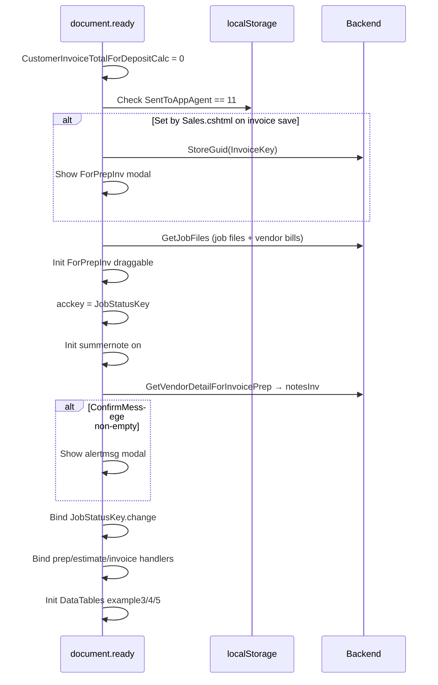
```mermaid
sequenceDiagram
    participant DR as document.ready
    participant LS as localStorage
    participant AJAX as Backend

    DR->>DR: CustomerInvoiceTotalForDepositCalc = 0
    DR->>LS: Check SentToAppAgent == 11
    alt Set by Sales.cshtml on invoice save
        DR->>AJAX: StoreGuid(InvoiceKey)
        DR->>DR: Show ForPrepInv modal
    end
    DR->>AJAX: GetJobFiles (job files + vendor bills)
    DR->>DR: Init ForPrepInv draggable
    DR->>DR: acckey = JobStatusKey
    DR->>DR: Init summernote on #notes
    DR->>AJAX: GetVendorDetailForInvoicePrep → notesInv
    alt ConfirmMessege non-empty
        DR->>DR: Show alertmsg modal
    end
    DR->>DR: Bind JobStatusKey.change
    DR->>DR: Bind prep/estimate/invoice handlers
    DR->>DR: Init DataTables example3/4/5
```

## 6.3 Function Reference Table

| Function Name | File | Triggered By | Purpose | Inputs | Backend/API Call | UI Update | Error Handling |
|---|---|---|---|---|---|---|---|
| `EmailEstimateToCustomer` | :102 | Email button | Navigate to email or block | `name`=InvoiceKey, `data-smallest` | Redirect `/EmailEstimateToCustomer/{key}` | Modal alert if blocked | Alert message for deposit approval wait |
| `SendSVCManagerForDepositApproval` | :120 | SVC button | Request deposit approval | `name`=InvoiceKey | GET redirect | Full navigation | `showPleaseWaitSendingEmail` |
| `RemoveInvoice` | :128 | Remove inv | Open delete modal | `name`=InvoiceKey | — | Modal show | — |
| `ApproveOnBehalfofTheCustomer` | :137 | On-behalf btn | Admin approval page | `id`=MutiEstiIdentifier, `selectid`=InvoiceKey | GET `ApproveCustomerEstimate` | Navigate | — |
| `#SaveDelete` handler | :144 | Delete confirm | Delete invoice | InvoiceKey, WhoApproved, note | GET `RemoveInvoice` JSON | Reload or error msg | data==2 paid block |
| `GetJobFiles` | :649 | Page load | Build file checkbox lists | JobKey | `GetJobFilesForModal`, `GetvendorbillsForModal` | `#divFilelist`, `#divFilelistInv` | — |
| `CreateEstimateFromVendorEstimate` | :640 | Modal button | Vendor estimate picker | JobKey | Redirect `MgtVendorInvoice/EIndex` | Navigate | — |
| `CreateEst` | :748 | Vendor est btn | Status change modal | VendorEstimateKey | — | Modal show | — |
| `CreateInv` | :754 | Vendor inv btn | Create customer inv | VendorInvoiceKey | Redirect `CreateInvoiceNew/{key}?id1=1` | Navigate | — |
| `SaveAsUnpaid` | :713 | Unpaid save | Mark unpaid | InvoiceKey, Note | GET `SetInvoiceToUnpaid` | Redirect or error | Note required |
| `SetInvoiceToUnpaid` | :737 | Unpaid button | Open unpaid modal | value=InvoiceKey | — | Modal | confirm() |
| `CheckForDepositInvoice` | ManageDepositInvoice.js | Add invoice | Deposit prerequisite check | JobKey | POST `MgtVendorInvoice/CheckForDepositInvoice` | Modal or GotoInvoice | SVC manager bypass |
| `GotoInvoice` | ManageDepositInvoice.js:74 | After deposit OK | Invoice creation routing | JobKey | `CheckForVendorInvoice`, `GetAllTheVendorInvoice` | Modal or Index redirect | — |
| `ManageCustomerDeposit` | ManageCustomerVendorDeposit.js:55 | Manage Deposit | Start deposit flow | InvoiceKey | `GetCustomerEstimateTotalForDeposit`, vendor deposit checks | Deposit modals | — |
| `SaveVendordepositAndCustomerDepositInDatabase` | :576 | Deposit final save | Persist deposits | Full deposit payload | POST `SaveVendorDepositCustomerDeposit` | Redirect SaleEstimated | flag 0/1 |
| `ProceedToFinal` | :551 | Deposit wizard end | Route save by formName | formName | Save endpoints | Hide modals | — |
| Dropzone success | SaleEstimated:36 | File drop | Count uploads | — | POST upload endpoints | localStorage vsavefile++ | — |
| Dropzone removedfile | :41/:75 | Remove file | Delete temp file | FileName, InvoiceKey/EstimateKey | `MgtMultipleJobMessege/RemoveFile` | localStorage-- | console.log |

> Dead handlers (`#GoToEstimate`, `LetsSee`, orphan `#mdb` / `#CreateVendorEstimate`) are documented in `31_Verification_Pass4_Deep_Trace_Report.md` only — not part of the active SaleEstimated UI.

## 6.4 AJAX / URL Inventory (Complete)

| URL | Method | Called From | Purpose |
|-----|--------|-------------|---------|
| `/MgtDashBoardActionButtons/UploadFiles/` | POST | Dropzone InvDropezone | Temp prep files |
| `/MgtDashBoardActionButtons/UploadFilesEst/` | POST | Dropzone EstDropezone | Temp prep files |
| `/MgtMultipleJobMessege/RemoveFile?InvoiceKey=` | POST | Dropzone remove | Remove temp file |
| `/MgtJobSalesOrder/EmailEstimateToCustomer/{key}` | GET redirect | EmailEstimateToCustomer | Email compose |
| `/MgtJobSalesOrder/SendEmailToSVCManagerForDepositApproval/{key}` | GET redirect | SVC button | Deposit approval |
| `/MgtJobSalesOrder/RemoveInvoice` | GET JSON | SaveDelete | Delete invoice |
| `/MgtJobSalesOrder/ApproveCustomerEstimate` | GET | On-behalf | Approval UI |
| `/MgtJobSalesOrder/StoreGuid` | GET JSON | Prep flows | Set GlobalClass.StoreGuid |
| `/Utility/UpdateAccountingStatus` | GET JSON | Accounting dropdown | Update accounting status |
| `/MgtJobSalesOrder/GetVendorDetailForInvoicePrep` | GET JSON | Page load | Default invoice prep note |
| `/MgtJobSalesOrder/PrepInv` | POST JSON | InvoicePrepSend | Invoice prep email |
| `/MgtJobSalesOrder/CheckIfConnectedToVendorestimate` | GET JSON | ProcessForPrep | Vendor connection check |
| `/MgtJobSalesOrder/GetAllTheVendorEstimateForCustomerEstimatePREP` | GET JSON | Prep modal | Vendor estimate HTML |
| `/MgtJobSalesOrder/PrepWhenVendorEstimateIsConnected` | POST JSON | Process click | Connected vendor prep |
| `/MgtJobSalesOrder/Prep` | POST JSON | Process click | Standard estimate prep |
| `/MgtJobSalesOrder/CheckForVendorEstimate` | GET JSON | GoToEstimateNew | Vendor estimates exist? |
| `/MgtJobSalesOrder/ManageEstimate/{JobKey}?id2={key}` | GET redirect | Multiple paths | Estimate editor |
| `/MgtJobSalesOrder/GetJobFilesForModal` | GET JSON | GetJobFiles | Job file checkboxes |
| `/MgtJobSalesOrder/GetvendorbillsForModal` | GET JSON | GetJobFiles | Vendor bill file checkboxes |
| `/MgtVendorEstimateToCustomerEstimate/ChangeEstimateStatus` | GET JSON | btnYes modal | Vendor est status → pending approval |
| `/MgtVendorEstimateToCustomerEstimate/CreateNew/{key}` | GET redirect | Vendor est flow | Create customer est from vendor |
| `/MgtVendorInvoiceToCustomerInvoice/CreateInvoiceNew/{key}?id1=1` | GET redirect | CreateInv | Create inv from vendor inv |
| `/MgtVendorInvoice/EIndex/{JobKey}` | GET redirect | CreateEstimateFromVendorEstimate | Vendor estimate index |
| `/MgtJobSalesOrder/SetInvoiceToUnpaid` | GET JSON | SaveAsUnpaid | Mark unpaid |
| `/MgtVendorInvoice/CheckForDepositInvoice` | POST JSON | CheckForDepositInvoice | Invoice deposit gate |
| `/MgtDepositManagement/CheckIfLoggedInuserIsSvcManagerOrNot` | GET JSON | Deposit gate fallback | SVC manager check |
| `/MgtDepositManagement/GetCustomerEstimateTotalForDeposit` | GET JSON | ManageCustomerDeposit | Estimate total |
| `/MgtDepositManagement/CheckIfVendorExiststhenVendorDeposit` | GET JSON | ManageCustomerDeposit | Vendor deposit list |
| `/MgtDepositManagement/GetVendorEstimatesForSpecificDeposit` | POST JSON | Deposit flow | Vendor deposit HTML |
| `/NewCustomerEstimate/SaveVendorDepositCustomerDeposit` | POST JSON | Deposit save | Persist deposits |
| `/NewCustomerEstimate/CheckIfThisJobHasVendorDeposit` | GET JSON | No customer deposit path | Vendor deposit check |
| `/MgtNewDashboard/SendVendorMails` | POST JSON | SendEstimate | Email vendor portal link |
| `/MgtJobSalesOrder/CheckForVendorInvoice` | GET JSON | GotoInvoice | Vendor invoices exist? |
| `/MgtJobSalesOrder/GetAllTheVendorInvoice` | GET JSON | GotoInvoice | Vendor invoice buttons |
| `/MgtJobSalesOrder/Index/{JobKey}?id2=1` | GET redirect | GotoInvoice | New invoice scratch |
| `/ShowImage/GetJobFileAttachement/{FileKey}` | GET | File links | View job file |
| `/MgtJob/GetCountForTheVBbubble` | GET JSON | _tabmenu.cshtml | VB bubble badge count |
| `/MgtDashBoardActionButtons/GetServiceRequestForJob` | GET JSON | _tabmenu.cshtml | Service request modal content |
| `/MgtJobSalesOrder/GetAllEstimateFileNew/{JobKey}?id2=` | GET JSON | ApproveCustomerEstimate | Approval file table HTML |
| `/MgtJobSalesOrder/UploadCustomerApprovalFiles?id=` | POST | ApproveCustomerEstimate Dropzone | Upload approval files |
| `/MgtJobFile/Delete` | POST JSON | ApproveCustomerEstimate | Delete approval file |
| `/MgtJobSalesOrder/SaveAcceptedEstimate` | GET JSON | ApproveCustomerEstimate | Persist on-behalf approval |
| `/MgtLocation/Details/{LocationKey}` | GET | Response grid | Location details |
| `/MgtJob/EditJob/{JobKey}` | GET | Response grid | Job editor |
| `/MgtJobSalesOrder/Sales/{InvoiceKey}` | GET | Response grid Go to Estimate | Estimate via Sales view |

## 6.5 Function Call Graph (Estimate / Invoice)

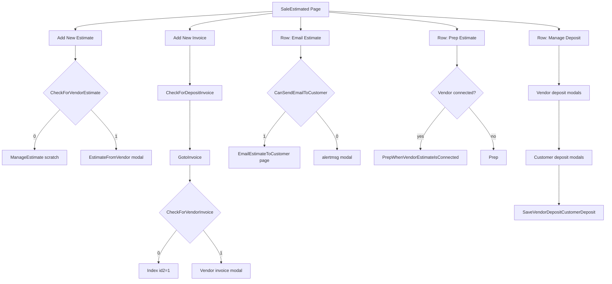
```mermaid
flowchart TD
    A[SaleEstimated Page] --> B[Add New Estimate]
    A --> C[Add New Invoice]
    A --> D[Row: Email Estimate]
    A --> E[Row: Prep Estimate]
    A --> F[Row: Manage Deposit]

    B --> B1{CheckForVendorEstimate}
    B1 -->|0| B2[ManageEstimate scratch]
    B1 -->|1| B3[EstimateFromVendor modal]

    C --> C1[CheckForDepositInvoice]
    C1 --> C2[GotoInvoice]
    C2 --> C3{CheckForVendorInvoice}
    C3 -->|0| C4[Index id2=1]
    C3 -->|1| C5[Vendor invoice modal]

    D --> D1{CanSendEmailToCustomer}
    D1 -->|1| D2[EmailEstimateToCustomer page]
    D1 -->|0| D3[alertmsg modal]

    E --> E1{Vendor connected?}
    E1 -->|yes| E2[PrepWhenVendorEstimateIsConnected]
    E1 -->|no| E3[Prep]

    F --> F1[Vendor deposit modals]
    F1 --> F2[Customer deposit modals]
    F2 --> F3[SaveVendorDepositCustomerDeposit]
```

## 6.6 Functions by Responsibility

| Responsibility | Functions |
|----------------|-----------|
| Create/update estimates | `#GoToEstimateNew`, `CreateEst`, `CreateEstimateFromVendorEstimate`, `btnSkipVendor`, `SendEstimate` → `ManageEstimate` |
| Create/update invoices | `CheckForDepositInvoice`, `GotoInvoice`, `CreateInv` → `Index`/`CreateInvoiceNew` |
| Calculate totals | Server-side in `FillInvoiceList`; deposit calc via `GetCustomerEstimateTotalForDeposit`; client `CustomerDepositPerc` ↔ `CustomerDepositAmount` sync |
| Send emails | `EmailEstimateToCustomer`, invoice ActionLink, `SendSVCManagerForDepositApproval`, prep POSTs |
| Change status | `#JobStatusKey.change`, prep `jobStatus1` checkbox, `ChangeEstimateStatus` |
| External services | Vendor portal `window.open` with `urlVendorPortal`; file view via `ShowImage`; uploads via Dropzone |
| Sales → hub handoff | `localStorage.SentToAppAgent` / `InvoiceKey` → `#ForPrepInv` on load |

## 6.7 Anti-Double-Click Patterns

| Location | Pattern |
|----------|---------|
| `#SaveDelete` | Hides button, shows "Processing..." |
| `#Process`, `#InvoicePrepSend` | Hides buttons during AJAX |
| `#SendEstimate`, `#CreateEstimate` | Hides `#btnDIV`, shows wait message |
| `SaveAsUnpaid` | Hides Save/Close during AJAX |
| `EmailEstimateToCustomer` | `showPleaseWait()` before redirect |

No universal debounce — reliance on hiding buttons and wait messages.


---

# 7. Admin Portal Backend Controllers

## Controller: MgtJobSalesOrderController

**File:** `D:\RFI Projects In New Framework\Admin Portal\ProjectRCS\Controllers\MgtJobSalesOrderController.cs`

### Action Summary Table

| Controller | Action | Route | HTTP | Called From | Purpose | Return Type | Downstream Calls |
|---|---|---|---|---|---|---|---|
| MgtJobSalesOrder | SaleEstimated | `/MgtJobSalesOrder/SaleEstimated/{id}` | GET | Navigation, redirects | Hub page load | View `DashboardClass` | JobSalesEstimateSetup, Utility |
| MgtJobSalesOrder | Prep | `/MgtJobSalesOrder/Prep` | POST | `#Process` | Estimate prep email | JsonResult (string) | MailToAdmin.SendEstimateToPrepMaster, Job status 24 |
| MgtJobSalesOrder | PrepWhenVendorEstimateIsConnected | `/MgtJobSalesOrder/PrepWhenVendorEstimateIsConnected` | POST | `#Process` (connected) | Estimate prep with vendor data | JsonResult | MailToAdmin, JobSalesOrderToVEstimate |
| MgtJobSalesOrder | PrepInv | `/MgtJobSalesOrder/PrepInv` | POST | `#InvoicePrepSend` | Invoice prep email | JsonResult | MailToAdmin.SendInvoiceToPrepMaster, AccountingHelper |
| MgtJobSalesOrder | StoreGuid | `/MgtJobSalesOrder/StoreGuid` | GET | Prep flows | Set `GlobalClass.StoreGuid` | JSON `"DONE"` | — |
| MgtJobSalesOrder | CheckIfConnectedToVendorestimate | `/MgtJobSalesOrder/CheckIfConnectedToVendorestimate` | GET | `.ProcessForPrep` | Vendor link check | JSON flag+mess | JobSalesOrderToVEstimate |
| MgtJobSalesOrder | GetAllTheVendorEstimateForCustomerEstimatePREP | `/MgtJobSalesOrder/GetAllTheVendorEstimateForCustomerEstimatePREP` | GET | Prep modal | Vendor estimate radio HTML | JSON HTML | VendorEstimate |
| MgtJobSalesOrder | GetVendorDetailForInvoicePrep | `/MgtJobSalesOrder/GetVendorDetailForInvoicePrep` | GET | Page load | Default prep note text | JSON string | Vendor data |
| MgtJobSalesOrder | GetJobFilesForModal | `/MgtJobSalesOrder/GetJobFilesForModal` | GET | GetJobFiles | Job file list | JSON array | JobFile |
| MgtJobSalesOrder | GetvendorbillsForModal | `/MgtJobSalesOrder/GetvendorbillsForModal` | GET | GetJobFiles | Vendor bill uploads | JSON array | JobBillVendorUploads |
| MgtJobSalesOrder | CheckForVendorEstimate | `/MgtJobSalesOrder/CheckForVendorEstimate` | GET | Add estimate | Any vendor estimates? | JSON 0/1 | VendorEstimate |
| MgtJobSalesOrder | CheckForVendorInvoice | `/MgtJobSalesOrder/CheckForVendorInvoice` | GET | GotoInvoice | Any vendor invoices? | JSON 0/1 | VendorInvoice |
| MgtJobSalesOrder | GetAllTheVendorEstimate | `/MgtJobSalesOrder/GetAllTheVendorEstimate` | GET | Legacy add est | Button HTML | JSON HTML | VendorEstimate |
| MgtJobSalesOrder | GetAllTheVendorInvoice | `/MgtJobSalesOrder/GetAllTheVendorInvoice` | GET | GotoInvoice | Button HTML | JSON HTML | VendorInvoice |
| MgtJobSalesOrder | SendEmailToSVCManagerForDepositApproval | `/MgtJobSalesOrder/SendEmailToSVCManagerForDepositApproval/{id}` | GET | SVC button | Deposit approval workflow | Redirect SaleEstimated | DepositApprovalFromSVCmanager, MailToAdmin |
| MgtJobSalesOrder | EmailEstimateToCustomer | `/MgtJobSalesOrder/EmailEstimateToCustomer/{id}` | GET/POST | Email button | Send estimate to customer | View/Redirect | MailToCustomers, InvoiceCreator |
| MgtJobSalesOrder | EmailInvoiceToCustomer | `/MgtJobSalesOrder/EmailInvoiceToCustomer/{id}` | GET/POST | Email link | Send invoice to customer | View/Redirect | MailToCustomers, InvoiceCreator |
| MgtJobSalesOrder | RemoveSalesInvoice | `/MgtJobSalesOrder/RemoveSalesInvoice/{id}` | GET | Remove estimate | Soft-delete estimate | Redirect | VendorDepositSet cleanup |
| MgtJobSalesOrder | RemoveInvoice | `/MgtJobSalesOrder/RemoveInvoice` | GET | Delete modal | Soft-delete invoice | JSON 1/2/msg | JobSalesInvoicePartialPay check |
| MgtJobSalesOrder | SetInvoiceToUnpaid | `/MgtJobSalesOrder/SetInvoiceToUnpaid` | GET | Unpaid modal | Reverse paid invoice | JSON 1/error | ReceivableStatus, partial pay |
| MgtJobSalesOrder | ApproveCustomerEstimate | `/MgtJobSalesOrder/ApproveCustomerEstimate` | GET | On-behalf button | Approval UI | View | UtilityTasks (on POST elsewhere) |
| MgtJobSalesOrder | ManageEstimate | `/MgtJobSalesOrder/ManageEstimate/{id}?id2=` | GET | Edit/create estimate | Estimate editor | View | NewCustomerEstimate AJAX save |
| MgtJobSalesOrder | Index | `/MgtJobSalesOrder/Index/{id}?id2=` | GET/POST | New invoice | Invoice creator | View/Redirect | SaveSalesInvoiceEstimates |
| MgtJobSalesOrder | Sales | `/MgtJobSalesOrder/Sales/{id}` | GET/POST | Edit inv/est | Editor | View/Redirect | UpdateSalesInvoiceEstimates |
| MgtJobSalesOrder | ProcessInvoice | `/MgtJobSalesOrder/ProcessInvoice/{id}` | GET/POST | Accounting link | QB/payment | View/Redirect | SaveInvoiceReceivables |
| MgtJobSalesOrder | Preview | `/MgtJobSalesOrder/Preview/{id}` | GET | Preview link | Route to estimate/invoice preview | Redirect | FillEstimateForPreview |
| MgtJobSalesOrder | ConfigureSalesOrder | `/MgtJobSalesOrder/ConfigureSalesOrder/{id}` | GET/POST | Configure link | Invoice/estimate config | View/Redirect | manage.SaveConfiguration |
| MgtJobSalesOrder | UploadFiles | `/MgtJobSalesOrder/UploadFiles` | POST | Email compose dropzone | Temp email attachments | — | TempFileStock |

---

## Detailed Action Notes

### Prep (Estimate — no vendor connection)

**Signature:** `Prep(int? Notvendor, string notes, Guid EstimateKey, string JobStatus, string MailTo, Guid?[] VendorEstimateList, Guid?[] Jobfiles, Guid?[] BillFiles, string WhoIsTheQuotingVendor)`

- If `JobStatus` non-empty: sets `Job.JobStatusKey = GlobalClass.GetJobStatus(24)` (ESTIMATE PREPPED FOR REVIEW)
- If `MailTo` non-empty: builds vendor estimate line items (unless `Notvendor`), preview via `FillEstimateForPreview(EstimateKey, 2)`, sends `MailToAdmin.SendEstimateToPrepMaster`
- On success: `ManageJobMessegingSetup.SaveGeneralNote`
- Returns JSON string message (success + errors concatenated)

### PrepWhenVendorEstimateIsConnected

Same job status change. Loads vendor estimates from `JobSalesOrderToVEstimate` or multi-option children. Title becomes `"Vendor Estimate"` when linked.

### PrepInv (Invoice)

- `FillSalesInvoiceOrEstimateDataForPreview(InvoiceKey, 1)`
- `MailToAdmin.SendInvoiceToPrepMaster`
- On success: `inv.IsPrepped = false`, `job.AccountingStatusKey = 40F90F4E-434A-4BE0-B679-D98ED6ADF9ED`, `AccountingHelper.WhenSentToPrepManager`, checklist `CheckForApprovalMailSent`

### SendEmailToSVCManagerForDepositApproval

**Parameter:** `id` = `JobSalesInvoice.InvoiceKey`

1. Builds customer deposit note from `estimate.DepositAmount`
2. Builds vendor deposit notes from `VendorDepositSet`
3. Appends `DepositOverrideRemark` warnings
4. Inline customer estimate HTML via `GetInlineInvoiceEstimate`
5. If logged-in user is SVC manager (`EmailSendToAddress.SendToType == 38`): auto-approves `DepositApprovalFromSVCmanager`, emails account manager
6. Else: creates/updates pending `DepositApprovalFromSVCmanager` record
7. `MailToAdmin.SendToSVCManagerForDepositApproval`
8. General note + redirect `SaleEstimated`

### RemoveSalesInvoice

Soft-deletes estimate (`IsActive = false`). For multiple-option: deactivates all `MutiEstiIdentifier` children. Removes `VendorDepositSet`, `JobSalesOrderToVEstimate`, `DepositOverrideRemark`, `DepositApprovalFromSVCmanager` for job. Saves general note with inline estimate HTML.

### RemoveInvoice

**Returns:** `1` success, `2` if any `JobSalesInvoicePartialPay.Paid == true`, else error string.

Sets `IsActive = false`, `DeleteManager`, `DeleteManagerRemark`. Removes partial pay rows. `RemoveCustomerDepositMarker`. Clears highlight 55.

### SetInvoiceToUnpaid

Requires note. Reverses `InvoicePaid`, `CheckNo`, `PaidOn`, partial pay paid flags, receivable status. Archive job special handling with admin email.

---

## Other Controllers (Called from SaleEstimated)

### MgtDepositManagementController

| Action | Purpose |
|--------|---------|
| `CheckIfLoggedInuserIsSvcManagerOrNot` | SVC manager role check (SendToType 38) |
| `GetCustomerEstimateTotalForDeposit` | Smallest active estimate total for deposit % |
| `CheckIfVendorExiststhenVendorDeposit` | Returns vendor keys or `"0"` |
| `GetVendorEstimatesForSpecificDeposit` | HTML for vendor deposit modal |

### NewCustomerEstimateController

| Action | Purpose |
|--------|---------|
| `SaveVendorDepositCustomerDeposit` | Persist vendor + customer deposits from SaleEstimated |
| `SaveCustomerEstimate` | Called from ManageEstimate (branch) |
| `SaveCustomerInvoiceFromEstimate` | Estimate → invoice conversion |
| Deposit CRUD endpoints | `SaveNewDepositForEstimate`, `EditDepositEstimateAmount`, etc. |

### MgtVendorEstimateToCustomerEstimateController

| Action | Purpose |
|--------|---------|
| `ChangeEstimateStatus` | Set vendor estimate status to pending approval (status 2) |
| `CreateNew/{VendorEstimateKey}` | Build customer estimate from vendor estimate |

### MgtVendorInvoiceToCustomerInvoiceController

| Action | Purpose |
|--------|---------|
| `CreateInvoiceNew/{key}?id1=1` | Build customer invoice from vendor invoice |

### JobEstimateResponseController

| Action | Purpose |
|--------|---------|
| `EstimateViewed/{Pkey}?id2={JobKey}` | `IsSeen=true`, remove highlight 12, redirect SaleEstimated |

### ShowOldCustomerEstimateInvEmailController

| Action | Purpose |
|--------|---------|
| `Index/{Pkey}` GET | Load prior sent email for view/resend |
| `Index` POST | Resend via `MailToCustomers.ResendSendEstimatedInvoiceToCustomer` |

### MgtDashBoardActionButtonsController

| Action | Purpose |
|--------|---------|
| `UploadFiles` | Prep invoice files → `TempJobNoteFile` |
| `UploadFilesEst` | Prep estimate files → `TempJobNoteFile` |

### Utility Controller

| Action | Purpose |
|--------|---------|
| `UpdateAccountingStatus` | Updates `Job.AccountingStatusKey` |

### MgtVendorInvoiceController

| Action | Purpose |
|--------|---------|
| `CheckForDepositInvoice` | Gate before invoice creation (deposit rules) |

### MgtNewDashboardController

| Action | Purpose |
|--------|---------|
| `SendVendorMails` | Email vendor portal link for estimate upload |

---

## Service / Helper Classes

| Class | File | Key Methods Used |
|-------|------|------------------|
| JobSalesEstimateSetup | `DatabaseInteraction\JobSalesEstimateSetup.cs` | FillInvoiceList, GetAllEstimateResponse, FillInvoiceEmailSentList, GetInlineInvoiceEstimate, FillEstimateForPreview, SaveSalesInvoiceEstimates, UpdateSalesInvoiceEstimates |
| ManageJobMessegingSetup | `DatabaseInteraction\ManageJobMessegingSetup.cs` | SaveGeneralNote |
| MailToCustomers | `Mailing\MailToCustomers.cs` | SendEstimatedToCustomer, SendInvoiceToCustomer |
| MailToAdmin | `Mailing\MailToAdmin.cs` | SendEstimateToPrepMaster, SendInvoiceToPrepMaster, SendToSVCManagerForDepositApproval |
| InvoiceCreator | `Helper\InvoiceCreator.cs` | PDF + inline HTML |
| AccountingHelper | Helper | WhenSentToPrepManager, WhenInvoiceIsCreated, PushedToQB |
| CustomerVendorDepositHelper | Helper | Vendor deposit HTML/calcs |
| UtilityTasks | Helper | ApproveEstimateOnBehalfOfCustomer |
| BlobFileService | `Helper\BlobFileService.cs` | File API calls |
| EmailApiClient | `Helper\EmailApiClient.cs` | Email API calls |


---

# 8. Customer Estimate Workflows

All workflows below are verified from `SaleEstimated.cshtml`, `MgtJobSalesOrderController`, `ManageEstimate`, `NewCustomerEstimateController`, and `JobSalesEstimateSetup`.

## Estimate Action Table

| Estimate Action | Trigger | Frontend | Backend/API | DB Write/Read | Side Effects | Status |
|---|---|---|---|---|---|---|
| Load estimate list | Open SaleEstimated | Grid `example4` | `FillInvoiceList` | Read `JobSalesInvoice` | Inline HTML in grid | Confirmed |
| Load estimate responses | Open SaleEstimated | Grid `example3` | `GetAllEstimateResponse` | Read `JobSalesInvoiceEstimateStatus` | Highlight colors | Confirmed |
| Add new estimate (scratch) | Add New Estimate (no vendor est) | `#GoToEstimateNew` | Redirect `ManageEstimate/{JobKey}?id2={NewEstimateKey}` | Read only on hub | New GUID pre-assigned | Confirmed |
| Add from vendor estimate | Add New Estimate (vendor exists) | Modal + `CreateEst`/`CreateEstimateFromVendorEstimate` | `ChangeEstimateStatus`, `CreateNew`, `EIndex` | VendorEstimate status update | General notes | Confirmed |
| Email vendor for estimate | Legacy modal path | `#SendEstimate` | `MgtNewDashboard/SendVendorMails` **emailType=5** | Email via `ResendVendorActionEmail` | Dashboard click type 5 | Confirmed |
| Create on behalf of vendor | Modal | `#CreateEstimate` | `window.open` Vendor Portal | — | Opens vendor portal | Confirmed |
| Edit estimate | Grid Edit (ESTCount==1) | Link | `ManageEstimate` GET | Read `JobSalesInvoiceDetail` | — | Confirmed |
| Save estimate lines | ManageEstimate page | AJAX `SaveCustomerEstimate` | `NewCustomerEstimateController` | Write `JobSalesInvoice`, `JobSalesInvoiceDetail` | Deposits, notes, redirect preview/email | Confirmed |
| Save estimate as invoice | ManageEstimate | `Save As Invoice` chain | `SaveCustomerInvoiceFromEstimate` | New `JobSalesInvoice` IsEstimate=0 | Redirect Sales | Confirmed |
| Preview estimate | Grid Preview | Link | `Preview` → `PreviewEstimates` | Read | — | Confirmed |
| Compare after edit | Grid link | Link | `PreviewWithCompare` | Read `JobSalesInvoiceAfterUpdate` | — | Confirmed |
| Remove estimate | Grid Remove | confirm GET | `RemoveSalesInvoice` | `IsActive=false`, cleanup deposits | General note | Confirmed |
| Prep for manager review | Grid Prep | `#ForPrep` modal, `#Process` | `Prep` or `PrepWhenVendorEstimateIsConnected` | Optional `Job.JobStatusKey` status 24 | Prep email, general note | Confirmed |
| SVC deposit approval request | Grid SVC button | GET redirect | `SendEmailToSVCManagerForDepositApproval` | `DepositApprovalFromSVCmanager` | Email to SVC, notes | Confirmed |
| Manage deposit | Grid Deposit btn | `ManageCustomerDeposit` | `SaveVendorDepositCustomerDeposit` | `JobSalesInvoice.DepositAmount`, `VendorDepositSet` | Approval request, partial pay | Confirmed |
| Email to customer | Grid email btn | `EmailEstimateToCustomer` | GET `EmailEstimateToCustomer` → POST send | `SentToCustomer`, `SendEmailMarker` | Email API, job status, action needed | Confirmed |
| Email blocked (deposit) | Grid email btn | Alert modal | — | Read `CanSendEmailToCustomer` | UI message only | Confirmed |
| Approve on behalf | Inline grid button | `ApproveOnBehalfofTheCustomer` | `ApproveCustomerEstimate` → `SaveAcceptedEstimate` | `RespondedByCustomer`, vendor deposits | CustomerEstimateApprovalHelper | Confirmed |
| Customer portal response | Customer action | — | Customer Portal / Email App | `JobSalesInvoiceEstimateStatus` | Dashboard highlight | Confirmed |
| Mark response viewed | Response grid | Link | `JobEstimateResponse/EstimateViewed` | `IsSeen=true` | Clear highlight 12 | Confirmed |
| Go to Estimate (response grid) | Response grid link | Navigation | `MgtJobSalesOrder/Sales/{InvoiceKey}` | Read | Opens **Sales** view — not ManageEstimate | Confirmed |
| Resend prior email | Email sent grid | Link | `ShowOldCustomerEstimateInvEmail` | Read `EmailInvoiceEstimate` | Resend email | Confirmed |

## Workflow Diagrams

### Load and Display Estimates

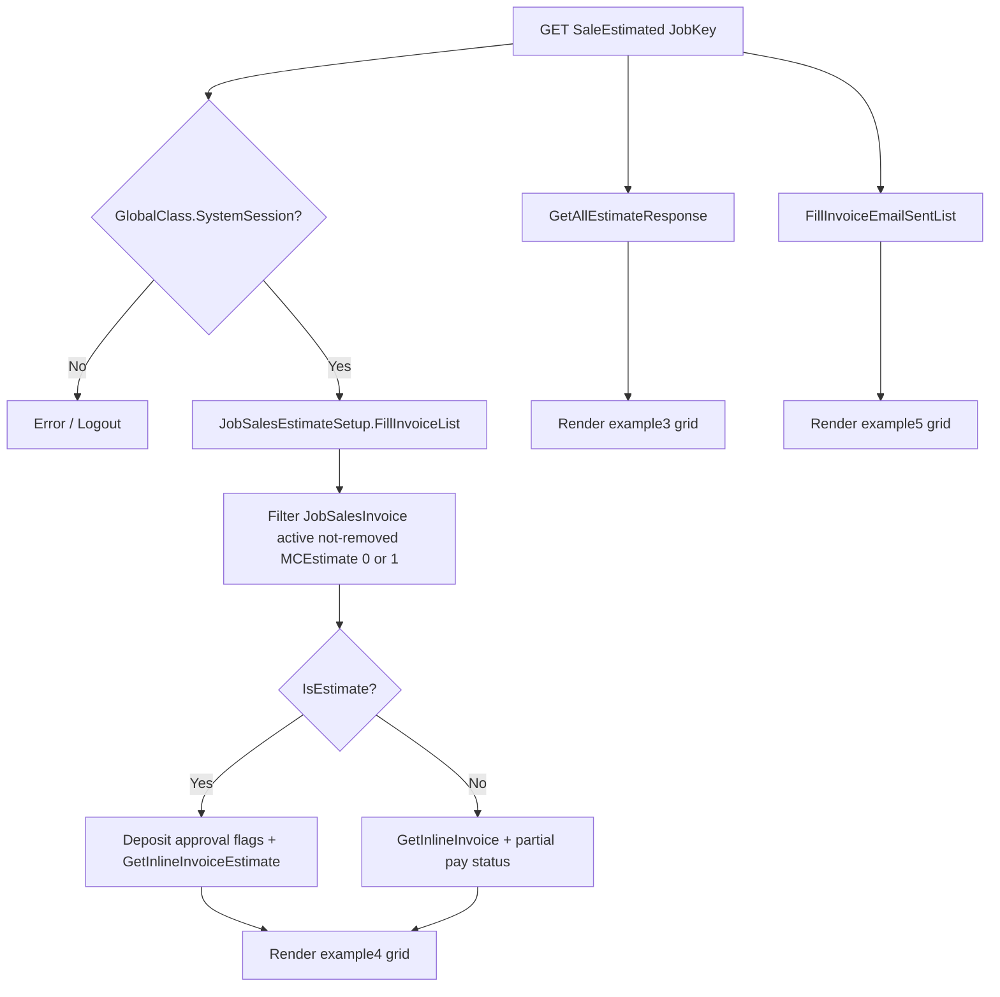
```mermaid
flowchart TD
    A[GET SaleEstimated JobKey] --> B{GlobalClass.SystemSession?}
    B -->|No| C[Error / Logout]
    B -->|Yes| D[JobSalesEstimateSetup.FillInvoiceList]
    D --> E[Filter JobSalesInvoice active not-removed MCEstimate 0 or 1]
    E --> F{IsEstimate?}
    F -->|Yes| G[Deposit approval flags + GetInlineInvoiceEstimate]
    F -->|No| H[GetInlineInvoice + partial pay status]
    G --> I[Render example4 grid]
    H --> I
    A --> J[GetAllEstimateResponse]
    J --> K[Render example3 grid]
    A --> L[FillInvoiceEmailSentList]
    L --> M[Render example5 grid]
```

### Create Customer Estimate

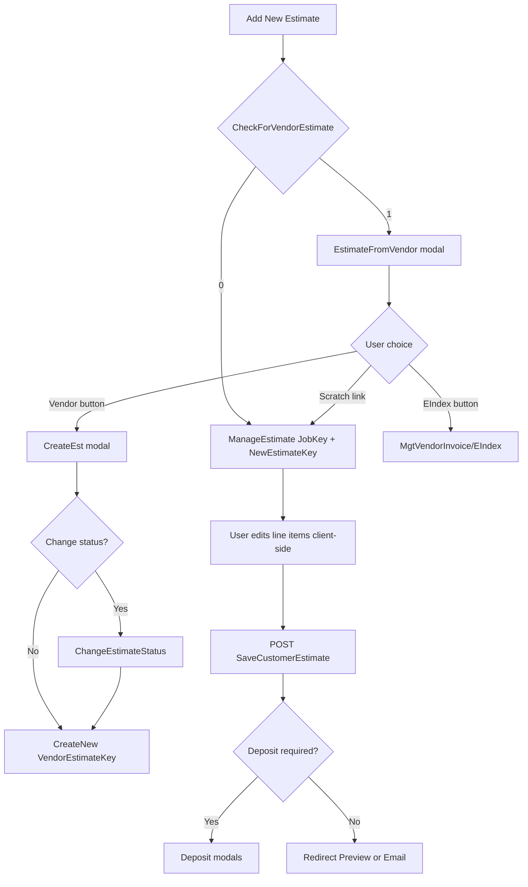
```mermaid
flowchart TD
    A[Add New Estimate] --> B{CheckForVendorEstimate}
    B -->|0| C[ManageEstimate JobKey + NewEstimateKey]
    B -->|1| D[EstimateFromVendor modal]
    D --> E{User choice}
    E -->|Vendor button| F[CreateEst modal]
    F --> G{Change status?}
    G -->|Yes| H[ChangeEstimateStatus]
    G -->|No| I[CreateNew VendorEstimateKey]
    H --> I
    E -->|Scratch link| C
    E -->|EIndex button| J[MgtVendorInvoice/EIndex]
    C --> K[User edits line items client-side]
    K --> L[POST SaveCustomerEstimate]
    L --> M{Deposit required?}
    M -->|Yes| N[Deposit modals]
    M -->|No| O[Redirect Preview or Email]
```

### Estimate Prep for Manager Review

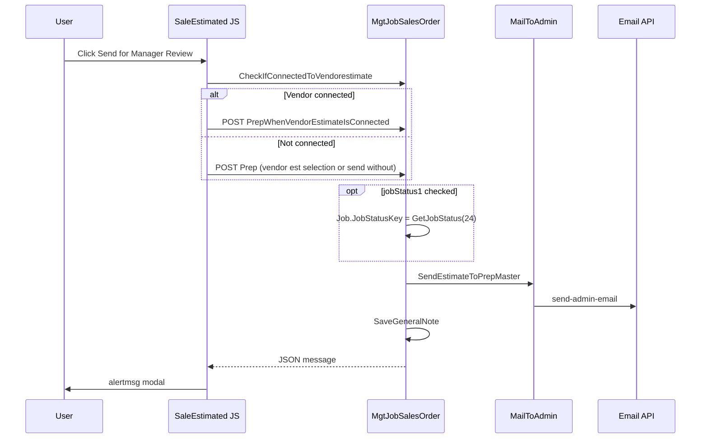
```mermaid
sequenceDiagram
    participant U as User
    participant SE as SaleEstimated JS
    participant C as MgtJobSalesOrder
    participant M as MailToAdmin
    participant E as Email API

    U->>SE: Click Send for Manager Review
    SE->>C: CheckIfConnectedToVendorestimate
    alt Vendor connected
        SE->>C: POST PrepWhenVendorEstimateIsConnected
    else Not connected
        SE->>C: POST Prep (vendor est selection or send without)
    end
    opt jobStatus1 checked
        C->>C: Job.JobStatusKey = GetJobStatus(24)
    end
    C->>M: SendEstimateToPrepMaster
    M->>E: send-admin-email
    C->>C: SaveGeneralNote
    C-->>SE: JSON message
    SE->>U: alertmsg modal
```

### Email Estimate to Customer

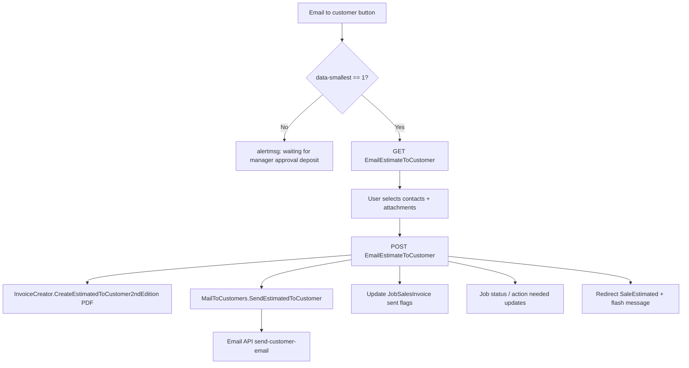
```mermaid
flowchart TD
    A[Email to customer button] --> B{data-smallest == 1?}
    B -->|No| C[alertmsg: waiting for manager approval deposit]
    B -->|Yes| D[GET EmailEstimateToCustomer]
    D --> E[User selects contacts + attachments]
    E --> F[POST EmailEstimateToCustomer]
    F --> G[InvoiceCreator.CreateEstimatedToCustomer2ndEdition PDF]
    F --> H[MailToCustomers.SendEstimatedToCustomer]
    H --> I[Email API send-customer-email]
    F --> J[Update JobSalesInvoice sent flags]
    F --> K[Job status / action needed updates]
    F --> L[Redirect SaleEstimated + flash message]
```

## Multi-Option Estimates

When `JobSalesInvoice.MultipleChoiceEstimate == true`:
- Parent row: `MCEstimate == 0`, children share `MutiEstiIdentifier`
- Grid shows `"Multiple Option Estimate"` status
- Edit only when `ESTCount == 1` (single child scenario)
- Remove cascades to all children
- Deposit logic uses smallest total across options (`GetCustomerEstimateTotalForDeposit`)

**Source:** `JobSalesEstimateSetup.FillInvoiceList`, `RemoveSalesInvoice`, `MgtDepositManagement.GetCustomerEstimateTotalForDeposit`.

## Customer Response States (Estimate Response Grid)

| UI Label | DB Condition | Source Field |
|----------|--------------|--------------|
| Accepted as Approved | `Accept == true` | `JobSalesInvoiceEstimateStatus.Accept` |
| Decline | `Decline == true` | `JobSalesInvoiceEstimateStatus.Decline` |
| Resubmit | `Resubmit == true` | `JobSalesInvoiceEstimateStatus.Resubmit` |
| VIEWED | `IsSeen == true` | `JobSalesInvoiceEstimateStatus.IsSeen` |
| MARK AS VIEWED | `IsSeen == false/null` | Same |
| This Estimate has been edited | `IsReplaced == true` | Any `JobSalesInvoice.RemovedDueToEdit` for InvoiceKey |

**Source:** `SaleEstimated.cshtml` lines 1027–1063, `GetAllEstimateResponse`.

## Notes / Activity Side Effects (Estimate)

| Trigger | Note Title (examples) | Helper |
|---------|----------------------|--------|
| Estimate prep sent | "Estimate for prep manager" | SaveGeneralNote |
| SVC deposit approval | "Send to SVC Manager for Approval" | SaveGeneralNote |
| Estimate deleted | "Customer Multiple Estimate Deleted" / inline | SaveGeneralNote |
| Deposit saved | Deposit-related notes | ManageJobMessegingSetup via NewCustomerEstimate |
| Email sent | Via email controller post-actions | SaveGeneralNote / email log tables |


---

# 9. Customer Invoice Workflows

Verified from `SaleEstimated`, `Index`, `Sales`, `ProcessInvoice`, `MgtJobSalesOrderController`, and `JobSalesEstimateSetup`.

## Invoice Action Table

| Invoice Action | Trigger | Frontend | Backend/API | DB Write/Read | Side Effects | Status |
|---|---|---|---|---|---|---|
| Load invoice list | Open SaleEstimated | Grid `example4` | `FillInvoiceList` | Read `JobSalesInvoice` IsEstimate=0 | Inline invoice HTML | Confirmed |
| Add new invoice (scratch) | Add New Invoice | `CheckForDepositInvoice` → `GotoInvoice` | `Index/{JobKey}?id2=1` | Session `GlobalSales` | Accounting on save | Confirmed |
| Add from vendor invoice | Vendor invoice modal | `CreateInv` | `CreateInvoiceNew/{VendorInvoiceKey}?id1=1` | Read vendor invoice details | Redirect to editor view | Confirmed |
| Edit invoice | Grid Edit | Link | `Sales/{InvoiceKey}` GET | Read header + details | Loads GlobalSales | Confirmed |
| Save invoice lines | Sales/Index POST | Form POST | `SaveSalesInvoiceEstimates` / `UpdateSalesInvoiceEstimates` | Write `JobSalesInvoice`, `JobSalesInvoiceDetail`, `JobSalesInvoicePartialPay` | Job.Invoiced, accounting helper, notes | Confirmed |
| Save invoice from estimate | ManageEstimate | Save As Invoice | `SaveCustomerInvoiceFromEstimate` | New invoice from estimate | Redirect Sales | Confirmed |
| Preview invoice | Grid Preview | Link | `Preview` → `PreviewInvoice` | Read | — | Confirmed |
| Prep for manager review | Grid Prep (invoice row) | `#ForPrepInv` | `PrepInv` POST | `IsPrepped=false`, accounting status GUID | Prep email, accounting helper | Confirmed |
| Email to customer | Grid EMAIL link | Navigation | `EmailInvoiceToCustomer` GET/POST | `SentToCustomer`, email markers | Email API, PDF to TempFileStock | Confirmed |
| Remove invoice | Grid Remove | Delete modal | `RemoveInvoice` JSON | `IsActive=false` | Blocked if paid partial pay | Confirmed |
| Move to accounting | Grid Accounting | Link | `ProcessInvoice` GET | Read invoice preview data | Print layout | Confirmed |
| QB pushed | ProcessInvoice | POST b1=1 | `SaveInvoiceReceivables` | `InvoiceManuallyPushedToquickBook`, QBrefNo | Accounting checklist | Confirmed |
| Mark paid | ProcessInvoice | POST b1=2 | `SaveInvoiceReceivables` | `InvoicePaid`, `CheckNo`, `PaidOn`, partial pay | Vendor deposit highlights | Confirmed |
| Manually sent to customer | ProcessInvoice | POST b1=3 | `SaveInvoiceReceivables` | `ManuallySentToCustomer` | Receivable status | Confirmed |
| Mark invoice unpaid | Grid button | `SetInvoiceToUnpaid` modal | `SetInvoiceToUnpaid` | Reverses paid fields | Archive job email if applicable | Confirmed |
| Deposit invoice type | Grid status column | — | `FillInvoiceList` | Read `JobSalesInvoicePartialPay` | Shows "Deposit Invoice" vs "Invoice" | Confirmed |
| Configure invoice defaults | Configure link | Navigation | `ConfigureSalesOrder` | Write config tables | Redirect SaleEstimated | Confirmed |
| Resend prior invoice email | Email sent grid | Link | `ShowOldCustomerEstimateInvEmail` | Read `EmailInvoiceEstimate` IsInvoice=true | Resend | Confirmed |

## Workflow Diagrams

### Create Customer Invoice (Scratch)

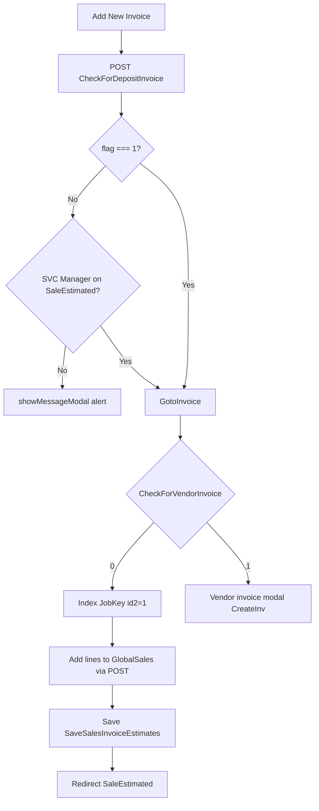
```mermaid
flowchart TD
    A[Add New Invoice] --> B[POST CheckForDepositInvoice]
    B --> C{flag === 1?}
    C -->|No| D{SVC Manager on SaleEstimated?}
    D -->|No| E[showMessageModal alert]
    D -->|Yes| F[GotoInvoice]
    C -->|Yes| F
    F --> G{CheckForVendorInvoice}
    G -->|0| H[Index JobKey id2=1]
    G -->|1| I[Vendor invoice modal CreateInv]
    H --> J[Add lines to GlobalSales via POST]
    J --> K[Save SaveSalesInvoiceEstimates]
    K --> L[Redirect SaleEstimated]
```

### Invoice Prep for Manager Review

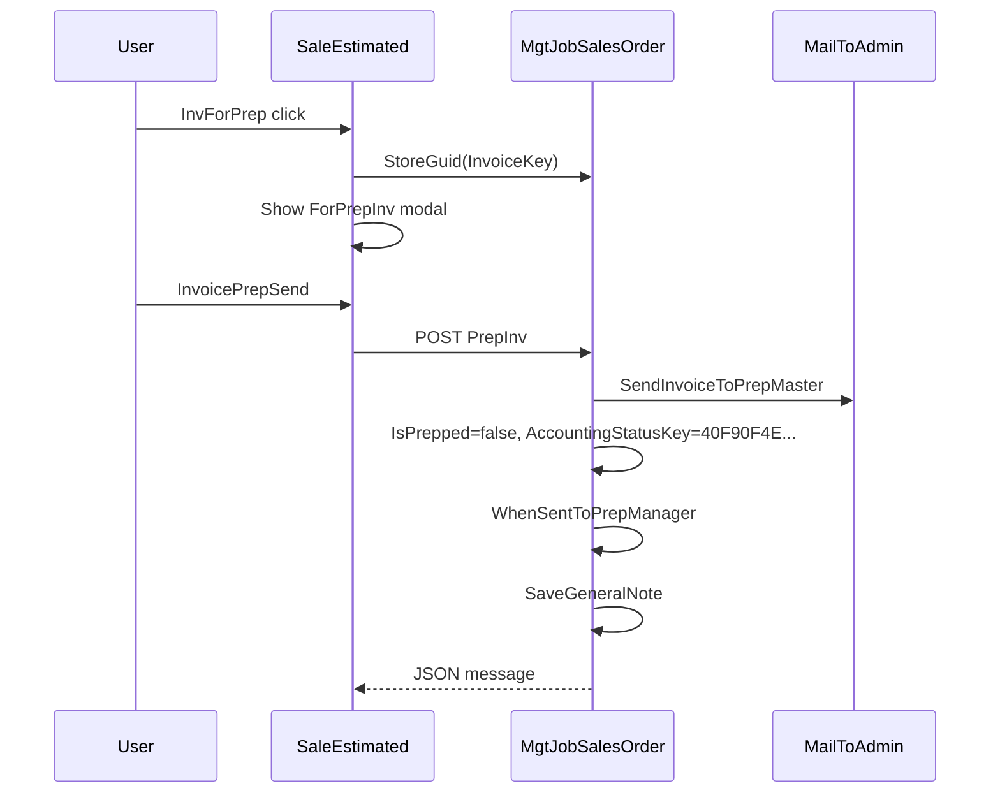
```mermaid
sequenceDiagram
    participant U as User
    participant SE as SaleEstimated
    participant C as MgtJobSalesOrder
    participant M as MailToAdmin

    U->>SE: InvForPrep click
    SE->>C: StoreGuid(InvoiceKey)
    SE->>SE: Show ForPrepInv modal
    U->>SE: InvoicePrepSend
    SE->>C: POST PrepInv
    C->>M: SendInvoiceToPrepMaster
    C->>C: IsPrepped=false, AccountingStatusKey=40F90F4E...
    C->>C: WhenSentToPrepManager
    C->>C: SaveGeneralNote
    C-->>SE: JSON message
```

### Email Invoice to Customer

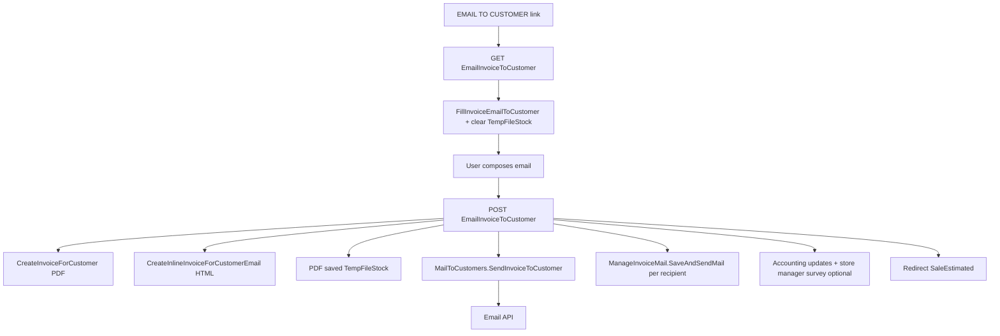
```mermaid
flowchart TD
    A[EMAIL TO CUSTOMER link] --> B[GET EmailInvoiceToCustomer]
    B --> C[FillInvoiceEmailToCustomer + clear TempFileStock]
    C --> D[User composes email]
    D --> E[POST EmailInvoiceToCustomer]
    E --> F[CreateInvoiceForCustomer PDF]
    E --> G[CreateInlineInvoiceForCustomerEmail HTML]
    E --> H[PDF saved TempFileStock]
    E --> I[MailToCustomers.SendInvoiceToCustomer]
    I --> J[Email API]
    E --> K[ManageInvoiceMail.SaveAndSendMail per recipient]
    E --> L[Accounting updates + store manager survey optional]
    E --> M[Redirect SaleEstimated]
```

### Accounting / Payment Flow

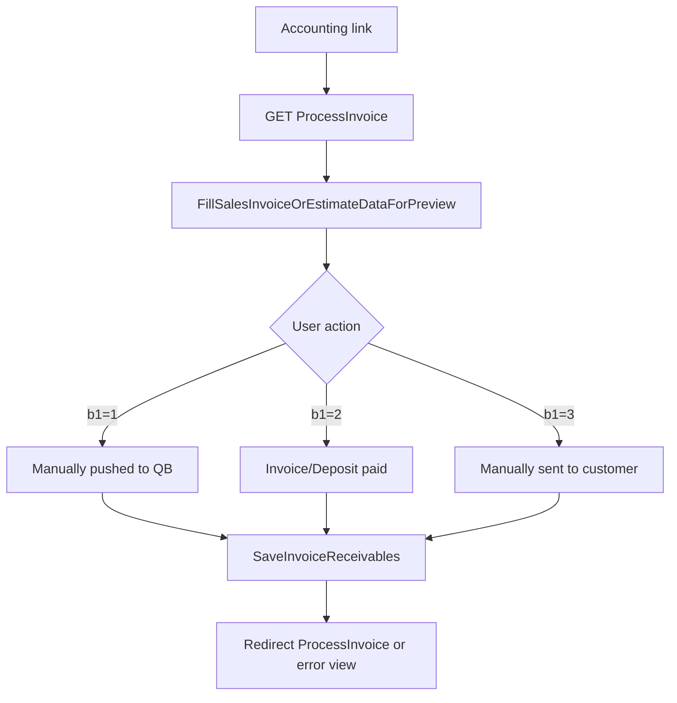
```mermaid
flowchart TD
    A[Accounting link] --> B[GET ProcessInvoice]
    B --> C[FillSalesInvoiceOrEstimateDataForPreview]
    C --> D{User action}
    D -->|b1=1| E[Manually pushed to QB]
    D -->|b1=2| F[Invoice/Deposit paid]
    D -->|b1=3| G[Manually sent to customer]
    E --> H[SaveInvoiceReceivables]
    F --> H
    G --> H
    H --> I[Redirect ProcessInvoice or error view]
```

## Deposit Invoices

When `JobSalesInvoicePartialPay` has `Deposit=true`:
- `FillInvoiceList` sets `estimateStatus` to `"Deposit Invoice"` if not paid, else `"Invoice"`
- `ProcessInvoice` handles deposit payment separately in `SaveInvoiceReceivables` (b1=2 branch)
- `RemoveInvoice` blocked if any partial pay row has `Paid=true`

**Source:** `JobSalesEstimateSetup.FillInvoiceList` lines 298–301, `RemoveInvoice`, `ProcessInvoice` POST.

## Invoice vs Estimate on Same Page

Both share `JobSalesInvoice` table. UI distinguishes via:
- `IsEstimate == false` → invoice prep button class `InvForPrep`, invoice email link, Accounting link
- `IsEstimate == true` → estimate flows (documented in 06)

## Index POST Note

`Index` with `id2=2` shows estimate UI but `SaveSalesInvoiceEstimates` sets `IsEstimate=false`. Primary estimate creation path is `ManageEstimate`, not `Index`.

**Source:** ManageEstimate/NewCustomerEstimate trace — **Confirmed** architectural split.


---

# 10. Approval, Deposit, and Status Logic

## Customer Approval

### Customer Portal / Email Response

| Mechanism | Entry | DB Record | Source |
|-----------|-------|-----------|--------|
| Customer email link | `CustomerAutoLoginToEstimate/{ContactKey}?EstimateKey=` | `JobSalesInvoiceEstimateStatus` Accept/Decline/Resubmit | `CustomerEmailForms`, Customer Portal `MgtInvoiceAndEstimates` |
| Token link (legacy) | `customerEstimateApproval` + JWT | Same + Email App handlers | `ManageCustomerEstimateController` |
| Admin mark viewed | `JobEstimateResponse/EstimateViewed` | `IsSeen=true` | Controller |
| Approve on behalf | Inline button → `ApproveCustomerEstimate` | `RespondedByCustomer=1` via `UtilityTasks.ApproveEstimateOnBehalfOfCustomer` | `SaveAcceptedEstimate` |

### Approve on Behalf Button Visibility

**Verified condition** in `GetInlineInvoiceEstimate` (lines 1655–1657, 1752–1754):

```csharp
if (IsDepositApproved == true && Withbutton == true)
```

- `IsDepositApproved` is the `depositapprovechecker` argument passed from `FillInvoiceList` (line 290).
- `Withbutton` is `true` when rendering the main SaleEstimated grid inline HTML.

**Not** shown when deposit approval is still pending (`IsDepositApproved == false`).

**Inline Edit button** (separate from grid Edit link): rendered when `mainitem.IsActive == true && Withbutton == true && mainitem.RespondedByCustomer != 0` (lines 1582, 1710) — links to `ManageEstimate` for that option.

**JS:** `ApproveOnBehalfofTheCustomer(evt)` uses:
- `id` = `MutiEstiIdentifier` (parent estimate key)
- `selectid` = specific option `InvoiceKey`

**Route:** `/MgtJobSalesOrder/ApproveCustomerEstimate?JobKey=&EstimateKey=&SelectedKey=`

### ApproveCustomerEstimate Branch (On-Behalf Form)

| Step | File | Action |
|------|------|--------|
| Load form | `ApproveCustomerEstimate.cshtml` | GET `ApproveCustomerEstimate` |
| List approval files | Inline JS `GetEstimateFiles` | GET `GetAllEstimateFileNew/{JobKey}?id2={SelectedKey}` |
| Upload files | Dropzone `#myFDropezone` | POST `UploadCustomerApprovalFiles?id={JobKey}` |
| Delete file | `DeleteThisFile` | POST `MgtJobFile/Delete` |
| Submit approval | `ApproveThisEstimate` | GET `SaveAcceptedEstimate` then reload same page |

**Validation on submit:** Requires uploaded file **or** non-empty `#txtCustomerConversation` (verbal approval text).

**ApproveCustomerEstimate GET** loads:
- `CustomerDNE` from `job.RevCustomerDNE`
- `CustomerTotal` via `utility.GetCustomerEstimateTotal`
- `VendorTotal` via `venHelp.GetVendorEstimateTotalForCustomerEstimate`
- 80% thresholds: `EityPecOfCustomerEst`, `EityPecOfCustomerDNE`

**Source:** `MgtJobSalesOrderController` lines 1133–1159, `JobSalesEstimateSetup.GetInlineInvoiceEstimate`.

### Prep Manager Approval (Email App)

Not initiated on SaleEstimated directly — links embedded in prep emails:
- `approvecustomerestimate` → `ManageCustomerEstimate/AdminApprovalforPrep`
- `approvecustomerinvoice` → `ManageCustomerInvoice/AdminApprovalforPrep`

**Status:** Confirmed in `Web.config` and `CustomerEmailForms`; prep flow sends these links.

---

## Deposit Logic

### FillInvoiceList Deposit Flags (per estimate row)

| Field | Logic | Source |
|-------|-------|--------|
| `IsDepositPresent` | `JobSalesInvoice.Isdeposit == true` | Line 230 |
| `IsDepositApproved` | Complex — see below | Lines 247–287 |
| `CanSendEmailToCustomer` | Gates estimate email button (`data-smallest`) | Lines 253–280 |
| `NoDepositPresent` | 0 or 1 — vendor deposit without bill blocks | Lines 247–285 |

**When `Isdeposit == true` and customer not yet approved (`RespondedByCustomer != 1`):**
- `IsDepositApproved = 0` until `DepositApprovalFromSVCmanager.IsApproved == true`
- `CanSendEmailToCustomer = 1` only if SVC approved

**When `Isdeposit == false` but vendor has `VendorDepositSet` without `JobBill.DepositBill`:**
- `NoDepositPresent = 1`, `IsDepositApproved = 0`
- Same SVC approval gate for email

**When customer approved (`RespondedByCustomer == 1`) with deposit:**
- `IsDepositApproved = 1`, `CanSendEmailToCustomer = 1`

### Manage Deposit Button Visibility

```csharp
(item.IsEstimate == true && item.IsDepositApproved == 0) 
|| (item.IsEstimate == true && item.NoDepositPresent == 0 && item.RespondedByCustomer == 99)
```

**Source:** `SaleEstimated.cshtml` lines 972–975.

### Deposit Save Flow (SaleEstimated)

1. `ManageCustomerDeposit` → `formName = "SaleEstimated"`
2. Vendor deposit modal (if vendors linked)
3. Customer deposit modal with 35% best-practice rule
4. `SaveVendorDepositCustomerDeposit` persists:
   - `JobSalesInvoice.DepositAmount`, `Isdeposit`, `ReasonForNoDeposit`
   - `VendorDepositSet` records
   - `DepositOverrideRemark`
   - `DepositApprovalFromSVCmanager` request if needed
   - `JobSalesInvoicePartialPay` if customer already approved

### SVC Manager Deposit Approval

**Trigger:** `SendSVCManagerForDepositApproval` button when `IsDepositApproved == 0`

**Email recipients:** `EmailSendToAddress` where `SendToType == 38`

**If caller is SVC manager:** auto-approves `DepositApprovalFromSVCmanager.IsApproved = true`

**Source:** `SendEmailToSVCManagerForDepositApproval` lines 776–933.

### Invoice Creation Deposit Gate

`MgtVendorInvoice/CheckForDepositInvoice` — if `flag !== 1`, non-SVC users see alert; SVC managers can proceed.

**Source:** `ManageDepositInvoice.js` lines 40–50.

---

## RespondedByCustomer — Authoritative Values

`JobSalesInvoice.RespondedByCustomer` is an **integer nullable column** on the estimate/invoice header. Inline code documents the contract at `UtilityTasks.cs:880` and Customer Portal `MgtInvoiceAndEstimatesController.cs:341`:

> `1` = approved · `null` = untouched · `0` = declined · `2` = resubmit

| DB value | Business meaning | Who sets it | Grid model (`FillInvoiceList`) | Inline HTML (`GetInlineInvoiceEstimate`) |
|----------|------------------|-------------|--------------------------------|----------------------------------------|
| `null` | Customer has not responded | Default on new/edited estimates | Mapped to **`99` only in view model** (`JobSalesEstimateSetup.cs:233`) for Manage Deposit button visibility — **never persisted as 99** | Info-style remark branch (not success/warning/grey) |
| `1` | Customer approved | Customer Portal `SimplyApproveEstimate`; `UtilityTasks.ApproveEstimateOnBehalfOfCustomer`; admin `SaveAcceptedEstimate` | `IsDepositApproved=1`, `CanSendEmailToCustomer=1` when deposit present (`:250–254`) | `alert-success` remark (`:1544, :1679`) |
| `0` | Customer declined | Customer Portal `UtilityTasks.cs:470,521` | Treated as "not approved" in deposit logic (`!= 1`) | Grey table background (`:1573, :1700`); remark HTML intentionally empty |
| `2` | Customer requested changes / resubmit | Customer Portal `ChangeEstimate` (`:911, :940`) | Same as not-approved for deposit gates | `alert-warning` remark (`:1548, :1683`) |

### Manage Deposit button condition (why `99` appears)

```csharp
(item.IsEstimate && item.IsDepositApproved == 0)
|| (item.IsEstimate && item.NoDepositPresent == 0 && item.RespondedByCustomer == 99)
```

`99` is a **UI sentinel** for `null` in `FillInvoiceList` — it means "customer has not approved yet" while deposit setup is still required.

---

## Already-Approved Estimate Edit

**Branch:** `NewCustomerEstimateController.SaveCustomerEstimate` — edit path when estimate already exists (`:362+`).

| Field / record | On save |
|----------------|---------|
| `RespondedByCustomer` | Set to `null` — approval cleared |
| `SentToCustomer` | `false` |
| `EmailToCustomerDate` | Cleared |
| `JobSalesInvoiceEstimateStatus` | Rows removed |
| `JobActionNeeded` ActionID 14 | Removed |

**Business rule:** Admins **may edit** an approved estimate. The system **resets** customer approval rather than blocking the edit. Customer must approve again after the estimate is re-sent.

---

## DNE (Do Not Exceed) — Approve on Behalf

| Layer | Behavior | Evidence |
|-------|----------|----------|
| Approval page display | Shows `CustomerDNE`, vendor total, 80% thresholds (`EityPecOfCustomerEst`, `EityPecOfCustomerDNE`) | `ApproveCustomerEstimate` GET `:1133+` |
| Pre-submit warning JSON | If vendor total ≥ 80% of customer estimate total, shows "Approve Anyway" vs "Save attachments only" | `MgtJobSalesOrderController.cs:1105–1126` |
| `SaveAcceptedEstimate` | **No DNE check** — calls `ApproveEstimateOnBehalfOfCustomer` directly | `:1162–1177` |
| Post-approval side effects | `UtilityTasks` uses 80% of approved customer DNE for **vendor estimate auto-approval / decline** logic | `UtilityTasks.cs:977+` |

**Not enforced on SaleEstimated grid** — DNE matters only on the approve-on-behalf branch and downstream vendor automation after approval.

---

## Incurred Cost

Line item field `JobSalesInvoiceDetail.CostIncurred` used in:
- Index/Sales/ManageEstimate client validation (Cost Incurred vs Proposed required)
- Display grouping in charge type logic

**Not referenced in SaleEstimated hub** — editing occurs in branch views.

---

## Rule Table

| Rule / Condition | Applies To | Code Reference | DB Reference | Result |
|---|---|---|---|---|
| Deposit required blocks email | Estimate email button | `EmailEstimateToCustomer` JS + `CanSendEmailToCustomer` | `DepositApprovalFromSVCmanager` | Alert modal |
| SVC approval unlocks email | Estimate with deposit | `FillInvoiceList` | `DepositApprovalFromSVCmanager.IsApproved` | `data-smallest=1` |
| Vendor deposit without bill | Estimate row | `FillInvoiceList` 273–284 | `VendorDepositSet`, `JobBill.DepositBill` | Manage Deposit + SVC path |
| Customer approved estimate | Deposit flags | `FillInvoiceList` 250–254 | `RespondedByCustomer==1` | Email allowed |
| Customer deposit < vendor deposit | Deposit modal | `ManageCustomerVendorDeposit.js` 461–467 | — | Override confirmation |
| Customer deposit < 35% above vendor | Deposit modal | `ManageCustomerVendorDeposit.js` 469–474 | — | Best practice override |
| Vendor deposit > 50% of estimate | Vendor deposit modal | `ManageCustomerVendorDeposit.js` 370–377 | — | Override list |
| Paid invoice cannot delete | Invoice remove | `RemoveInvoice` | `JobSalesInvoicePartialPay.Paid` | JSON returns 2 |
| Delete requires manager name + remarks | Invoice remove UI | `#SaveDelete` JS | `DeleteManager`, `DeleteManagerRemark` | Validation |
| Mark unpaid requires note | Unpaid modal | `SaveAsUnpaid` | General note in action | JSON |
| Estimate prep optional job status | Prep modal | `#jobStatus1` | `GlobalClass.GetJobStatus(24)` | Job status change |
| Invoice prep sets accounting status | PrepInv success | `PrepInv` | `AccountingStatusKey = 40F90F4E-434A-4BE0-B679-D98ED6ADF9ED` | Accounting workflow |

---

## Pending Approval Paths

| Path | Trigger | Status Change |
|------|---------|---------------|
| Vendor estimate → customer estimate | `ChangeEstimateStatus` | `VendorEstimate.Status = 2`, `IsApproved = false` |
| Estimate prep for review | `jobStatus1` checkbox | Job status → ESTIMATE PREPPED FOR REVIEW (24) |
| SVC deposit approval pending | Send SVC button (non-manager) | `DepositApprovalFromSVCmanager.IsApproved = null` |
| Below-markup estimate approval | ManageEstimate save | `ApproveEstimateBelowMarkupController` — **branch only** |


---

# 11. Email, PDF, and Notification Logic

## Email / Notification / PDF Table

| Email / Notification / PDF | Trigger | Recipient / Output | Template/Source | Service Used | Failure Handling |
|---|---|---|---|---|---|
| Estimate to customer | EmailEstimateToCustomer POST | Customer/location contacts | `CustomerEmailForms.CreateCustomerEstimateMONew` or `CreateCustomerEstimateSingleOptionVersion2` | Email API `send-customer-email` | `DataReturn.flag=0`, message in response |
| Invoice to customer | EmailInvoiceToCustomer POST | Customer/location contacts | `CustomerEmailForms.InvoiceForm` + inline HTML | Email API `send-customer-email` | Same |
| Estimate prep to manager | Prep / PrepWhenVendorEstimateIsConnected POST | `EmailSendToAddress` SendToType **34** | Prep email + `CreateCustomerApprove` link | Email API `send-admin-email` | JSON message appended with exception text |
| Invoice prep to manager | PrepInv POST | SendToType **33** | Prep email + `CreateCustomerApproveInvoice` | Email API `send-admin-email` | Same |
| SVC deposit approval | SendEmailToSVCManagerForDepositApproval | SendToType **38** | `AdminEmailForms.CreateDepositApprovalForm` | Email API `send-admin-email` | Redirect with note of email result |
| SVC auto-approve notification | Same (if caller is SVC manager) | Account manager | Deposit story HTML | `SendMailToAccountManagerForApprovedDeposit` | Logged in note |
| Resend old email | ShowOldCustomerEstimateInvEmail POST | Original recipients | `ResendSendEstimatedInvoiceToCustomer` | Email API | Redirect SaleEstimated |
| Vendor estimate request | SendVendorMails (modal) | Vendor contacts | MgtNewDashboard email template | Email API (vendor path) | JSON response in modal |
| Store manager survey | After **invoice** email succeeds (conditional) | Location store manager email | `CustomerEmailForms.CreateStoreManagerSurveyForm` + `StoreManagerSurvey.html` | Email API `send-customer-email` via `SendSurveyMailToLocationManager` | Rollback survey row + general note on failure; append to `estimateConfirmMessege` |

## PDF Generation

| Document | Generator Method | File | Output |
|----------|------------------|------|--------|
| Estimate PDF for email | `InvoiceCreator.CreateEstimatedToCustomer2ndEdition` | `Helper\InvoiceCreator.cs` | `InvoiceFileType { Title, bytes }` |
| Invoice PDF for email | `InvoiceCreator.CreateInvoiceForCustomer` | Same | PDF bytes |
| Invoice inline HTML | `InvoiceCreator.CreateInlineInvoiceForCustomerEmail` | Same | HTML string in email body |
| Grid inline preview | `GetInlineInvoiceEstimate`, `GetInlineInvoice` | `JobSalesEstimateSetup.cs` | HTML in grid (not PDF) |
| Preview pages | `FillEstimateForPreview`, `FillSalesInvoiceOrEstimateDataForPreview` | JobSalesEstimateSetup | Razor preview views |

**Library:** iTextSharp (referenced in InvoiceCreator — **Confirmed** from agent trace).

## Email Attachment Sources

| Source | Table | Used In |
|--------|-------|---------|
| Compose upload | `TempFileStock` (JobKey = InvoiceKey) | Email POST |
| Job files | `JobFile` → Blob | `UploadedJobFiles` checkboxes |
| Vendor bill uploads | `JobBillVendorUploads` | `VendorUploadedJobFiles` |
| Generated PDF | Memory → archived on first send | `EmailInvoiceEstimateDetail` via blob |

## Email Persistence

| Table | Written When | Fields |
|-------|--------------|--------|
| `EmailInvoiceEstimate` | First successful send per batch | JobKey, InvoiceKey, IsInvoice, SentOn, Subject, SentBy |
| `EmailInvoiceEstimateDetail` | Attachment archival | Links to blob-stored files |
| `JobSalesInvoice` | After send | `SentToCustomer`, `SendEmailMarker`, `EmailToCustomerDate`, `EstimatesSent`/`InvoiceSent` |

## Recipient Configuration

| SendToType / SendID | Purpose |
|---------------------|---------|
| 34 | Estimate prep manager recipients |
| 33 | Invoice prep manager recipients |
| 38 | SVC manager (deposit approval) |
| 134 | BCC for estimate prep emails |
| 133 | BCC for invoice prep emails |

**Source:** `MailToAdmin.cs` (agent trace), `SendEmailToSVCManagerForDepositApproval` line 823.

## Customer Portal Links in Emails

| Config Key | URL Purpose |
|------------|-------------|
| `CustomerAutoLoginToEstimate` | Primary CTA for customer to review/approve estimate |
| `customerEstimateApproval` | Token-based respond link |
| `customerEstimateResubmit` | Request changes link |
| `approvecustomerestimate` | Prep manager approve estimate |
| `approvecustomerinvoice` | Prep manager approve invoice |

**Built in:** `ProjectRCS\MailFunctions\CustomerEmailForms.cs`

## Email API Integration

| Setting | Value (dev) |
|---------|-------------|
| `EmailApiBaseUrl` | `https://service-rfi-email-api-dev.retailfixitapp.com` |
| `EmailApiKey` | `rfi-mailing-api-key-change-this-in-production` |
| Header | `X-API-Key` |

**Client:** `EmailApiClient.SendCustomerEmailAsync`, `SendAdminEmailAsync`

**API Controller:** `RFIEmailService\Controllers\EmailController.cs`

**Request shape:**
```json
{
  "From": "string",
  "To": "string",
  "Subject": "string",
  "HtmlBody": "string",
  "Bcc": "optional",
  "Cc": "optional",
  "Attachments": [{ "FileName", "ContentBase64", "ContentType" }]
}
```

## Store Manager Survey — Full Flow (Invoice Send Only)

**Not triggered by estimate email.** Runs only in `EmailInvoiceToCustomer` POST after at least one recipient send succeeds (`sendingflag > 0`).

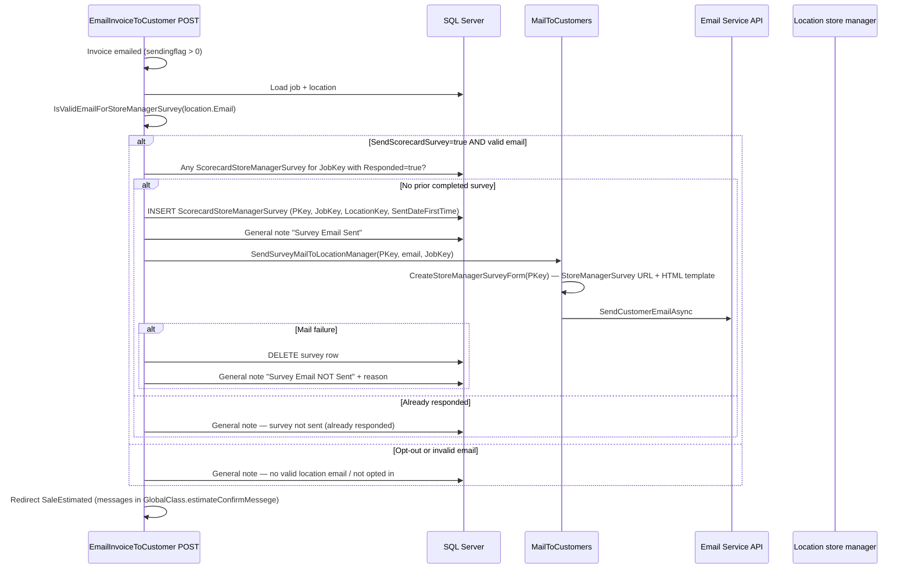
```mermaid
sequenceDiagram
    participant POST as EmailInvoiceToCustomer POST
    participant DB as SQL Server
    participant Mail as MailToCustomers
    participant API as Email Service API
    participant Loc as Location store manager

    POST->>POST: Invoice emailed (sendingflag > 0)
    POST->>DB: Load job + location
    POST->>POST: IsValidEmailForStoreManagerSurvey(location.Email)
    alt SendScorecardSurvey=true AND valid email
        POST->>DB: Any ScorecardStoreManagerSurvey for JobKey with Responded=true?
        alt No prior completed survey
            POST->>DB: INSERT ScorecardStoreManagerSurvey (PKey, JobKey, LocationKey, SentDateFirstTime)
            POST->>DB: General note "Survey Email Sent"
            POST->>Mail: SendSurveyMailToLocationManager(PKey, email, JobKey)
            Mail->>Mail: CreateStoreManagerSurveyForm(PKey) — StoreManagerSurvey URL + HTML template
            Mail->>API: SendCustomerEmailAsync
            alt Mail failure
                POST->>DB: DELETE survey row
                POST->>DB: General note "Survey Email NOT Sent" + reason
            end
        else Already responded
            POST->>DB: General note — survey not sent (already responded)
        end
    else Opt-out or invalid email
        POST->>DB: General note — no valid location email / not opted in
    end
    POST->>POST: Redirect SaleEstimated (messages in GlobalClass.estimateConfirmMessege)
```

| Step | Code location | Detail |
|------|---------------|--------|
| Gate | `MgtJobSalesOrderController.cs:1635–1638` | `location.SendScorecardSurvey == true` and `IsValidEmailForStoreManagerSurvey` |
| Duplicate prevention | `:1640–1641` | Skip if `ScorecardStoreManagerSurvey` exists for job with `Responded == true` |
| Persist survey row | `:1644–1654` | `ScorecardStoreManagerSurvey` + general note |
| Send email | `:1656–1658` | `MailToCustomers.SendSurveyMailToLocationManager` |
| Email body | `MailToCustomers.cs:1807–1846` | Subject: "How Did Our Service Provider Do At Your Location?" |
| Survey link | `CustomerEmailForms.cs:750–765` | `Web.config` `StoreManagerSurvey` + `{PKey}`; template `Views/Home/StoreManagerSurvey.html` |
| Failure handling | Controller `:1660–1666`, `:1680–1685` | Remove row on mail failure; catch appends to flash message |

> **Job Ops API** configures survey **question items** in customer setup (`ManageCustomerSetup`) — it is **not** called when sending the survey email from SaleEstimated.

## Failure Handling Patterns

| Layer | Behavior |
|-------|----------|
| Prep actions | Exception message appended to JSON string; partial success possible (status changed but mail failed) |
| Email POST | Redirect SaleEstimated with `GlobalClass.estimateConfirmMessege` on success/failure |
| EmailEstimateToCustomer JS gate | Client-side only — no server call if deposit not approved |
| Email API | `DataReturn.flag` checked; `mess` contains error detail |
| MailToCustomers | **No** Application Insights / log4net — failures in `DataReturn.mess` and UI flash (`GlobalClass.estimateConfirmMessege`) |
| Store manager survey | Survey row rolled back on send failure; general note always written |

## Email Flow Diagram

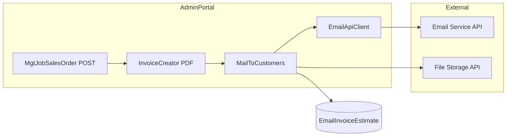
```mermaid
flowchart LR
    subgraph AdminPortal
        A[MgtJobSalesOrder POST]
        B[InvoiceCreator PDF]
        C[MailToCustomers]
        D[EmailApiClient]
    end
    subgraph External
        E[Email Service API]
        F[File Storage API]
    end
    A --> B
    B --> C
    C --> D
    D --> E
    C --> F
    C --> G[(EmailInvoiceEstimate)]
```


---

# 12. File Attachment and Blob Storage Logic

## File Operation Table

| File Operation | Trigger | Backend/API/File Service | Storage/DB | Result | Status |
|---|---|---|---|---|---|
| Upload prep estimate files | Dropzone `#EstDropezone` | POST `/MgtDashBoardActionButtons/UploadFilesEst/` | `TempJobNoteFile` (JobKey=`GlobalClass.StoreGuid`) | Staged for prep email attachments | Confirmed |
| Upload prep invoice files | Dropzone `#InvDropezone` | POST `/MgtDashBoardActionButtons/UploadFiles/` | `TempJobNoteFile` | Same | Confirmed |
| Remove prep upload | Dropzone removedfile | POST `/MgtMultipleJobMessege/RemoveFile?InvoiceKey=` | Temp file delete | Decrement localStorage count | Confirmed |
| List job files for prep | Page load `GetJobFiles` | GET `GetJobFilesForModal` | Read `JobFile` | Checkbox list with View link | Confirmed |
| List vendor bill files | Page load `GetJobFiles` | GET `GetvendorbillsForModal` | Read `JobBillVendorUploads` | Checkbox list | Confirmed |
| View job file | Click View link | GET `/ShowImage/GetJobFileAttachement/{FileKey}` | Blob serve `FileCategoryEnum.JobFiles` | File download/display | Confirmed |
| View vendor paper | Click View link | GET `/ShowImage/GetVendorPapers/{FileKey}` | Blob serve | File display | Confirmed |
| Upload email compose files | EmailEstimate/Invoice views dropzone | POST `MgtJobSalesOrder/UploadFiles?id={InvoiceKey}` | `TempFileStock` | Attach to outgoing email | Confirmed |
| Attach job files to email | Email POST | `MailToCustomers` reads `JobFile` | Blob read via `JobFileSetup` | Email attachment | Confirmed |
| Attach vendor bills to email | Email POST | `GetJobVendorUploadsFileBytes` | Blob | Email attachment | Confirmed |
| Archive estimate PDF | First successful estimate email | `JobFileSetup.SaveEmailAttachmentInUploadedFiles` | Blob `FileCategoryEnum.Estimate` | `EmailInvoiceEstimateDetail` | Confirmed |
| Archive invoice PDF | First successful invoice email | Same pattern | Blob `FileCategoryEnum.Invoice` | Detail record | Confirmed |
| Customer approval file upload | ApproveCustomerEstimate view | POST `UploadCustomerApprovalFiles` | `JobFile` via `JobFileSetup` | Job attachment | Confirmed |
| Prep email attachments | Prep/PrepInv | `MailToAdmin` reads `TempJobNoteFile`, `JobFile`, `JobBillVendorUploads` | Mixed | Email attachments | Confirmed |

## StoreGuid Pattern

Before prep modals open, JS calls `MgtJobSalesOrder/StoreGuid` with current `InvoiceKey` or `EstimateKey`.

Sets `GlobalClass.StoreGuid` used as `JobKey` column in `TempJobNoteFile` for dropzone uploads.

**Naming mismatch:** `StoreGuid` stores InvoiceKey/EstimateKey but temp table column is `JobKey`.

**Source:** `MgtJobSalesOrderController.StoreGuid` line 560–567.

## BlobFileService

| Config | Dev Value |
|--------|-----------|
| `FILESERVEURL` | `https://service-rfi-file-storage-api-dev.retailfixitapp.com/` |
| `RFIEXTERNALAUTHKEY` | (see Web.config) |
| Header | `RFIApiKey` |

| Method | Endpoint |
|--------|----------|
| `GetFileBytesAsync` | POST `/api/files/serve-blob` |
| `UploadFileToBlobAsync` | POST multipart `/api/files/upload-file` |

**API Project:** `D:\RFI PROJECTS\RFIFileandStorageManagement\Controllers\FilesController.cs`

## File Category Enum (Email Archival)

| Category | Used For |
|----------|----------|
| `JobFiles` | General job attachments |
| `Estimate` | Archived estimate email PDFs |
| `Invoice` | Archived invoice email PDFs |

## Temp Tables

| Table | Lifetime | Cleared When |
|-------|----------|--------------|
| `TempJobNoteFile` | Prep session | Consumed by prep email send |
| `TempFileStock` | Email compose | Cleared on Email GET (`EmailInvoiceToCustomer`/`EmailEstimateToCustomer`) |

## File Flow Diagram

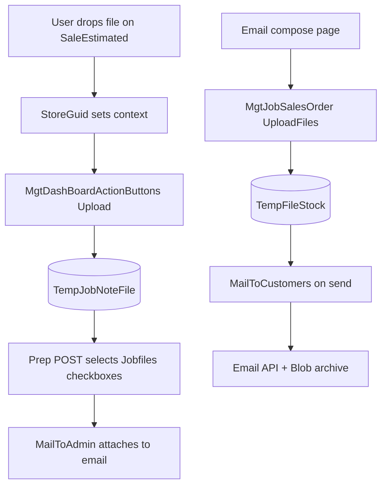
```mermaid
flowchart TD
    A[User drops file on SaleEstimated] --> B[StoreGuid sets context]
    B --> C[MgtDashBoardActionButtons Upload]
    C --> D[(TempJobNoteFile)]
    D --> E[Prep POST selects Jobfiles checkboxes]
    E --> F[MailToAdmin attaches to email]
    
    G[Email compose page] --> H[MgtJobSalesOrder UploadFiles]
    H --> I[(TempFileStock)]
    I --> J[MailToCustomers on send]
    J --> K[Email API + Blob archive]
```

## Delete Actions

| Action | Verified? |
|--------|-----------|
| Remove temp prep file | Yes — Dropzone removedfile → RemoveFile |
| Delete JobFile from SaleEstimated | No direct delete on hub page |
| Delete archived email attachment | Not on SaleEstimated — **Referenced but Not Traced** |

## Storage Config Risk

Blob and email API URLs are environment-specific in `Web.config`. Wrong environment causes silent send failures or missing attachments.

**Source:** `16_Configuration_and_Environment_Dependencies.md`


---

# 13. External API and Web Service Integrations

## Integration Summary Table (SaleEstimated Scope Only)

| Service | Endpoint/Method | HTTP | Called By | Purpose | Request | Response | Config/Auth | Status |
|---|---|---|---|---|---|---|---|---|
| Email Service API | `/api/email/send-customer-email` | POST | MailToCustomers | Customer est/inv email, store manager survey | SendEmailRequest JSON | EmailSendResponse | EmailApiBaseUrl, X-API-Key | Confirmed |
| Email Service API | `/api/email/send-admin-email` | POST | MailToAdmin | Prep/deposit emails | SendEmailRequest | EmailSendResponse | Same | Confirmed |
| File Storage API | `/api/files/serve-blob` | POST | BlobFileService, ShowImage | Read file bytes | Blob request | File bytes | FILESERVEURL, RFIApiKey | Confirmed |
| File Storage API | `/api/files/upload-file` | POST multipart | BlobFileService | Store attachments | Multipart | Upload result | Same | Confirmed |
| Vendor Portal | `/VendorLogin/LoginByRCSadminWithTaskOptions` | GET | `#CreateEstimate` window.open | Vendor estimate entry | JobKey, ContactKey, Option, adminKey | Portal page | vendorloginfromadminWIthTaskOptions | Confirmed |
| Customer Portal | `/Home/AutoLoginToEstimate/{ContactKey}?EstimateKey=` | GET | Email HTML links | Customer estimate review | ContactKey, EstimateKey | Portal session | CustomerAutoLoginToEstimate | Confirmed |
| Customer Portal | `/MgtInvoiceAndEstimates/SimplyApproveEstimate` | GET | Portal UI | Approve estimate | EstKey, JobKey, SelectedKey | DataReturn JSON | Portal auth | Confirmed |
| Email App | `/ManageCustomerEstimate/RespondToEstimate?formOption=` | GET | Email token links | Token approval | JWT token | Form | customerEstimateApproval | Confirmed |
| Email App | `/ManageCustomerEstimate/AdminApprovalforPrep/` | GET | Prep email | Manager approve estimate | EstimateKey, JobKey, staff keys | Form | approvecustomerestimate | Confirmed |
| Email App | `/ManageCustomerInvoice/AdminApprovalforPrep/` | GET | Prep email | Manager approve invoice | Same pattern | Form | approvecustomerinvoice | Confirmed |
| Email App | `/MgtDeposit/Approve/` | GET | SVC deposit email | Approve deposit | JobKey params | Form | approveDeposit (Web.config) | Confirmed |

> **Excluded from this table:** Job Ops API and Legacy Web Service are **not** HTTP-called from SaleEstimated estimate/invoice flows. See § Out of Scope below.

## Email Service API Detail

**Project:** `D:\Projects\RFI\WEB API Version 2\Email Service API\RFIEmailService`

**Client:** `D:\RFI Projects In New Framework\Admin Portal\ProjectRCS\Helper\EmailApiClient.cs`

**Authentication:** `X-API-Key: {EmailApiKey}` header on all requests.

**Error handling in Admin Portal:** Returns `EmailApiResponse` with `Success`, `Error` fields; wrapped into `DataReturn.flag`. **No centralized logging** in `MailToCustomers` or `EmailApiClient` — errors surface via `DataReturn.mess` and redirect flash messages.

## File Storage API Detail

**Project:** `D:\RFI PROJECTS\RFIFileandStorageManagement`

**Used for:**
- Serving job file attachments in prep/email UIs
- Archiving estimate/invoice PDFs after email send
- `ShowImageController` file display

## Customer Portal Detail

**Project:** `D:\RFI Projects In New Framework\Customer Portal\RCScustomerVersion2`

**Relevant controller:** `MgtInvoiceAndEstimatesController`

| Action | Purpose |
|--------|---------|
| `ManageEstimates` | Review estimate UI |
| `SimplyApproveEstimate` | Approve from portal |
| `ChangeEstimate` | Request changes (resubmit) |
| `PendingEstimate` | List pending |

Customer responses write `JobSalesInvoice.RespondedByCustomer` and `JobSalesInvoiceEstimateStatus`.

**How Admin reaches Customer Portal:** Email links built in `CustomerEmailForms` (`CustomerAutoLoginToEstimate` + ContactKey). Admin Portal does **not** call Customer Portal or Legacy WS directly from SaleEstimated.

## Vendor Portal Detail

**Config:** `vendorloginfromadminWIthTaskOptions` = `https://vendor-dev.retailfixitapp.com/VendorLogin/LoginByRCSadminWithTaskOptions?JobKey=`

**URL built in SaleEstimated:**
```
urlVendorPortal + JobKey + "&ContactKey=" + vendorContact + "&Option=1&adminKey=" + loggedIn
```

Opens in new tab (`window.open`).

## Email App (rcsappmailer) Detail

**Project:** `D:\RFI PROJECTS\Email App\RCS_app`

Handles tokenized customer responses and prep-manager approval without full portal login.

## Out of Scope (Not SaleEstimated Integrations)

### Legacy Web Service

**Project:** `D:\RFI PROJECTS\Legacy RFI webservice\RCSwebservice`

| Fact | Detail |
|------|--------|
| Used by | Customer Portal for dashboard invoice/estimate lists (e.g. `GetAllEstimateAndInvoice`) |
| Used by SaleEstimated? | **No** — grep of `MgtJobSalesOrder` views/controllers shows no `LegacyWebServiceBaseUrl` calls |
| Why it appeared in docs | Config key exists in `Web.config`; easy to assume all portal data flows through Admin → Legacy WS |

Admin estimate/invoice email uses **`MailToCustomers` → Email API**, not Legacy WS.

### Job Ops API

| Fact | Detail |
|------|--------|
| Config | `JobOpsApiBaseUrl` in `Web.config` |
| SaleEstimated usage | **None traced** |
| Other usage | `JobOpsChatController`, `ManageCustomerSetup` (survey item CRUD, DNE setup) |

Store manager survey **send** on invoice email uses Email API only (`SendSurveyMailToLocationManager`).

## Dependency Map

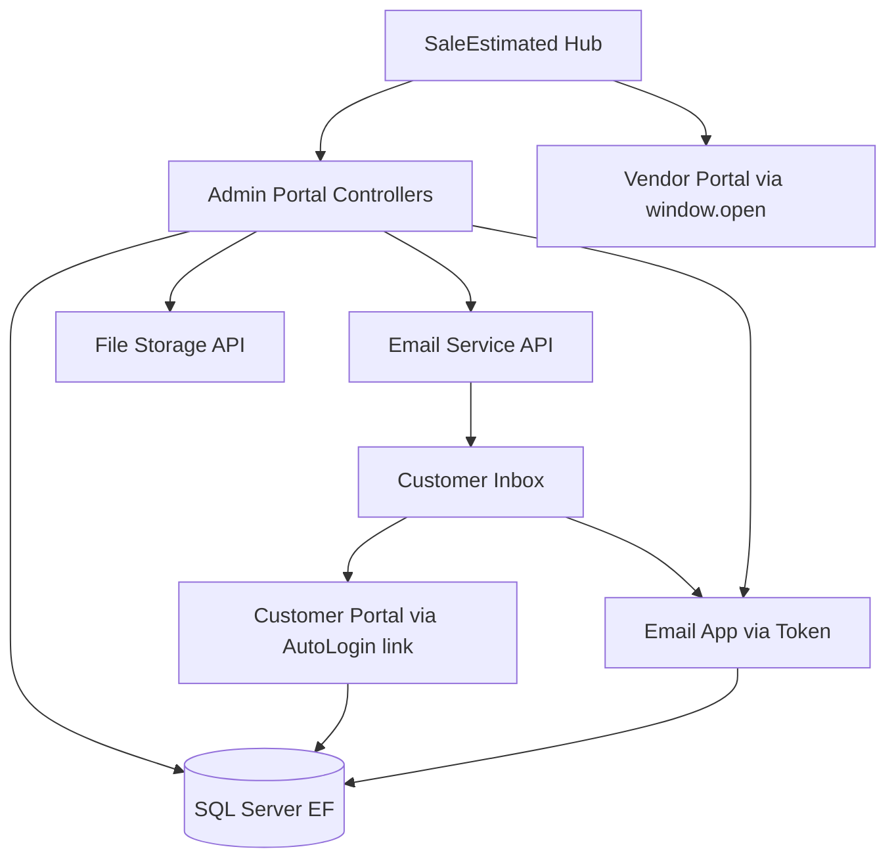
```mermaid
flowchart TB
    SE[SaleEstimated Hub]
    SE --> AP[Admin Portal Controllers]
    AP --> EMAIL[Email Service API]
    AP --> FILE[File Storage API]
    AP --> DB[(SQL Server EF)]
    
    EMAIL --> CUST[Customer Inbox]
    CUST --> CP[Customer Portal via AutoLogin link]
    CUST --> EA[Email App via Token]
    
    SE --> VP[Vendor Portal via window.open]
    
    CP --> DB
    EA --> DB
    AP --> EA
```

## Authentication Summary

| Integration | Auth Mechanism |
|-------------|----------------|
| Email API | API key header (`X-API-Key`) |
| File API | `RFIApiKey` header |
| Vendor Portal | `adminKey` query param (`PersonnelKey`) |
| Customer Portal auto-login | `ContactKey` GUID in URL — no JWT/expiry; requires `CustomerLogin` record (see module 15) |
| Email App tokens | JWT in `formOption` query string |


---

# 14. Database Documentation

**Primary script sources:**
- `D:\CURSOR\Database\June_2026_19\db_tables.sql`
- `D:\CURSOR\Database\June_2026_19\stored_procedure.sql`
- `D:\CURSOR\Database\June_2026_19\sql_functions.sql`

## Core Table Documentation

### JobSalesInvoice

| Attribute | Detail |
|-----------|--------|
| Purpose | Single header table for customer estimates AND invoices on a job |
| PK | `InvoiceKey` (uniqueidentifier) |
| Key discriminator | `IsEstimate` — 1=estimate, 0=invoice |
| Multi-option | `MultipleChoiceEstimate`, `MCEstimate`, `MutiEstiIdentifier`, `EstimateTitle` |
| Deposit | `Isdeposit`, `DepositAmount`, `ReasonForNoDeposit`, `DepositeSentToCustomer` |
| Customer send | `SentToCustomer`, `EmailToCustomerDate`, `SendEmailMarker`, `EstimatesSent`, `InvoiceSent` |
| Customer response | `RespondedByCustomer` |
| Prep | `IsPrepped`, `PreppedBy`, `PrepNote`, `PrepDate` |
| Payment | `InvoicePaid`, `PaidOn`, `CheckNo`, `QBrefNo`, `InvoiceNo` |
| Vendor link | `VendoeEstimateKey`, `CreatedFromVendorEstimate` |
| Soft delete | `IsActive`, `RemovedDueToEdit`, `Remark` |
| Read/Write | Both — hub reads; branch controllers write |

### JobSalesInvoiceDetail

| Attribute | Detail |
|-----------|--------|
| Purpose | Line items for estimates and invoices |
| PK | `DetailKey` |
| FK (logical) | `InvoiceKey` → `JobSalesInvoice` |
| Pricing | `Rate`, `Qty`, `Amt`, `ChargeTypeKey` |
| Incurred | `CostIncurred`, `MarkAsIncurredCmt`, `MarkAsProposed` |
| Vendor link | `VendorEstimateDetailKey` |
| Display | `Display`, `Perc`, `LineItemTitle`, `LineItemTitleDisplayOrder` |

### JobSalesInvoiceEstimateStatus

| Attribute | Detail |
|-----------|--------|
| Purpose | Customer accept/decline/resubmit responses |
| PK | `Pkey` |
| Keys | `InvoiceKey`, `JobKey`, `CustomerKey` |
| Flags | `Accept`, `Decline`, `Resubmit`, `IsSeen` |
| Content | `Remark`, `DashboardMsg`, `CreatedDate` |

### EmailInvoiceEstimate / EmailInvoiceEstimateDetail

| Purpose | Audit log of emails sent to customers |
| Used by | `FillInvoiceEmailSentList`, resend controller |

### DepositApprovalFromSVCmanager

| Purpose | SVC manager approval gate for deposit + estimate email |
| Key fields | `InvoiceKey`, `JobKey`, `IsApproved`, `ApprovingAdminKey`, `ApprovalSentDate` |

### VendorDepositSet

| Purpose | Vendor deposit amounts approved for job |
| Key fields | `JobKey`, `VendorKey`, `DepositAmount`, `DepositSetDate`, `ApprovedBy` |

### JobSalesInvoicePartialPay

| Purpose | Deposit invoices and partial payment tracking |
| Key fields | `InvoiceKey`, `Deposit`, `DepositAmount`, `Paid`, QB fields |

### JobSalesOrderToVEstimate

| Purpose | Links customer estimate `InvoiceKey` to `VendorEstimateKey` |

### Supporting Tables

| Table | Purpose in Feature |
|-------|-------------------|
| `Job` | Job header, `AccountingStatusKey`, `JobStatusKey`, `RevCustomerDNE`, `PO` |
| `Customer`, `CustomerContact` | Contact info on grid and emails |
| `SalesStatus` | Estimate/invoice sales status label |
| `AccountStatus` | Accounting status dropdown |
| `JobFile` | Job attachments |
| `JobBillVendorUploads` | Vendor bill scan attachments |
| `TempJobNoteFile` | Prep upload staging |
| `TempFileStock` | Email compose staging |
| `DepositOverrideRemark` | Deposit rule override audit |
| `JobSalesInvoiceAfterUpdate` | Estimate version history for compare |
| `VendorEstimate`, `VendorInvoice` | Source documents for conversion |
| `VendorEstimateDetail` | Vendor estimate line items (prep modal checkboxes) |
| `VendorEstimateDetail1` | Vendor labor line items in prep HTML |
| `StaffList` | `CreatedBy` display on grid rows |
| `SalesChargeType` | Line item charge type FK |
| `JobSalesTemplate` | New template detection (`IsNewTemplate`) |
| `JobSalesTemplateForWorkDescription` | New template detection |
| `JobBill` | Vendor deposit bill existence check |
| `JobVendor` | Active vendors on job |
| `JobHighlights` | Dashboard highlights (e.g., 12=estimate response) |
| `JobOnDepositList` | Accounting deposit queue |

## SQL Functions (Feature-Related)

| SQL Object | Type | Purpose | Called By |
|---|---|---|---|
| `GetEstimateStatus(@InvoiceKey)` | Function | HTML status from estimate response | Customer portal SPs |
| `CheckIfEstimateOrInvoice` | Function | Badge label | Reports/portal |
| `GetCustomerInvoiceTotal` | Function | Sum line totals | Utility/calcs |
| `GetInvoiceTotalByJobKey` | Function | Job invoice total | Reports |
| `GetDepositCheckList` | Function | Deposit accounting checklist HTML | Accounting UI |
| `GetVendorBillingCheckListDeposit` | Function | Vendor deposit billing status | Accounting |
| `Dashboard_HighlightResponseForJob` | Function | Unseen response highlight | Dashboard |
| `EstimateResubmittedToCustomerOrnot` | Function | Resubmit state int | Workflow |

## Stored Procedures (Feature-Related)

| SQL Object | Type | Purpose |
|---|---|---|
| `sp_CUSTOMER_GetAllInvoiceCustomerwise` | SP | Customer portal invoice/estimate list |
| `GetAccountingDepositList` | SP | Accounting deposit grid |
| `AccountingInvoicing` | SP | Accounting invoicing grid |
| `API_SaveEditVendorEstimate_All` | SP | Vendor estimate API save |
| `JobsPaidInvoices` | SP | Fully paid job detection |

## Tables Referenced by Incorrect Names

Some legacy comments refer to `CustomerDeposit` or `VendorDeposit` **tables**. Those table names **do not exist** in `db_tables.sql`. Use:

| Concept | Actual tables/columns |
|---------|----------------------|
| Customer deposit | `JobSalesInvoice.DepositAmount`, `Isdeposit`, `JobSalesInvoicePartialPay`, `JobOnDepositList` |
| Vendor deposit | `VendorDepositSet` |

`crm.EstimateApproval` exists in the schema but is **not** used by Admin Portal EF for this feature. Approval state is on `JobSalesInvoice.RespondedByCustomer` and `JobSalesInvoiceEstimateStatus`.

## Soft Delete Patterns

| Entity | Pattern |
|--------|---------|
| `JobSalesInvoice` | `IsActive = false` + remark append |
| Estimate edit history | `RemovedDueToEdit` set on replaced rows |
| Multi-option delete | All `MutiEstiIdentifier` children deactivated |

## Relationship ERD

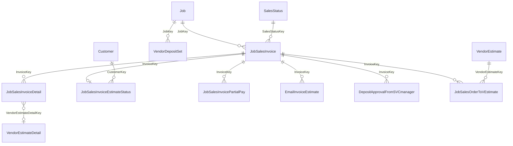
```mermaid
erDiagram
    Job ||--o{ JobSalesInvoice : JobKey
    JobSalesInvoice ||--o{ JobSalesInvoiceDetail : InvoiceKey
    JobSalesInvoice ||--o| JobSalesInvoiceEstimateStatus : InvoiceKey
    JobSalesInvoice ||--o{ JobSalesInvoicePartialPay : InvoiceKey
    JobSalesInvoice ||--o{ EmailInvoiceEstimate : InvoiceKey
    JobSalesInvoice ||--o{ DepositApprovalFromSVCmanager : InvoiceKey
    Job ||--o{ VendorDepositSet : JobKey
    JobSalesInvoice ||--o{ JobSalesOrderToVEstimate : InvoiceKey
    VendorEstimate ||--o{ JobSalesOrderToVEstimate : VendorEstimateKey
    JobSalesInvoiceDetail }o--o| VendorEstimateDetail : VendorEstimateDetailKey
    Customer ||--o{ JobSalesInvoiceEstimateStatus : CustomerKey
    SalesStatus ||--o{ JobSalesInvoice : SalesStatusKey
```

## Tables Referenced but Not Found

| Name | Actual Implementation |
|------|----------------------|
| `CustomerDeposit` (table) | Columns/tables listed above — not a standalone table |
| `VendorDeposit` (table) | `VendorDepositSet` |
| `crm.EstimateApproval` (for this feature) | Unused in Admin Portal code path — use `RespondedByCustomer` |

## GUID Constants Found in Code

| GUID | Usage |
|------|-------|
| `40F90F4E-434A-4BE0-B679-D98ED6ADF9ED` | Accounting status after invoice prep (`PrepInv`) |
| Job status 24 via `GlobalClass.GetJobStatus(24)` | ESTIMATE PREPPED FOR REVIEW |

**Note:** Exact GUID for status 24 resolved at runtime via `GetJobStatus` — lookup in `JobStatus` table for environment-specific value.


---

# 15. Status Transitions and Side Effects

## Status Transition Table

| Trigger | Before Status | After Status | Object Updated | Code Reference | DB Reference |
|---|---|---|---|---|---|
| Accounting dropdown change | Previous `AccountingStatusKey` | Selected AccountStatus | `Job.AccountingStatusKey` | `Utility/UpdateAccountingStatus` | `Job`, `AccountStatus` |
| Estimate prep + jobStatus1 checked | Prior job status | ESTIMATE PREPPED FOR REVIEW (status 24) | `Job.JobStatusKey` | `Prep`, `PrepWhenVendorEstimateIsConnected` | `Job`, `JobStatus` |
| Invoice prep success | Prior accounting status | `40F90F4E-434A-4BE0-B679-D98ED6ADF9ED` | `Job.AccountingStatusKey` | `PrepInv` | `Job`, `AccountStatus` |
| Invoice prep | `IsPrepped` prior | `IsPrepped = false` | `JobSalesInvoice` | `PrepInv` | `JobSalesInvoice` |
| Email estimate sent | Not sent | `SentToCustomer=true`, `SendEmailMarker` set | `JobSalesInvoice` | `EmailEstimateToCustomer` POST | `JobSalesInvoice` |
| Customer approves (portal/email) | `RespondedByCustomer` null/0 | `RespondedByCustomer=1` | `JobSalesInvoice` + status row | Customer Portal / approval helpers | `JobSalesInvoiceEstimateStatus.Accept` |
| Approve on behalf | Not approved | `RespondedByCustomer=1` | `JobSalesInvoice` | `UtilityTasks.ApproveEstimateOnBehalfOfCustomer` | Same |
| Mark estimate response viewed | `IsSeen=false` | `IsSeen=true` | `JobSalesInvoiceEstimateStatus` | `JobEstimateResponse/EstimateViewed` | Same |
| SVC deposit approval (manager) | `IsApproved` null/false | `IsApproved=true` | `DepositApprovalFromSVCmanager` | `SendEmailToSVCManagerForDepositApproval` | Table |
| SVC deposit request (non-manager) | No record / approved | `IsApproved=null` pending | `DepositApprovalFromSVCmanager` | Same | Table |
| Vendor est status change (modal Yes) | Prior vendor status | `Status=2`, `IsApproved=false` | `VendorEstimate` | `ChangeEstimateStatus` | `VendorEstimate` |
| Invoice created | Job not invoiced | `Job.Invoiced` updated | `Job` | `SaveSalesInvoiceEstimates` | `Job` |
| Invoice paid (accounting) | `InvoicePaid=false` | `InvoicePaid=true`, check/QB fields | `JobSalesInvoice`, partial pay | `ProcessInvoice` b1=2 | Multiple |
| Mark unpaid | Paid | `InvoicePaid=false`, cleared check/date | `JobSalesInvoice` | `SetInvoiceToUnpaid` | Multiple |
| Remove estimate | Active | `IsActive=false` | `JobSalesInvoice` + children | `RemoveSalesInvoice` | Multiple |
| Remove invoice | Active | `IsActive=false` | `JobSalesInvoice` | `RemoveInvoice` | Same |
| Deposit saved | No/partial deposit | `Isdeposit=true`, `DepositAmount` set | `JobSalesInvoice` | `SaveVendorDepositCustomerDeposit` | Same + `VendorDepositSet` |

## Action Needed / Dashboard / Highlights

| Side Effect | Trigger | Created/Updated/Cleared | Stored In | Cross-Module | Status |
|---|---|---|---|---|---|
| Estimate response highlight | Customer responds | Highlight factor 12 | `JobHighlights` / `GlobalClass.GlobalHighLights` | Dashboard tab menu | Confirmed |
| Clear response highlight | Mark viewed | Remove highlight 12 | `JobHighlights` | Dashboard | Confirmed |
| Email send action needed | Estimate email POST | Dashboard action update | Action needed tables via mail helpers | Dashboard | Confirmed — exact table **Needs Verification** per helper path |
| Invoice delete highlight | RemoveInvoice | Remove highlight 55 | `JobHighlights` | Dashboard | Confirmed |
| Job status note | Most major actions | General note | Notes via `ManageJobMessegingSetup` | Activity tab | Confirmed |
| Accounting checklist | Invoice create/pay/prep | Checklist flags | `ManageJobInvoicingStatusChecklist` | Accounting module | Confirmed |
| Vendor deposit highlight on pay | ProcessInvoice paid | Vendor highlights | Highlight helpers in SaveInvoiceReceivables | Vendor billing | Confirmed |

## RespondedByCustomer Values

| Value | Meaning in FillInvoiceList |
|-------|---------------------------|
| `null` → stored as 99 in view model | No response yet |
| `1` | Customer approved |
| Other values | **Needs Verification** — read from `JobSalesInvoice.RespondedByCustomer` usage in approval helpers |

## State Diagram (Estimate Lifecycle)

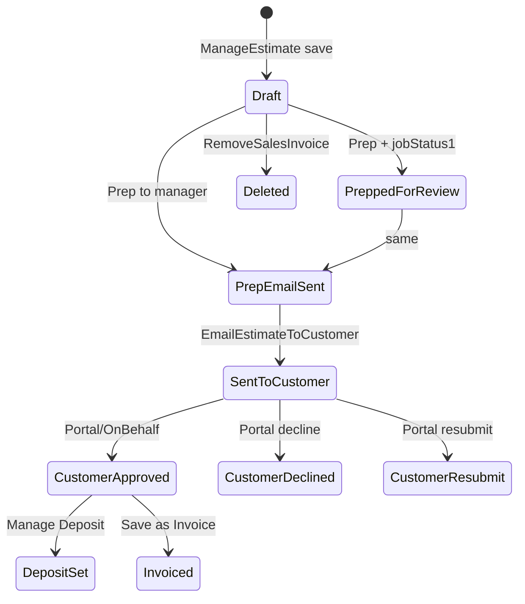
```mermaid
stateDiagram-v2
    [*] --> Draft: ManageEstimate save
    Draft --> PreppedForReview: Prep + jobStatus1
    Draft --> PrepEmailSent: Prep to manager
    PreppedForReview --> PrepEmailSent: same
    PrepEmailSent --> SentToCustomer: EmailEstimateToCustomer
    SentToCustomer --> CustomerApproved: Portal/OnBehalf
    SentToCustomer --> CustomerDeclined: Portal decline
    SentToCustomer --> CustomerResubmit: Portal resubmit
    CustomerApproved --> DepositSet: Manage Deposit
    CustomerApproved --> Invoiced: Save as Invoice
    Draft --> Deleted: RemoveSalesInvoice
```

## State Diagram (Invoice Lifecycle)

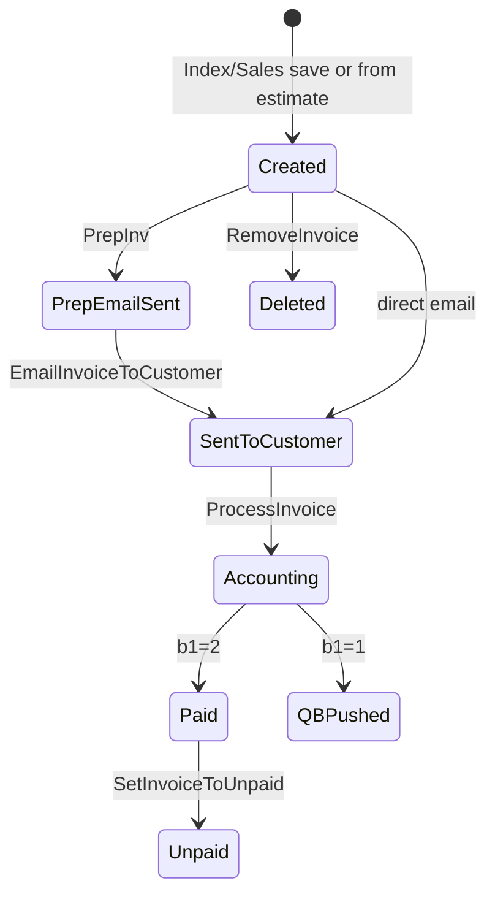
```mermaid
stateDiagram-v2
    [*] --> Created: Index/Sales save or from estimate
    Created --> PrepEmailSent: PrepInv
    PrepEmailSent --> SentToCustomer: EmailInvoiceToCustomer
    Created --> SentToCustomer: direct email
    SentToCustomer --> Accounting: ProcessInvoice
    Accounting --> Paid: b1=2
    Accounting --> QBPushed: b1=1
    Paid --> Unpaid: SetInvoiceToUnpaid
    Created --> Deleted: RemoveInvoice
```

## Cross-Module Impact Summary

| Module | Impact |
|--------|--------|
| Job profile | Job status, accounting status, invoiced flag |
| Dashboard | Highlights, action needed, estimate response colors |
| Customer portal | Approval links, response records |
| Vendor portal | Estimate creation on behalf |
| Accounting | ProcessInvoice, deposit lists, QB refs |
| Email app | Prep approval, token responses |
| Notes/activity | General notes on virtually every mutation |


---

# 16. Validation, Error, and Exception Handling

## Error Condition Table

| Condition / Error | Layer | Current Behavior | User Message | Risk | Recommendation |
|---|---|---|---|---|---|
| Session expired | Controller | Error view → Logout | "Sorry, your Session has Expired" | User loses work | Ensure AJAX handlers check session |
| Missing JobKey | Route | 404/error from EF | Framework error | Low if routed correctly | Validate job exists in action |
| Deposit not approved — estimate email | JS | Blocks navigation | "Waiting for manager approval for estimate send..." | User confusion if flags wrong | Verify `FillInvoiceList` deposit logic |
| Remove invoice — missing manager name | JS | Inline validation | "Please enter the name of the manager who approved." | — | — |
| Remove invoice — missing remarks | JS | Inline validation | "Please enter remarks." | — | — |
| Remove invoice — already paid | Backend JSON | Returns `2` | "This invoice cannot be deleted because payment has been made..." | Data integrity protected | — |
| Remove invoice — other error | Backend JSON | Returns error string | Displayed in modal | — | Log exception server-side |
| Mark unpaid — empty note | JS | Validation | "Please enter a note" | — | — |
| Mark unpaid — failure | Backend JSON | Error message | "Please try again later. {data}" | Partial state change risk | Verify transaction scope |
| Accounting status change declined | JS | Reverts dropdown | confirm cancelled | — | — |
| Accounting status update failure | AJAX | Reverts to `#acckey` | "Sorry Cannot update due to internal error." | UI/db mismatch | Check Utility action logs |
| Prep — no vendor/vendor option selected | JS | `#msgRed` | Selection required messages | — | — |
| Prep — mailToManager not checked | JS | `#msgRed` | "Please select SEND ESTIMATE TO MANAGER FOR REVIEW checkbox" | — | — |
| Prep — partial failure | Backend JSON | Concatenated message | Status changed but mail failed possible | Inconsistent state | Review transaction boundaries |
| Deposit — vendor YES/NO not all selected | JS | alertVendordepo | "You have to select YES or NO for each Vendor." | — | — |
| Deposit — zero vendor deposit | JS | alertVendordepo | "Deposit amount cannot be 0" | — | — |
| Deposit — customer amount empty/zero | JS | msgCustomerDepositAmount | Appropriate deposit messages | — | — |
| Deposit save failure | AJAX | Redirect with message | funcReturn.mess | — | — |
| Invoice create deposit gate | AJAX | Modal alert | funcReturn.mess from CheckForDepositInvoice | Blocks non-SVC users | Document SVC bypass rule |
| Email compose missing data | GET | ViewBag.mess | "Could not load Data due to missing information" | Empty form | — |
| FillInvoiceList exception | Setup | Swallowed in catch | Empty/partial grid — **no user message** | Silent data loss | Add logging; surface error |
| GetAllEstimateResponse post-loop | Setup | Returns `temp.ToList()` not `obj` | Wrong status/highlight possible | Display bugs | Fix or verify EF behavior |
| Concurrent edits | Session GlobalSales | Last save wins | No explicit warning | Data overwrite | Consider optimistic concurrency |
| Already approved estimate edit | `SaveCustomerEstimate` edit branch | **Resets approval** — sets `RespondedByCustomer=null`, `SentToCustomer=false`, clears `JobSalesInvoiceEstimateStatus`; does **not** block edit | Admin must re-send for customer approval | Documented behavior — not a bypass bug |
| Deposit email gate bypass | `EmailEstimateToCustomer` POST | **No server-side** `CanSendEmailToCustomer` check | Direct POST to email compose may skip JS gate | **Confirmed gap** — enforce on POST |
| Negative qty/rate | Client AddToGrid | Validation in branch views | Field required messages | Not on SaleEstimated hub | — |
| Unauthorized AJAX | Controllers | JSON error or redirect | Varies | Direct URL access | Verify all JSON endpoints check session |
| Email API failure | MailToCustomers | `DataReturn.flag=0` | `mess` contains `ex.Message` | Customer not notified; **no server log** | Add structured logging / monitoring |
| Blob service failure | BlobFileService | Exception in read/upload | Attachment missing | Email without files | Monitor file API |
| PDF generation failure | InvoiceCreator | Exception in POST | Error in redirect message | No email sent | — |

## Exception Paths in SaleEstimated Action

| Path | Handling |
|------|----------|
| `!GlobalClass.SystemSession` | `HandleErrorInfo` → Error view |
| No try/catch in action | Unhandled exceptions bubble to ASP.NET error handler |

## Exception Paths in Prep Actions

```csharp
catch (Exception ex) {
    mess = mess + ex.Message.ToString() + "Mail Could not be sent. ";
}
```

Job status change has separate try/catch — **partial success is possible**.

## Anti-Forgery

`SaleEstimated` form includes `@Html.AntiForgeryToken()` but primary mutations use GET JSON (`RemoveInvoice`, `SetInvoiceToUnpaid`) and POST JSON without visible token in JS — **CSRF risk on JSON GET endpoints**.

**Source:** `SaleEstimated.cshtml` line 763, `#SaveDelete` uses `$.getJSON` for `RemoveInvoice`.

## Null Reference Risks

| Location | Risk |
|----------|------|
| `db.JobSalesInvoice.Find(id)` in actions | Null if invalid key |
| `depositOverride` in SVC approval | Null-coalesced to "-" |
| `svcManager` null | Falls back to `AccountingAdminKey` static |

## Recommendations (Documentation Only — No Code Changes)

1. Add structured logging to `FillInvoiceList` catch block.
2. Verify `GetAllEstimateResponse` return list mutation bug in QA.
3. Review GET-based mutations (`RemoveInvoice`, `SetInvoiceToUnpaid`) for CSRF and idempotency.
4. Document `RespondedByCustomer` enum values in shared constants doc.
5. Add integration tests for deposit email gate matrix.


---

# 17. Authentication, Authorization, and Session

## Session Model

| Item | Detail |
|------|--------|
| Gate | `GlobalClass.SystemSession` (bool) |
| User identity | `GlobalClass.LoginUser` — `PersonnelKey`, `PName`, `Usergr`, email config |
| Session expiry | Returns `Error` view with `HandleErrorInfo` → `UserHome/Logout` |
| Applied to | `SaleEstimated`, `ApproveCustomerEstimate`, email GET views, `ProcessInvoice`, etc. |

**Source:** `MgtJobSalesOrderController.SaleEstimated` lines 742–773.

## Authorization Enforcement Table

| Area | Enforcement | Evidence | Risk |
|---|---|---|---|
| Page load SaleEstimated | `GlobalClass.SystemSession` | Controller | Session hijack if not HTTPS |
| JSON GET RemoveInvoice | Session check in action | Controller ~2889 | CSRF + no anti-forgery on GET |
| JSON GET SetInvoiceToUnpaid | Session check | Controller ~2777 | Same |
| Prep POST | No explicit role check | Controller | Any logged-in admin user |
| Email send POST | Session on GET; POST inherits | Controller | — |
| SVC manager auto-approve | `EmailSendToAddress.SendToType==38` match PersonnelKey | SendEmailToSVCManagerForDepositApproval | Privileged bypass intentional |
| SVC manager invoice bypass | `CheckIfLoggedInuserIsSvcManagerOrNot` | MgtDepositManagement | Deposit invoice gate bypass |
| Accounting status change | No role check in JS/controller trace | Utility action | Any session user |
| Vendor portal on behalf | `adminKey=PersonnelKey` in URL | SaleEstimated modal | URL param auth to vendor portal |
| Customer auto-login | `ContactKey` GUID in URL | `CustomerEmailForms` → `AutoLoginToEstimate` | No JWT/expiry; requires `CustomerLogin` record |
| Email app token links | JWT in `formOption` | Email App | Token expiry depends on JWT config |
| Email API | `X-API-Key` | EmailApiClient | Key in Web.config |
| File API | `RFIApiKey` | BlobFileService | Key in Web.config |
| Approve on behalf | Session on GET; DNE warnings display-only | `SaveAcceptedEstimate` → `UtilityTasks` | File or conversation text required on client |
| Direct URL to ManageEstimate | Session only | Controller | No per-estimate permission check traced |

## StaffKey / ContactKey Usage

| Key | Usage |
|-----|-------|
| `GlobalClass.LoginUser.PersonnelKey` | SVC check, vendor portal adminKey, email sender config |
| `CustomerContact.ContactKey` | Email recipient selection (estimate uses GUID in checkboxes) |
| `CreatedByCustomer` | Highlight default contact in email forms |

## UI-Only Restrictions

| Restriction | Enforced Server-Side? |
|-------------|----------------------|
| Email estimate blocked by `data-smallest` | **Partially** — JS on hub; POST does not re-check deposit flags (**confirmed gap**) |
| Edit estimate only if ESTCount==1 | UI only in view | Server ManageEstimate may still accept direct URL |
| Delete invoice manager approval | JS validation + server stores name | No auth proof of manager identity |

## Anti-Forgery

| Endpoint | Anti-Forgery |
|----------|--------------|
| SaleEstimated form | Token present but form mostly non-posting |
| Email POST views | `[ValidateAntiForgeryToken]` on POST — **Confirmed** on email actions |
| Prep AJAX POST | JSON POST without token visible in JS |
| Deposit save POST | JSON without token |

## Cross-Service Authentication

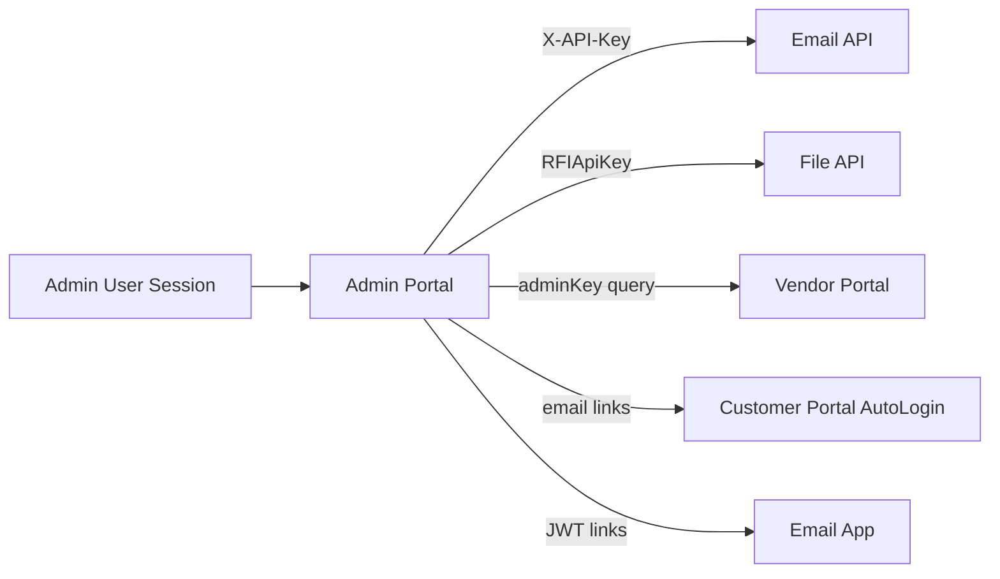
```mermaid
flowchart LR
    A[Admin User Session] --> B[Admin Portal]
    B -->|X-API-Key| C[Email API]
    B -->|RFIApiKey| D[File API]
    B -->|adminKey query| E[Vendor Portal]
    B -->|email links| F[Customer Portal AutoLogin]
    B -->|JWT links| G[Email App]
```

## Security Recommendations (Documentation Only)

1. Verify server-side deposit gate on `EmailEstimateToCustomer` POST matches `CanSendEmailToCustomer`.
2. Convert destructive GET JSON endpoints to POST with anti-forgery.
3. Audit CustomerAutoLogin link expiration and authorization.
4. Rotate API keys per environment; avoid committing production keys.


---

# 18. Configuration and Environment Dependencies

**Source file:** `D:\RFI Projects In New Framework\Admin Portal\ProjectRCS\Web.config` (appSettings)

## Configuration Table

| Config / Constant | Location | Used For | Risk |
|---|---|---|---|
| `EmailApiBaseUrl` | Web.config | Email Service API base URL | Wrong env sends real emails from dev |
| `EmailApiKey` | Web.config | `X-API-Key` header | Secret exposure in config file |
| `FILESERVEURL` | Web.config | File Storage API base | Broken attachments if wrong |
| `RFIEXTERNALAUTHKEY` | Web.config | File API `RFIApiKey` header | Secret exposure |
| `CustomerAutoLoginToEstimate` | Web.config | Customer estimate email CTA | Broken approval links |
| `CustomerAutoLoginToAJob` | Web.config | General customer job login | Portal navigation |
| `CustomerPortalLogin` | Web.config | Portal base URL | Email templates |
| `customerEstimateApproval` | Web.config | Token estimate response URL | Email App dependency |
| `customerEstimateResubmit` | Web.config | Resubmit request URL | Email App |
| `approvecustomerestimate` | Web.config | Prep manager estimate approval | Email App |
| `approvecustomerinvoice` | Web.config | Prep manager invoice approval | Email App |
| `approveDeposit` / `declineDeposit` | Web.config | SVC deposit approve/decline | Email App MgtDeposit |
| `vendorloginfromadminWIthTaskOptions` | Web.config | Vendor portal admin task login | Vendor estimate on behalf |
| `JobOpsApiBaseUrl` | Web.config | Job Ops API | Not used in SaleEstimated traced flows |
| `LegacyWebServiceBaseUrl` / appservice URLs | Web.config | Dashboard, vendor lists | Other features |
| `GlobalClass.GetJobStatus(24)` | Code constant index | ESTIMATE PREPPED FOR REVIEW GUID | Environment-specific GUID in DB |
| `40F90F4E-434A-4BE0-B679-D98ED6ADF9ED` | Hardcoded in PrepInv | Accounting status after invoice prep | Breaks if GUID changes in DB |
| `SystemStaticID.StaticValue[AccountingAdminKey]` | Code | Fallback SVC approver | Static GUID dependency |
| SendToType `33`, `34`, `38` | DB `EmailSendToAddress` | Prep invoice, prep estimate, SVC | Misconfiguration blocks emails |
| SendID `133`, `134` | DB `EmailSentToJustEmail` | BCC lists | Missing BCC recipients |
| summernote CDN | SaleEstimated view | Rich text editor | CDN availability |
| dropzone | ~/Scripts/dropzone/ | File upload UI | Local script dependency |

## Environment URL Examples (Dev — from Web.config)

```
EmailApiBaseUrl = https://service-rfi-email-api-dev.retailfixitapp.com
FILESERVEURL = https://service-rfi-file-storage-api-dev.retailfixitapp.com/
CustomerAutoLoginToEstimate = https://customer-dev.retailfixitapp.com/Home/AutoLoginToEstimate/
vendorloginfromadminWIthTaskOptions = https://vendor-dev.retailfixitapp.com/VendorLogin/LoginByRCSadminWithTaskOptions?JobKey=
approvecustomerestimate = https://rcsappmailer-dev.retailfixitapp.com/ManageCustomerEstimate/AdminApprovalforPrep/
```

## Hardcoded Business Constants

| Constant | Value | Location |
|----------|-------|----------|
| 80% DNE threshold factor | `0.8m` | `ApproveCustomerEstimate` action |
| 35% customer deposit best practice | `TotalVendorDeposit * 0.35 + TotalVendorDeposit` | ManageCustomerVendorDeposit.js |
| 50% vendor deposit override threshold | `data-half` on vendor rows | Server-rendered deposit HTML |
| Dropzone maxFiles | 25 | SaleEstimated.cshtml |
| parallelUploads | 55 | SaleEstimated.cshtml |

## Logging

| Component | Behavior | Evidence |
|-----------|----------|----------|
| `FillInvoiceList` catch | Swallows exception — empty/partial grid, **no user message** | `JobSalesEstimateSetup.cs` catch block |
| `MailToCustomers` | `catch` → `DataReturn.mess = ex.Message`, `flag = 0` | All send methods; e.g. `SendSurveyMailToLocationManager:1840–1844` |
| `EmailApiClient` | Returns `EmailApiResponse.Error` on HTTP failure — **no log write** | `EmailApiClient.cs:332–336` |
| Application Insights | **Not used** in `MailToCustomers` or `EmailApiClient` | Grep: no `TelemetryClient` / `ApplicationInsights` in Mailing folder |
| log4net | Configured app-wide in `Global.asax.cs` | **Not invoked** from `MailToCustomers` |
| Operator visibility | `GlobalClass.estimateConfirmMessege` on redirect; prep JSON appends exception text; general notes for survey failures | Controller POST branches |

**Confirmed gap:** Email send failures are visible to the admin user in-session but are **not** written to a centralized log or telemetry stream. Production troubleshooting requires DB general notes, user reports, or Email API-side logs.

## Deployment Checklist

1. Set all `*-dev.retailfixitapp.com` URLs to target environment.
2. Rotate `EmailApiKey` and `RFIEXTERNALAUTHKEY`.
3. Verify `EmailSendToAddress` SendToType 33/34/38 recipients exist in target DB.
4. Verify `AccountStatus` contains GUID `40F90F4E-434A-4BE0-B679-D98ED6ADF9ED`.
5. Verify `JobStatus` entry for `GetJobStatus(24)`.


---

# 19. Diagrams (Evidence-Based)

All diagrams derived from traced code paths only.

## 1. SaleEstimated Page Load Flow

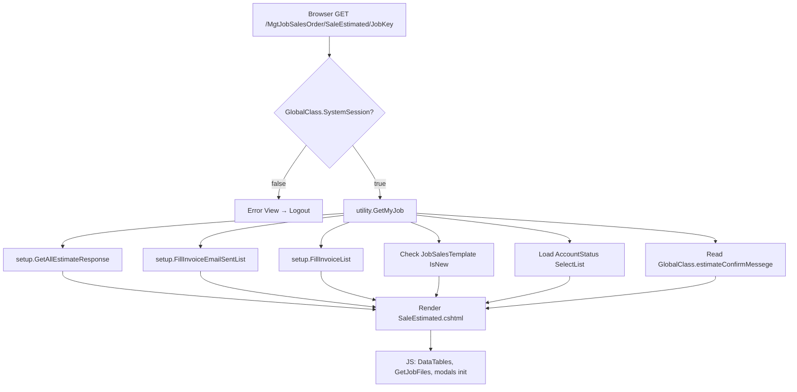
```mermaid
flowchart TD
    A[Browser GET /MgtJobSalesOrder/SaleEstimated/JobKey] --> B{GlobalClass.SystemSession?}
    B -->|false| C[Error View → Logout]
    B -->|true| D[utility.GetMyJob]
    D --> E[setup.GetAllEstimateResponse]
    D --> F[setup.FillInvoiceEmailSentList]
    D --> G[setup.FillInvoiceList]
    D --> H[Check JobSalesTemplate IsNew]
    D --> I[Load AccountStatus SelectList]
    D --> J[Read GlobalClass.estimateConfirmMessege]
    E --> K[Render SaleEstimated.cshtml]
    F --> K
    G --> K
    H --> K
    I --> K
    J --> K
    K --> L[JS: DataTables, GetJobFiles, modals init]
```

## 2. Customer Estimate Create/Edit/Save Flow

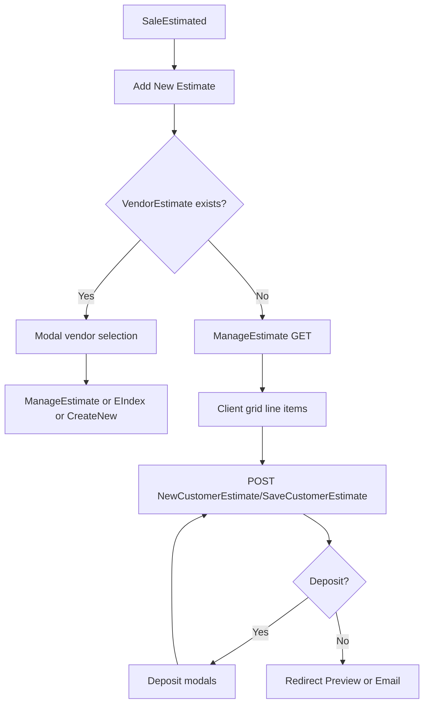
```mermaid
flowchart TD
    A[SaleEstimated] --> B[Add New Estimate]
    B --> C{VendorEstimate exists?}
    C -->|No| D[ManageEstimate GET]
    C -->|Yes| E[Modal vendor selection]
    E --> F[ManageEstimate or EIndex or CreateNew]
    D --> G[Client grid line items]
    G --> H[POST NewCustomerEstimate/SaveCustomerEstimate]
    H --> I{Deposit?}
    I -->|Yes| J[Deposit modals]
    I -->|No| K[Redirect Preview or Email]
    J --> H
```

## 3. Customer Estimate Approval Flow

```mermaid
flowchart TD
    A[Estimate emailed to customer] --> B[Customer opens AutoLoginToEstimate link]
    B --> C[Customer Portal ManageEstimates]
    C --> D{Customer action}
    D -->|Approve| E[SimplyApproveEstimate]
    D -->|Decline| F[Decline handler]
    D -->|Resubmit| G[ChangeEstimate]
    E --> H[JobSalesInvoiceEstimateStatus + RespondedByCustomer]
    H --> I[Dashboard highlight]
    
    A --> J[Admin: Approve on Behalf button]
    J --> K[ApproveCustomerEstimate view]
    K --> L[SaveAcceptedEstimate]
    L --> H
```

## 4. Customer Estimate Email/PDF Flow

```mermaid
sequenceDiagram
    participant SE as SaleEstimated
    participant EC as EmailEstimateToCustomer
    participant IC as InvoiceCreator
    participant MC as MailToCustomers
    participant API as Email Service API

    SE->>EC: GET if CanSendEmailToCustomer
    EC->>EC: FillEstimateEmailToCustomer
    EC->>IC: CreateEstimatedToCustomer2ndEdition
    EC->>MC: SendEstimatedToCustomer per contact
    MC->>API: POST send-customer-email
    MC->>MC: Archive PDF to blob + EmailInvoiceEstimate
```

## 5. Customer Invoice Create/Edit/Save Flow

```mermaid
flowchart TD
    A[SaleEstimated Add New Invoice] --> B[CheckForDepositInvoice]
    B --> C[GotoInvoice]
    C --> D{VendorInvoice exists?}
    D -->|No| E[Index GET id2=1]
    D -->|Yes| F[CreateInvoiceNew from vendor]
    E --> G[POST Index SaveSalesInvoiceEstimates]
    F --> H[Sales editor]
    G --> I[Redirect SaleEstimated]
    H --> J[POST Sales UpdateSalesInvoiceEstimates]
    J --> K[Redirect Preview or SaleEstimated]
```

## 6. Customer Invoice Email/PDF Flow

```mermaid
sequenceDiagram
    participant SE as SaleEstimated
    participant EI as EmailInvoiceToCustomer
    participant IC as InvoiceCreator
    participant MC as MailToCustomers

    SE->>EI: GET link
    EI->>IC: CreateInvoiceForCustomer + inline HTML
    EI->>MC: SendInvoiceToCustomer
    MC->>MC: Email API + blob archive
```

## 7. Deposit/DNE Decision Flow

```mermaid
flowchart TD
    A[Manage Deposit click] --> B[GetCustomerEstimateTotalForDeposit]
    B --> C{Vendor deposits linked?}
    C -->|Yes| D[Vendor deposit modal YES/NO amounts]
    C -->|No| E[Customer deposit modal]
    D --> E
    E --> F{Customer deposit valid?}
    F -->|Override needed| G[Override confirmation]
    F -->|OK| H[SaveVendorDepositCustomerDeposit]
    G --> H
    H --> I{SVC approval needed?}
    I -->|Yes| J[CanSendEmailToCustomer=0 until approved]
    I -->|No| K[Email allowed]
    J --> L[Send SVC Manager button]
    L --> M[DepositApprovalFromSVCmanager]
```

## 8. Status Transition Diagram

See `13_Status_Transitions_and_Side_Effects.md` state diagrams.

## 9. External Service Dependency Map

```mermaid
flowchart LR
    SE[SaleEstimated] --> AP[Admin Portal MVC]
    AP --> SQL[(SQL Server)]
    AP --> EM[Email API]
    AP --> FS[File Storage API]
    EM --> CP[Customer Portal]
    EM --> EA[Email App]
    AP --> VP[Vendor Portal]
```

## 10. Database ERD

See `12_Database_Documentation.md` ERD section.

## 11. Error/Exception Flow

```mermaid
flowchart TD
    A[User Action] --> B{Session valid?}
    B -->|No| C[Error Logout]
    B -->|Yes| D[Controller/JS validation]
    D -->|Fail| E[User message modal/alert]
    D -->|Pass| F[Business logic]
    F -->|Exception| G[Catch: append to JSON message or Error view]
    F -->|Success| H[Redirect/Reload SaleEstimated]
```

## 12. Cross-Module Side-Effect Flow

```mermaid
flowchart TD
    A[Estimate/Invoice mutation] --> B[ManageJobMessegingSetup.SaveGeneralNote]
    A --> C[Job status / accounting status]
    A --> D[JobHighlights]
    A --> E[EmailInvoiceEstimate log]
    A --> F[Accounting checklist]
    A --> G[Action needed / dashboard]
    B --> H[Activity tab]
    D --> I[Dashboard UI]
```

## Line Item Calculation Flow

```mermaid
flowchart LR
    A[User enters Rate Qty] --> B[Client Amt = Rate * Qty]
    B --> C[Save to JobSalesInvoiceDetail]
    C --> D[Grid total: SUM Rate*Qty]
    D --> E[Deposit calc: smallest multi-option total]
```

**Source:** `JobSalesInvoiceDetail` fields; `GetCustomerEstimateTotalForDeposit`; ManageEstimate client grid.


---

# 20. Read-Only SQL Verification Queries

**Safety:** SELECT-only. Replace `@JobKey`, `@InvoiceKey`, `@EstimateKey` with actual GUIDs.

## Job Estimate and Invoice Headers

```sql
-- All active estimates and invoices for a job
SELECT InvoiceKey, JobKey, IsEstimate, IsActive, RemovedDueToEdit,
       InvoiceNo, CreatedDate, MCEstimate, MutiEstiIdentifier,
       MultipleChoiceEstimate, Isdeposit, DepositAmount, RespondedByCustomer,
       SentToCustomer, SendEmailMarker, InvoicePaid, IsPrepped, SalesStatusKey
FROM dbo.JobSalesInvoice
WHERE JobKey = @JobKey
  AND IsActive = 1
  AND RemovedDueToEdit IS NULL
ORDER BY CreatedDate DESC;
```

## Customer Estimate Line Items

```sql
SELECT d.DetailKey, d.InvoiceKey, d.ChargeTypeKey, d.Description,
       d.Rate, d.Qty, d.Amt, d.CostIncurred, d.VendorEstimateDetailKey, d.Display
FROM dbo.JobSalesInvoiceDetail d
INNER JOIN dbo.JobSalesInvoice i ON i.InvoiceKey = d.InvoiceKey
WHERE i.JobKey = @JobKey
  AND i.IsEstimate = 1
  AND i.IsActive = 1
  AND i.RemovedDueToEdit IS NULL
ORDER BY d.InvoiceKey, d.Display;
```

## Customer Invoice Line Items

```sql
SELECT d.DetailKey, d.InvoiceKey, d.Rate, d.Qty, d.Amt, d.Description
FROM dbo.JobSalesInvoiceDetail d
INNER JOIN dbo.JobSalesInvoice i ON i.InvoiceKey = d.InvoiceKey
WHERE i.JobKey = @JobKey
  AND i.IsEstimate = 0
  AND i.IsActive = 1
ORDER BY d.InvoiceKey;
```

## Invoice Totals Check

```sql
SELECT i.InvoiceKey, i.IsEstimate, i.InvoiceNo,
       SUM(ROUND(d.Rate, 2) * ROUND(d.Qty, 2)) AS CalculatedTotal
FROM dbo.JobSalesInvoice i
LEFT JOIN dbo.JobSalesInvoiceDetail d ON d.InvoiceKey = i.InvoiceKey
WHERE i.JobKey = @JobKey AND i.IsActive = 1
GROUP BY i.InvoiceKey, i.IsEstimate, i.InvoiceNo;
```

## Vendor Estimate Link

```sql
SELECT jso.InvoiceKey AS CustomerEstimateKey,
       jso.VendorEstimateKey,
       ve.VendorKey, ve.Status AS VendorEstimateStatus
FROM dbo.JobSalesOrderToVEstimate jso
INNER JOIN dbo.VendorEstimate ve ON ve.InvoiceKey = jso.VendorEstimateKey
WHERE jso.InvoiceKey = @EstimateKey;
```

## Estimate Approval Status

```sql
SELECT es.Pkey, es.InvoiceKey, es.JobKey, es.Accept, es.Decline,
       es.Resubmit, es.IsSeen, es.Remark, es.CreatedDate
FROM dbo.JobSalesInvoiceEstimateStatus es
WHERE es.JobKey = @JobKey
ORDER BY es.CreatedDate DESC;
```

## Job Status After Approval

```sql
SELECT j.JobKey, j.JobName, j.JobStatusKey, js.TName AS JobStatusName,
       j.AccountingStatusKey, ac.TName AS AccountingStatusName,
       j.Invoiced, j.ReceivableStatus
FROM dbo.Job j
LEFT JOIN dbo.JobStatus js ON js.ID = j.JobStatusKey
LEFT JOIN dbo.AccountStatus ac ON ac.ID = j.AccountingStatusKey
WHERE j.JobKey = @JobKey;
```

## Deposit Records

```sql
-- Customer deposit on estimate header
SELECT InvoiceKey, Isdeposit, DepositAmount, ReasonForNoDeposit, RespondedByCustomer
FROM dbo.JobSalesInvoice
WHERE JobKey = @JobKey AND IsEstimate = 1 AND IsActive = 1;

-- SVC deposit approval
SELECT PKey, InvoiceKey, JobKey, IsApproved, ManagerName, ApprovalSentDate, ApprovedDeclinedOn
FROM dbo.DepositApprovalFromSVCmanager
WHERE JobKey = @JobKey;

-- Vendor deposits
SELECT PKey, JobKey, VendorKey, DepositAmount, DepositSetDate, ApprovedBy
FROM dbo.VendorDepositSet
WHERE JobKey = @JobKey;

-- Partial pay / deposit invoices
SELECT Pkey, InvoiceKey, Deposit, DepositAmount, Paid, CheckNo
FROM dbo.JobSalesInvoicePartialPay
WHERE JobKey = @JobKey;
```

## DNE Fields

```sql
SELECT JobKey, JobName, PO, RevCustomerDNE
FROM dbo.Job
WHERE JobKey = @JobKey;
```

## Action Needed / Highlights

```sql
SELECT HighlightKey, JobKey, HighlightFactor, HighlightText
FROM dbo.JobHighlights
WHERE JobKey = @JobKey;

-- Estimate response highlight factor 12
SELECT * FROM dbo.JobHighlights
WHERE JobKey = @JobKey AND HighlightFactor = 12;
```

## Email Log

```sql
SELECT Pkey, JobKey, InvoiceKey, IsInvoice, SentOn, Subject, SentBy
FROM dbo.EmailInvoiceEstimate
WHERE JobKey = @JobKey
ORDER BY SentOn DESC;
```

## File Attachment Metadata

```sql
SELECT FileKey, JobKey, Title, AddedOn, FileCategory
FROM dbo.JobFile
WHERE JobKey = @JobKey
ORDER BY AddedOn DESC;
```

## Data Quality Checks

```sql
-- Approved estimates but no response row
SELECT i.InvoiceKey, i.RespondedByCustomer
FROM dbo.JobSalesInvoice i
WHERE i.JobKey = @JobKey AND i.IsEstimate = 1 AND i.IsActive = 1
  AND i.RespondedByCustomer = 1
  AND NOT EXISTS (
    SELECT 1 FROM dbo.JobSalesInvoiceEstimateStatus es
    WHERE es.InvoiceKey = i.InvoiceKey AND es.Accept = 1
  );

-- Invoices with line items but zero total
SELECT i.InvoiceKey, i.InvoiceNo
FROM dbo.JobSalesInvoice i
WHERE i.JobKey = @JobKey AND i.IsEstimate = 0 AND i.IsActive = 1
  AND NOT EXISTS (
    SELECT 1 FROM dbo.JobSalesInvoiceDetail d
    WHERE d.InvoiceKey = i.InvoiceKey AND (d.Rate * d.Qty) > 0
  );

-- Recently updated records (last 7 days)
SELECT InvoiceKey, IsEstimate, CreatedDate, Remark
FROM dbo.JobSalesInvoice
WHERE JobKey = @JobKey
  AND CreatedDate >= DATEADD(day, -7, GETUTCDATE())
ORDER BY CreatedDate DESC;
```

## SQL Function Verification

```sql
SELECT dbo.GetEstimateStatus(@InvoiceKey) AS EstimateStatusHtml;
SELECT dbo.GetCustomerInvoiceTotal(@InvoiceKey) AS InvoiceTotal;
```


---

# 21. Developer Debugging Guide

## Files to Open First

| Priority | File | Why |
|----------|------|-----|
| 1 | `Views\MgtJobSalesOrder\SaleEstimated.cshtml` | All UI triggers and inline JS |
| 2 | `Controllers\MgtJobSalesOrderController.cs` | SaleEstimated + prep/email/delete actions |
| 3 | `DatabaseInteraction\JobSalesEstimateSetup.cs` | `FillInvoiceList` deposit flags + inline HTML |
| 4 | `FormScripts\ManageCustomerVendorDeposit.js` | Deposit workflow |
| 5 | `FormScripts\ManageDepositInvoice.js` | Invoice create gate |
| 6 | `Mailing\MailToCustomers.cs` | Customer email send failures |
| 7 | `Web.config` | API URLs and portal links |

## Browser DevTools — Network Tab

Monitor these calls when reproducing issues:

| Symptom area | Watch for |
|--------------|-----------|
| Page load | `SaleEstimated/{guid}` document request |
| Accounting change | `Utility/UpdateAccountingStatus` |
| Prep estimate | `CheckIfConnectedToVendorestimate`, `Prep` POST |
| Prep invoice | `PrepInv` POST |
| Deposit | `GetCustomerEstimateTotalForDeposit`, `SaveVendorDepositCustomerDeposit` |
| Delete invoice | `RemoveInvoice?InvoiceKey=` |
| Unpaid | `SetInvoiceToUnpaid` |
| Add invoice | `CheckForDepositInvoice` POST |

## JavaScript Breakpoints

| Breakpoint location | Purpose |
|--------------------|---------|
| `EmailEstimateToCustomer` function | Deposit email gate |
| `#Process.click` handler | Estimate prep submission |
| `#InvoicePrepSend.click` | Invoice prep |
| `ManageCustomerDeposit` | Deposit flow start |
| `SaveVendordepositAndCustomerDepositInDatabase` | Deposit save payload |
| `#SaveDelete.click` | Invoice deletion |

## Backend Breakpoints

| Method | File |
|--------|------|
| `SaleEstimated` | MgtJobSalesOrderController |
| `FillInvoiceList` | JobSalesEstimateSetup |
| `SendEmailToSVCManagerForDepositApproval` | MgtJobSalesOrderController |
| `Prep` / `PrepInv` | MgtJobSalesOrderController |
| `RemoveInvoice` | MgtJobSalesOrderController |
| `SendEstimatedToCustomer` | MailToCustomers |
| `SaveVendorDepositCustomerDeposit` | NewCustomerEstimateController |

## Symptom → Cause Table

| Symptom | Likely Cause | Frontend Check | Backend/API Check | DB Check | Fix Direction |
|---------|--------------|----------------|-------------------|----------|---------------|
| Email estimate button shows alert | `CanSendEmailToCustomer=0` | `data-smallest` on `<td>` | `FillInvoiceList` logic | `DepositApprovalFromSVCmanager.IsApproved` | Complete SVC deposit approval |
| Manage Deposit missing | Row condition false | Deposit column empty | `IsDepositApproved`, `NoDepositPresent` | `Isdeposit`, `VendorDepositSet` | Set deposit or vendor deposit |
| Grid empty | FillInvoiceList exception | Network 200 but empty tbody | Server logs / debug FillInvoiceList | Active JobSalesInvoice rows? | Fix data or exception |
| Prep email not received | MailToAdmin failure | AJAX response message | Email API logs | `EmailSendToAddress` type 33/34 | Verify recipients + API key |
| Cannot delete invoice | Paid partial pay | JSON response `2` | RemoveInvoice | `JobSalesInvoicePartialPay.Paid=1` | Mark unpaid first or accounting reversal |
| Accounting status reverts | User cancelled or API fail | `#acckey` vs dropdown | UpdateAccountingStatus returns non-1 | Job.AccountingStatusKey | Retry update |
| Vendor files missing in prep | GetJobFiles failed | Checkbox list empty | GetJobFilesForModal JSON | JobFile for JobKey | Upload job files |
| Wrong estimate total in deposit | Multi-option smallest total | CustomerInvoiceTotalForDepositCalc | GetCustomerEstimateTotalForDeposit | Multiple MCEstimate rows | Verify MutiEstiIdentifier set |
| Customer response not showing | No status row | example3 empty | GetAllEstimateResponse | JobSalesInvoiceEstimateStatus | Customer approval path |
| Highlight won't clear | Mark viewed failed | Link clicked? | EstimateViewed action | IsSeen still 0 | Re-run EstimateViewed |

## Config Keys to Verify

- `EmailApiBaseUrl`, `EmailApiKey`
- `FILESERVEURL`, `RFIEXTERNALAUTHKEY`
- `CustomerAutoLoginToEstimate`
- `vendorloginfromadminWIthTaskOptions`

## SQL Quick Checks

```sql
-- Deposit gate for specific estimate
SELECT i.InvoiceKey, i.Isdeposit, i.DepositAmount, i.RespondedByCustomer,
       d.IsApproved AS SVCApproved
FROM dbo.JobSalesInvoice i
LEFT JOIN dbo.DepositApprovalFromSVCmanager d ON d.InvoiceKey = i.InvoiceKey
WHERE i.InvoiceKey = @InvoiceKey;
```

## Logs to Check

| Log | Location |
|-----|----------|
| Email API response | `DataReturn.mess` in UI flash / alert modal |
| IIS / ASP.NET errors | Server event log for unhandled exceptions |
| FillInvoiceList | No logging today — use debugger on catch | **Gap** |

## Common Development Mistakes

1. Confusing `InvoiceKey` on estimate vs invoice rows (same column name).
2. Testing email on dev without checking Email API target environment.
3. Forgetting `StoreGuid` before dropzone upload (files attach to wrong record).
4. Editing estimate with `ESTCount != 1` — Edit link hidden but direct URL may work.


---

# 22. Regression Test Plan

Replace `@JobKey`, `@EstimateKey`, `@InvoiceKey` with test data GUIDs.

## Test Scenarios

| Test Scenario | Preconditions | Steps | Expected UI Result | Expected API/Web Service Call | Expected DB Result |
|---|---|---|---|---|---|
| Open SaleEstimated | Valid session, job exists | Navigate to `/MgtJobSalesOrder/SaleEstimated/{JobKey}` | Page loads with 3 grids | GET SaleEstimated | Read JobSalesInvoice, statuses |
| Load estimate data | Job has active estimates | Open page | example4 shows estimate rows with inline HTML | FillInvoiceList | IsEstimate=1 rows |
| Load invoice data | Job has active invoices | Open page | example4 shows invoice rows | FillInvoiceList | IsEstimate=0 rows |
| Load estimate responses | Customer responded | Open page | example3 shows Accept/Decline/Resubmit | GetAllEstimateResponse | JobSalesInvoiceEstimateStatus rows |
| Load email sent list | Prior emails sent | Open page | example5 shows subjects | FillInvoiceEmailSentList | EmailInvoiceEstimate rows |
| Flash confirm message | Prior action set GlobalClass.estimateConfirmMessege | Open page | alertmsg modal shows message | — | Message cleared from global |
| Change accounting status | User confirms | Change dropdown, confirm OK | Alert success | GET UpdateAccountingStatus | Job.AccountingStatusKey updated |
| Cancel accounting change | — | Change dropdown, cancel | Dropdown reverts | No call | No change |
| Add estimate scratch | No vendor estimates | Click Add New Estimate | Redirect ManageEstimate | CheckForVendorEstimate returns 0 | NewEstimateKey in URL |
| Add estimate from vendor | Vendor estimates exist | Add New Estimate | Modal with vendor buttons | CheckForVendorEstimate returns 1 | — |
| Create from vendor with status change | Vendor estimate selected | CreateEst → Yes | Redirect CreateNew | ChangeEstimateStatus JSON 1 | VendorEstimate.Status=2 |
| Edit estimate | ESTCount=1 | Click Edit | ManageEstimate loads | ManageEstimate GET | Details loaded |
| Edit estimate hidden | ESTCount>1 | — | No Edit link | — | — |
| Remove estimate | Active estimate | Remove + confirm | Redirect SaleEstimated | RemoveSalesInvoice | IsActive=0, deposit cleanup |
| Preview estimate | Active estimate | Preview link | PreviewEstimates view | Preview redirect | Read only |
| Compare estimate versions | OlderVersionBeforeUpdate>0 | Update made link | PreviewWithCompare | FillEstimateForPreview | Read JobSalesInvoiceAfterUpdate |
| Prep estimate (no vendor link) | Estimate row | Send for Manager Review → Process | alertmsg with result | POST Prep | Optional JobStatus 24, email sent |
| Prep estimate (vendor linked) | Linked vendor estimate | Prep → Process | alertmsg | POST PrepWhenVendorEstimateIsConnected | Vendor data in email |
| Prep invoice | Invoice row | InvForPrep → Send | alertmsg | POST PrepInv | AccountingStatusKey updated, email |
| SVC deposit approval | IsDepositApproved=0 | Click SVC button | Redirect SaleEstimated | SendEmailToSVCManagerForDepositApproval | DepositApprovalFromSVCmanager row |
| Email estimate blocked | CanSendEmailToCustomer=0 | Email button | alertmsg deposit message | No navigation | — |
| Email estimate allowed | CanSendEmailToCustomer=1 | Email button | EmailEstimateToCustomer form | GET EmailEstimateToCustomer | — |
| Send estimate email | Email form complete | POST send | Redirect SaleEstimated + message | Email API send-customer-email | SentToCustomer=true |
| Approve on behalf | Button visible in grid | Click Approve on Behalf | ApproveCustomerEstimate view | GET ApproveCustomerEstimate | — |
| Mark response viewed | Unseen response | MARK AS VIEWED | Redirect SaleEstimated | EstimateViewed | IsSeen=true, highlight 12 cleared |
| Manage deposit | Deposit button visible | Manage Deposit → complete wizard | Redirect SaleEstimated | SaveVendorDepositCustomerDeposit | DepositAmount, VendorDepositSet |
| Add invoice scratch | No vendor invoices | Add New Invoice | Redirect Index id2=1 | CheckForDepositInvoice, CheckForVendorInvoice | — |
| Add invoice from vendor | Vendor invoices exist | Add invoice → vendor button | CreateInvoiceNew | — | — |
| Edit invoice | Active invoice | Edit link | Sales view | Sales GET | GlobalSales populated |
| Remove invoice | Unpaid invoice | Remove modal with manager+remarks | Page reload | RemoveInvoice JSON 1 | IsActive=0 |
| Remove paid invoice | Paid partial pay | Remove attempt | Error message data=2 | RemoveInvoice | No delete |
| Email invoice | Invoice row | EMAIL TO CUSTOMER | Email form | GET EmailInvoiceToCustomer | — |
| Send invoice email | Form complete | POST | Redirect SaleEstimated | Email API | Sent flags set |
| Accounting page | Invoice exists | Accounting link | ProcessInvoice view | GET ProcessInvoice | Preview data |
| Mark paid | ProcessInvoice | b1=2 with check no | Success redirect | SaveInvoiceReceivables | InvoicePaid=true |
| Mark unpaid | Paid invoice | Mark unpaid + note | Redirect SaleEstimated | SetInvoiceToUnpaid JSON 1 | InvoicePaid=false |
| Resend email | Email in example5 | View/Resend | ShowOldCustomerEstimateInvEmail | GET Index | Load EmailInvoiceEstimate |
| Configure sales order | — | Configure link | ConfigureSalesOrder form | GET | Read config |
| Template link | — | Template click | MgtJobInvoiceTemplate | Navigation | — |
| Vendor portal create | Vendor modal | Create on behalf | New tab vendor portal | window.open vendor URL | — |
| Session expired | Session timeout | Open SaleEstimated | Error logout view | — | — |
| Dropzone upload prep | Prep modal open | Drop file | File in dropzone | UploadFilesEst POST | TempJobNoteFile row |

## Line Item Tests (Branch Views)

| Test Scenario | Preconditions | Steps | Expected Result |
|---|---|---|---|
| Add estimate line item | ManageEstimate open | AddToGrid + Save | JobSalesInvoiceDetail insert |
| Edit estimate line item | Existing estimate | Modify grid + Save | Detail update |
| Cost incurred validation | Estimate mode | Missing incurred/proposed | Client validation message |
| Save as invoice | Estimate saved | Save As Invoice | New IsEstimate=0 record |
| Add invoice line Index | Index open | Add to Grid + Save | SaveSalesInvoiceEstimates |
| Vendor cost exceed check | Index save | Save with high total | Modal if vendor costs exceed |

## Status Verification Tests

| After Action | Verify |
|--------------|--------|
| Estimate prep + checkbox | Job.JobStatusKey = status 24 |
| Invoice prep | Job.AccountingStatusKey = 40F90F4E-... |
| Customer approve | RespondedByCustomer=1, EstimateStatus Accept |
| Email sent | EmailInvoiceEstimate row created |

## Negative / Failure Tests

| Scenario | Expected |
|----------|----------|
| Email API down | DataReturn.flag=0, user sees error message |
| File API down | Missing attachment, email may still send |
| DB save failure deposit | funcReturn.flag=0, redirect with error |
| Concurrent edit Index/Sales | Last save wins (GlobalSales) |


---

# 23. Risks, Technical Debt, and Open Questions

## Findings Table

| Finding | Layer | Evidence | Impact | Recommendation |
|---|---|---|---|---|
| Large monolithic view (1453 lines) | View | SaleEstimated.cshtml | Hard to maintain/test | Extract partials/JS modules when refactoring allowed |
| Large controller (~3000 lines) | Controller | MgtJobSalesOrderController.cs | Cognitive load, merge conflicts | Split by workflow area in future |
| Inline JavaScript ~740 lines | Frontend | SaleEstimated.cshtml | No type checking; legacy dead handlers remain | Remove dead code per module 31 |
| Single table for est+invoice | DB/Domain | JobSalesInvoice.IsEstimate | Confusion, query complexity | Document clearly |
| FillInvoiceList silent catch | Backend | JobSalesEstimateSetup:305-308 | Empty grid without error | Add logging and user-visible warning |
| GetAllEstimateResponse return bug | Backend | Returns `temp.ToList()` line 60 not mutated `obj` | Wrong `EntryDate`/`SalesStatusName` in response grid | **Confirmed** — fix return to `obj` |
| Deposit email gate JS-only on hub | Security | EmailEstimateToCustomer JS; POST has no deposit re-check | Bypass via direct URL to email POST | **Confirmed gap** — enforce server-side |
| GET JSON mutations | Security | RemoveInvoice, SetInvoiceToUnpaid | CSRF, accidental prefetch delete | Convert to POST with anti-forgery |
| Hardcoded accounting GUID | Backend | PrepInv line 544 | Breaks across DB environments | Move to config or lookup |
| GlobalClass.GlobalSales session state | Backend | Index/Sales | Lost on session timeout/app pool recycle | Persist draft or warn user |
| Duplicate estimate/invoice logic | Backend | Index vs ManageEstimate vs Sales | Inconsistent behavior | Unified save service |
| 35%/50% deposit rules in JS | Frontend | ManageCustomerVendorDeposit.js | Client bypass possible | Enforce on server in SaveVendorDepositCustomerDeposit |
| CustomerAutoLogin URL auth | Security | CustomerEmailForms + AutoLoginToEstimate | No expiry; GUID link + portal login record | Security review; consider signed/time-limited tokens |
| API keys in Web.config | Config | EmailApiKey, RFIEXTERNALAUTHKEY | Secret leakage | Use secret manager |
| Naming: StoreGuid stores InvoiceKey | Code | StoreGuid action | Developer confusion | Rename in future refactor |
| RemoveFile URL uses InvoiceKey param for estimates | JS | Dropzone est remove line 82 | Wrong param name — uses EstimateKey value | Verify backend accepts |
| MailToCustomers no centralized logging | Ops | No TelemetryClient/log4net in Mailing | Email failures only in UI flash / general notes | Add structured logging |
| Multi-option ESTCount edit guard UI-only | Frontend | ESTCount==1 for Edit | Direct URL edit possible | Server validation |
| Partial success in Prep | Backend | Separate try/catch blocks | Job status changed, email failed | Use transactions where appropriate |
| localStorage prep state | Frontend | SentToAppAgent, InvoiceKey | Stale modal on different browser | Document Sales→hub handoff behavior |
| iTextSharp PDF dependency | Backend | InvoiceCreator | Legacy library risk | Plan PDF library upgrade |

## Verified in Pass 4 (No Longer Open)

| Item | Outcome |
|------|---------|
| `SentToAppAgent == "11"` | **Active** — set in `Sales.cshtml:459`, read on SaleEstimated load |
| Store manager survey | **Confirmed** — invoice email POST only; see module 09 |
| `RespondedByCustomer` 0/1/2/null | **Confirmed** — see module 08 |
| Already-approved estimate edit | **Resets approval** on save — not blocked |
| Approve on behalf DNE | **Display-only** warnings; not enforced in `SaveAcceptedEstimate` |
| Job Ops / Legacy WS from SaleEstimated | **Not used** — excluded from integration docs |
| Dead JS (`#GoToEstimate`, etc.) | **Dead code** — module 31 only |

## Open Questions (Remaining)

### SaleEstimated Action
- Does `utility.GetMyJob` filter jobs by user permission or return any job by key?

### Invoice Workflow
- Full `SaveSalesInvoiceEstimates` behavior when `approvingPermission==1` in Index POST

### Database
- FK constraint absence on `JobSalesInvoiceDetail.InvoiceKey` in script dump — enforced in prod?

### Status Transitions
- Complete mapping of `GlobalClass.GetJobStatus` index to GUIDs per environment

### Accounting
- All checklist flags touched by ProcessInvoice b1 values in `ManageJobInvoicingStatusChecklist`

### Security
- Anti-forgery on Prep/PrepInv JSON POST

### Error Handling
- Whether Email API retries exist in EmailApiClient (none traced — single HTTP attempt)

## Maintainer Cleanup (Dead Code — See Module 31)

Safe to remove after sign-off: `#GoToEstimate` handler, `LetsSee()`, `ReInitModalCustomerDepositForInvEstList`, orphan `#mdb` / `#CreateVendorEstimate` on SaleEstimated.

**Do not remove:** `SentToAppAgent=11` Sales→hub handoff.


---

# 24. Final Traceability Matrix

Status legend:
- **Confirmed** — Verified in code/DB
- **Needs Verification** — Partial evidence
- **Referenced but Not Found** — Named but no implementation found
- **Referenced but Not Traced** — Exists elsewhere, not reached from SaleEstimated
- **Possibly Unused** — Code present, no UI trigger found

| Feature Behavior | UI/View Reference | JavaScript Reference | Admin Portal Backend | External API/Web Service | Email/PDF/File Service | Database Reference | Status |
|---|---|---|---|---|---|---|---|
| Load SaleEstimated hub | SaleEstimated.cshtml | document.ready | MgtJobSalesOrder.SaleEstimated | — | — | Job, JobSalesInvoice | Confirmed |
| Main invoice/estimate grid | example4 tbody | DataTable init | JobSalesEstimateSetup.FillInvoiceList | — | GetInline HTML | JobSalesInvoice, JobSalesInvoiceDetail | Confirmed |
| Estimate response grid | example3 | DataTable | GetAllEstimateResponse | — | — | JobSalesInvoiceEstimateStatus | Confirmed |
| Email sent history grid | example5 | DataTable | FillInvoiceEmailSentList | — | — | EmailInvoiceEstimate | Confirmed |
| Accounting status dropdown | #JobStatusKey | change handler | Utility.UpdateAccountingStatus | — | — | Job.AccountingStatusKey, AccountStatus | Confirmed |
| Add new estimate | #GoToEstimateNew | click handler | CheckForVendorEstimate, ManageEstimate | Vendor Portal (on behalf path) | — | VendorEstimate | Confirmed |
| Add new invoice | #GoToInvoice | CheckForDepositInvoice | MgtVendorInvoice.CheckForDepositInvoice, Index | — | — | JobSalesInvoice | Confirmed |
| Configure invoice/estimate | Configure link | — | ConfigureSalesOrder | — | — | Config tables via manage helper | Confirmed |
| Template link | Template ActionLink | — | MgtJobInvoiceTemplate.Index | — | — | JobSalesTemplate | Confirmed |
| Inline estimate preview | EstimateDetail column | — | GetInlineInvoiceEstimate | — | — | JobSalesInvoiceDetail | Confirmed |
| Inline invoice preview | EstimateDetail column | — | GetInlineInvoice | — | InvoiceCreator inline | JobSalesInvoiceDetail | Confirmed |
| Send estimate prep | .ProcessForPrep | #Process | Prep, PrepWhenVendorEstimateIsConnected | Email API send-admin-email | TempJobNoteFile, JobFile | Job.JobStatusKey, JobSalesOrderToVEstimate | Confirmed |
| Send invoice prep | .InvForPrep | #InvoicePrepSend | PrepInv | Email API send-admin-email | TempJobNoteFile | Job.AccountingStatusKey | Confirmed |
| SVC deposit approval | SVC button | SendSVCManagerForDepositApproval | SendEmailToSVCManagerForDepositApproval | Email API | — | DepositApprovalFromSVCmanager | Confirmed |
| Email estimate to customer | Email button | EmailEstimateToCustomer | EmailEstimateToCustomer GET/POST | Email API send-customer-email | InvoiceCreator PDF, blob | JobSalesInvoice send flags | Confirmed |
| Deposit gate on estimate email | data-smallest attr | EmailEstimateToCustomer | FillInvoiceList CanSendEmailToCustomer | — | — | DepositApprovalFromSVCmanager | Confirmed |
| Email invoice to customer | EMAIL link | — | EmailInvoiceToCustomer GET/POST | Email API | PDF + TempFileStock | JobSalesInvoice | Confirmed |
| Preview estimate/invoice | Preview link | — | Preview → PreviewEstimates/PreviewInvoice | — | Fill*ForPreview | JobSalesInvoice | Confirmed |
| Compare estimate versions | Update made link | — | PreviewWithCompare | — | — | JobSalesInvoiceAfterUpdate | Confirmed |
| Edit estimate | Edit link (ESTCount=1) | — | ManageEstimate | — | — | JobSalesInvoiceDetail | Confirmed |
| Edit invoice | Edit link | — | Sales GET/POST | — | — | JobSalesInvoiceDetail | Confirmed |
| Remove estimate | Remove link | confirm | RemoveSalesInvoice | — | — | IsActive=false, deposit cleanup | Confirmed |
| Remove invoice | Remove button | RemoveInvoice, #SaveDelete | RemoveInvoice JSON | — | — | IsActive=false | Confirmed |
| Mark invoice unpaid | Mark unpaid btn | SetInvoiceToUnpaid, SaveAsUnpaid | SetInvoiceToUnpaid | — | — | InvoicePaid, partial pay | Confirmed |
| Accounting/QB/pay | Accounting link | ProcessInvoice JS | ProcessInvoice POST | — | — | InvoicePaid, QBrefNo | Confirmed |
| Manage deposit | Manage Deposit btn | ManageCustomerDeposit chain | SaveVendorDepositCustomerDeposit | — | — | DepositAmount, VendorDepositSet | Confirmed |
| Approve on behalf | Inline button in EstimateDetail | ApproveOnBehalfofTheCustomer | ApproveCustomerEstimate, SaveAcceptedEstimate | — | — | RespondedByCustomer | Confirmed |
| Mark response viewed | MARK AS VIEWED | confirm | JobEstimateResponse.EstimateViewed | — | — | IsSeen, JobHighlights | Confirmed |
| Resend prior email | View/Resend | — | ShowOldCustomerEstimateInvEmail | Email API | — | EmailInvoiceEstimate | Confirmed |
| Vendor estimate → customer est | Vendor modal | CreateEst, btnYes/No | ChangeEstimateStatus, CreateNew | — | — | VendorEstimate, JobSalesInvoice | Confirmed |
| Vendor invoice → customer inv | Vendor modal | CreateInv | CreateInvoiceNew | — | — | VendorInvoice → JobSalesInvoice | Confirmed |
| Vendor portal estimate create | ModalSendEstimateToVendor | #CreateEstimate | — | Vendor Portal URL | — | — | Confirmed |
| Email vendor for estimate | #SendEstimate | POST | MgtNewDashboard.SendVendorMails | Email API | — | — | Confirmed |
| Job file attachments in prep | GetJobFiles checkboxes | GetJobFiles | GetJobFilesForModal | File API serve-blob | ShowImage | JobFile | Confirmed |
| Vendor bill attachments | UploadedJobFiles1 | GetJobFiles | GetvendorbillsForModal | File API | ShowImage | JobBillVendorUploads | Confirmed |
| Dropzone prep uploads | EstDropezone/InvDropezone | Dropzone init | MgtDashBoardActionButtons Upload* | — | TempJobNoteFile | Confirmed |
| Customer portal approval | — | — | — | Customer Portal AutoLogin | Email link in template | JobSalesInvoiceEstimateStatus | Confirmed |
| Email app token approval | — | — | — | Email App RespondToEstimate | customerEstimateApproval URL | Same | Confirmed |
| Prep manager approval link | — | — | — | Email App AdminApprovalforPrep | approvecustomerestimate URL | — | Confirmed |
| Store manager survey after invoice send | — | — | EmailInvoiceToCustomer POST | Email API | CreateStoreManagerSurveyForm | ScorecardStoreManagerSurvey | **Confirmed** |
| Sales → SaleEstimated prep handoff | — | localStorage SentToAppAgent | StoreGuid, #ForPrepInv | — | — | — | **Confirmed** — setter in Sales.cshtml:459 |
| Tab menu VB bubble | _tabmenu | page load AJAX | MgtJob.GetCountForTheVBbubble | — | — | — | Confirmed |
| Tab menu service request | _tabmenu | modal trigger | GetServiceRequestForJob | — | — | — | Confirmed |
| Response grid Go to Estimate | example3 | link | Sales GET | — | — | JobSalesInvoice | Confirmed — not ManageEstimate |
| Approval file upload branch | ApproveCustomerEstimate | Dropzone | UploadCustomerApprovalFiles | File API | JobFile | — | Confirmed |
| Approve on behalf submit | ApproveCustomerEstimate | ApproveThisEstimate | SaveAcceptedEstimate | — | — | RespondedByCustomer | Confirmed |
| emailType=5 vendor mail | #SendEstimate | POST | SendVendorMails | Email API ResendVendorActionEmail | — | — | Confirmed |
| GetAllEstimateResponse bug | example3 | page load | GetAllEstimateResponse | — | — | JobSalesInvoiceEstimateStatus | **Confirmed bug** — wrong return list |

## Coverage Summary

| Category | Actions/Elements Traced | Gaps |
|----------|-------------------------|------|
| SaleEstimated UI controls | 45+ | Deposit email gate not enforced server-side on estimate POST |
| JavaScript functions | 45+ active | Dead legacy handlers documented in module 31 only |
| MgtJobSalesOrder actions | 40+ from hub | Branch-only actions in appendix |
| **Branches from SaleEstimated** | **46 mapped** | See `30_Complete_Branch_Map.md` |
| External services | Email API, File API, 3 portals, Email App | Job Ops / Legacy WS out of scope |
| Database tables | 30+ core | Deposit naming: no CustomerDeposit/VendorDeposit tables |

## Branch Documentation Index

See `30_Complete_Branch_Map.md` for the master table. Priority branch deep dives:

| Priority | Branch | Doc file |
|----------|--------|----------|
| 1 | ManageEstimate | `24_Branch_Coverage_ManageEstimate.md` |
| 2 | EmailEstimateToCustomer | `25_Branch_Coverage_EmailEstimateToCustomer.md` |
| 3 | Sales | `26_Branch_Coverage_Sales.md` |
| 4 | Index + CreateInvoiceNew | `27_Branch_Coverage_Index.md` |
| 5 | ProcessInvoice + SetUnpaid | `28_Branch_Coverage_ProcessInvoice.md` |
| 6 | All other branches | `29_Branch_Coverage_Additional_Branches.md` |
| Email flows | 6 types | Store manager survey |
| File flows | 10 operations | Delete archived email files |

## Document Cross-Reference

| Topic | Primary Doc File |
|-------|------------------|
| Page load | 03, 17 |
| Estimate workflows | 06, 17 |
| Invoice workflows | 07, 17 |
| Deposit/approval | 08, 17 |
| Email/PDF | 09 |
| Files/blob | 10 |
| External APIs | 11 |
| Database | 12, 18 |
| Status | 13 |
| Errors | 14 |
| Security | 15 |
| Config | 16 |
| Debug | 19 |
| Tests | 20 |
| Risks | 21 |
| Audit | 23 |
| Branch coverage | 24–30 |


---

# Documentation Audit Report — Customer Estimates and Customer Invoices

**Audit date:** 2026-07-09  
**Method:** Re-read `SaleEstimated.cshtml` (1453 lines), `MgtJobSalesOrderController.cs`, `_PartialVendorCustomerDeposit.cshtml`, `ManageCustomerVendorDeposit.js`, `ManageDepositInvoice.js`, `_Layout.cshtml`, `_tabmenu.cshtml`, `JobSalesEstimateSetup.cs` (key methods), `ApproveCustomerEstimate.cshtml`, database scripts. Compared against documentation package files 00–22.

---

## Audit Verdict

| Area | Status |
|------|--------|
| Core SaleEstimated load flow | Accurate |
| Main grid / prep / email / deposit flows | Mostly accurate; gaps in partial-view and JS inventory |
| External API integrations | Accurate for Email API + File API |
| Database core tables | Accurate |
| Helper/service method inventory | **Weak / incomplete** |
| MgtJobSalesOrderController full action list | **Incomplete** (branch-only actions under-documented) |
| Deposit partial modals | **Under-documented** |
| `_tabmenu` side effects | **Missing** |
| SQL triggers | Correctly absent — none in `db_tables.sql` dump |
| Unsupported conclusions | **None found** in prior docs |
| Incorrect assumptions | **2 corrected** (see below) |

---

## Corrections Applied (Evidence-Based)

### 1. `GetAllEstimateResponse` return bug — **Confirmed** (was "Needs Verification")

**Evidence:** `JobSalesEstimateSetup.cs` lines 49–60 mutates `obj[d]` but returns `temp.ToList()`, re-executing LINQ without post-processing.

**Impact:** `EntryDate` localization and `SalesStatusName` may not appear in Estimate Response grid.

### 2. Approve-on-behalf button visibility — **Corrected**

**Prior wording:** Vague "depositapprovechecker conditions."

**Verified condition:** Button rendered when `IsDepositApproved == true && Withbutton == true` in `GetInlineInvoiceEstimate` (line 1655). The `IsDepositApproved` argument is the `depositapprovechecker` boolean computed in `FillInvoiceList` (line 290).

### 3. `RespondedByCustomer` values — **Confirmed** (Pass 4 expanded)

| Value | Meaning | Writers |
|-------|---------|---------|
| `null` | No response | Default; grid maps to `99` for deposit button only |
| `1` | Approved | Portal, `UtilityTasks`, `SaveAcceptedEstimate` |
| `0` | Declined | Customer Portal `UtilityTasks` |
| `2` | Resubmit | Customer Portal `ChangeEstimate` |

### 4. `SentToAppAgent == "11"` — **CORRECTED in Pass 4: Active**

**Pass 2 (wrong):** Marked dead — no setter found.  
**Pass 4 (correct):** `Sales.cshtml:459` sets `localStorage.setItem('SentToAppAgent', 11)` when saving invoice without App Agent approval. SaleEstimated `:187–197` reads it and reopens `#ForPrepInv`.

### 5–7. Dead code on SaleEstimated — **Excluded from feature docs (Pass 4)**

`#CreateVendorEstimate`, `#mdb`, `ModalCustomerDepositForInvEstList`, `#GoToEstimate` — confirmed dead/no-op on SaleEstimated. Documented only in **`31_Verification_Pass4_Deep_Trace_Report.md`**.

### 8. Estimate Response "Go to Estimate" — **Corrected destination**

**Evidence:** Line 1068 links to `MgtJobSalesOrder/Sales/{InvoiceKey}`, **not** `ManageEstimate`.

### 9. `emailType = 5` in SendEstimate — **Documented**

**Evidence:** `MgtNewDashboardController.SendVendorMails` line 3440 — `emailType == 5` sends `SendCreateEstimateMailToVendorReminder` / `SendCreateEstimateMailToVendorCustomEmail` via `ResendVendorActionEmail`. Dashboard button click type `5` on success.

### 10. `Utility` controller path — **Corrected**

**Evidence:** `UtilityController.cs` line 1210 — `UpdateAccountingStatus(Guid JobStatusKey, Guid JobKey)`. Not a generic `Utility.cs` file.

---

## Missing Sections (Added in This Audit)

| Missing Item | Added To |
|--------------|----------|
| Full `_PartialVendorCustomerDeposit` modal inventory | `02`, `03` (this audit) |
| `_Layout.cshtml` global JS (`showPleaseWait`, `showMessageModal`) | `04` |
| `_tabmenu.cshtml` AJAX (`GetCountForTheVBbubble`, Service Request modal) | `02`, `03` |
| `ApproveCustomerEstimate` branch (SaveAcceptedEstimate, file upload) | `06`, `08` |
| `GetVendorDetailForInvoicePrep` default note content | `03` |
| `VendorEstimateDetail` / `VendorEstimateDetail1` labor totals | `12`, `21` |
| `JobSalesTemplate`, `JobSalesTemplateForWorkDescription` | `12` |
| `OnlyJobKey` tab menu model | `03` |
| `MgtLocation/Details`, `MgtJob/EditJob` response grid links | `03` |
| `ModalHowToDeposit` (informational, no SaleEstimated trigger) | `02` |
| `approveDeposit` / `declineDeposit` config keys | `16` |
| Prep connected path bypasses `mailToManager1` requirement | `06`, `08` |
| Inline Edit button inside `GetInlineInvoiceEstimate` HTML | `03` |
| `CustomerDepositStory` inline display in grid HTML | `03` |
| No SQL triggers in database dump | `12` |

---

## Missed Files (Reachable from SaleEstimated)

| File | Status in Prior Docs |
|------|---------------------|
| `Views\Shared\_Layout.cshtml` | **Missed** — global wait/modal functions |
| `Views\Shared\_tabmenu.cshtml` | Partially missed — AJAX + modals |
| `Views\MgtJobSalesOrder\ApproveCustomerEstimate.cshtml` | Branch mentioned; detail thin |
| `Controllers\UtilityController.cs` | Path imprecise |
| `Controllers\MgtNewDashboardController.cs` (SendVendorMails) | emailType 5 detail thin |
| `Controllers\MgtJobFileController.cs` (GetDefaultVendorContactList) | Dead `#GoToEstimate` path only — see module 31 |
| `Views\MgtJobInvoiceTemplate\Index` | Link documented |
| `Models\ApproveCustomerClass.cs` | **Missed** |
| `Models\OnlyJobKey.cs` | **Missed** |
| `Helper\UtilityTasks.cs` | Referenced indirectly; thin |
| `Mailing\ResendVendorActionEmail.cs` | **Missed** for vendor estimate email |

---

## Missed JavaScript Functions / Handlers

| Item | File | Prior Doc |
|------|------|-----------|
| `YESCustomerDeposit`, `NoCustomerDeposit`, `SetNoCustomerDepositdiv` | ManageCustomerVendorDeposit.js | Partial |
| `btnBackToVendor` | ManageCustomerVendorDeposit.js | **Missed** |
| `hasVendorDepositValues` | ManageCustomerVendorDeposit.js | **Missed** |
| `isNumberKey` | ManageCustomerVendorDeposit.js | **Missed** |
| `checkboxVenDepoYes/No` delegated handlers | ManageCustomerVendorDeposit.js | **Missed** |
| `txtdepoAmt` / `txtdepoPerc` sync handlers | ManageCustomerVendorDeposit.js | **Missed** |
| `showPleaseWait`, `showPleaseWaitSendingEmail` | _Layout.cshtml | **Missed** |
| `showMessageModal` | _Layout.cshtml | **Missed** |
| Dropzone `removedfile` POST handlers (2) | SaleEstimated.cshtml | Documented |
| `#VendorEstimates.click`, `#SendWithoutVendorEstimate.click` | SaleEstimated.cshtml | **Missed** |
| `#GoToEstimate.click` (legacy, no button) | Dead code — module 31 only |
| `ApproveThisEstimate`, `DeleteThisFile`, `GetEstimateFiles` | ApproveCustomerEstimate.cshtml | **Missed** (branch) |
| `LoadclsUniversalShowServiceRequest` | _tabmenu.cshtml | **Missed** |

---

## Missed Endpoints

| Endpoint | Called From | Prior Doc |
|----------|-------------|-----------|
| `/MgtJob/GetCountForTheVBbubble` | _tabmenu.cshtml | **Missed** |
| `/MgtDashBoardActionButtons/GetServiceRequestForJob` | _tabmenu.cshtml | **Missed** |
| `/MgtJobFile/GetDefaultVendorContactList` | Dead `#GoToEstimate` only — not active UI | Excluded (module 31) |
| `/MgtJobSalesOrder/GetAllEstimateFileNew` | ApproveCustomerEstimate | **Missed** |
| `/MgtJobSalesOrder/UploadCustomerApprovalFiles` | ApproveCustomerEstimate | **Missed** |
| `/MgtJobFile/Delete` | ApproveCustomerEstimate | **Missed** |
| `/MgtJobSalesOrder/SaveAcceptedEstimate` | ApproveCustomerEstimate | Thin |
| `/MgtNewDashboard/SendVendorMails` (emailType=5) | #SendEstimate | Partial |
| `MailToAdmin.SendMailToAccountManagerForApprovedDeposit` | SendEmailToSVCManager (SVC user) | **Missed** |
| `InvoiceCreator.InlineVendorEstimateForDisplay` | SendEmailToSVCManager | **Missed** |

---

## Missed Database Objects

| Object | Evidence | Prior Doc |
|--------|----------|-----------|
| `VendorEstimateDetail` | GetAllTheVendorEstimateForCustomerEstimatePREP | Partial |
| `VendorEstimateDetail1` | Labor totals in vendor list HTML | **Missed** |
| `JobSalesTemplate` | SaleEstimated IsNewTemplate | Mentioned |
| `JobSalesTemplateForWorkDescription` | Same | Mentioned |
| `JobCustomerEstimateDashboardAlert` | Not in SaleEstimated path | N/A |
| `SalesChargeType` | Line item FK | Thin |
| `StaffList` | CreatedBy FK | **Missed** |
| `EmailSendToAddress` | SendToType 33/34/38 | Documented |
| `EmailSentToJustEmail` | BCC 133/134 | Documented |
| SQL Views / Triggers | Not used by this EF feature — removed from module 12 (Pass 4) |

---

## Unsupported Statements in Prior Documentation

**None identified.** Prior docs appropriately used "Needs Verification" and "Referenced but Not Traced" markers.

---

## Incorrect Assumptions (Fixed)

| Prior Statement | Correction |
|-----------------|------------|
| `SentToAppAgent=11` re-opens invoice prep modal | **Pass 4:** Setter in `Sales.cshtml:459` — **active** Sales→hub handoff |
| Approve on behalf always available when deposit pending | Button requires `IsDepositApproved==true` (deposit approval path complete) |

---

## Weak / Shallow Areas (Remaining)

1. **JobSalesEstimateSetup** — 4000+ lines; only ~8 methods documented. Full method inventory not attempted.
2. **MgtJobSalesOrderController** — 50+ actions; only SaleEstimated-reachable subset documented.
3. **SaveSalesInvoiceEstimates / UpdateSalesInvoiceEstimates** — branch views only summarized.
4. **ProcessInvoice / SaveInvoiceReceivables** — accounting b1 branches need line-by-line doc.
5. **Stored procedures** — only representative SPs listed, not exhaustive grep of all SPs referencing JobSalesInvoice.
6. **NewCustomerEstimateController** — deposit + save methods not fully enumerated.
7. **MailToCustomers / MailToAdmin** — individual method parameters not fully tabulated.
8. **Request/response JSON shapes** — documented at high level only.

---

## Checklist vs User Requirements (36 items)

| # | Requirement | Audit Result |
|---|-------------|--------------|
| 1 | Every UI section in SaleEstimated | **Pass** after deposit partial additions |
| 2 | Every hidden field / Razor variable | **Pass** — added JobName, ViewBag.mess note, OnlyJobKey |
| 3 | Every estimate action | **Pass** |
| 4 | Every invoice action | **Pass** |
| 5 | Every approval action | **Pass** after ApproveCustomerEstimate branch |
| 6 | Every deposit/DNE action | **Pass** after partial modal inventory |
| 7 | Every email/PDF action | **Pass** |
| 8 | Every file/attachment action | **Pass** after approval file branch |
| 9 | Every JS function/handler | **Gap** — branch/tabmenu handlers added; deposit JS expanded |
| 10 | Every AJAX call | **Pass** after tabmenu + approval additions |
| 11 | Every Admin Portal controller action | **Gap** — branch-only actions listed in appendix |
| 12 | Every helper/service method | **Gap** — intentionally shallow |
| 13 | Every external API endpoint | **Pass** for traced paths |
| 14 | Every email/PDF/file service call | **Pass** |
| 15 | Every model/DTO | **Gap** — ApproveCustomerClass, OnlyJobKey added |
| 16 | Every DB table used | **Pass** core; vendor detail tables added |
| 17 | Every stored procedure | **Gap** — representative only |
| 18 | Every SQL function | **Gap** — representative only |
| 19 | Every view/trigger/status lookup | Triggers: none. Views: not found for feature |
| 20–28 | Workflows / side effects | **Pass** at hub level |
| 29 | Accounting impact | **Pass** branch to ProcessInvoice |
| 30 | Validation rules | **Pass** |
| 31 | Error conditions | **Pass** |
| 32 | Auth/session | **Pass** |
| 33 | Config keys | **Pass** after approveDeposit keys |
| 34 | Diagrams | **Pass** evidence-based |
| 35 | Read-only SQL | **Pass** |
| 36 | Open questions | **Pass** — expanded in §21 |

---

## Appendix: MgtJobSalesOrderController Actions NOT Called from SaleEstimated

Documented as branch-only for traceability:

`GetVendorDetailForNewInvoicePrep`, `GetVendorEstimateDetailForNewInvoicePrep`, `SaveCreateContactPopup`, `CheckForUserName`, `AccountingNotesExist`, `GetEstimateListForApproving`, `CheckIfCustomerEstimateExisty`, `CheckIfVendorWillBeApproved`, `SendToCustomerLogin`, `SaleEstimatedunformatted`, `ArchiveSaleEstimated`, `EmailToCustomer`, `PreviewWithoutFormat`, `PreviewEstimatesFromApprovedGrid`, `GetLocationContact`, `GetCustomerContact`, `GetCustomerContactForEstimate`, `GetLocationContactForEstimate`, `RemoveFile`, `Remove` (generic), `ManuallyOverrideQBentered`, `GetFileFromEstimateList`, `CheckIfVendorCostsExceedsCustomerInvoiceTotal`, `ResolveDuplicateFileName`, `GetAllEstimateFileNew`, `UploadCustomerApprovalFiles`, `LoadEstimateItems`

**Status:** Referenced but Not Traced from SaleEstimated hub (reachable via branches).

---

## Files Updated in This Audit Pass

- `23_AUDIT_REPORT_AND_CORRECTIONS.md` (this file)
- `00_README_AND_STATUS.md` — audit status
- `02_Source_Boundary_and_Evidence_Inventory.md` — expanded inventories
- `03_SaleEstimated_Action_and_View_Deep_Dive.md` — corrections + partial modals
- `04_JavaScript_and_Frontend_Logic.md` — expanded function/AJAX tables
- `08_Approval_Deposit_and_Status_Logic.md` — RespondedByCustomer, approve-on-behalf condition
- `12_Database_Documentation.md` — triggers/views note, vendor detail tables
- `16_Configuration_and_Environment_Dependencies.md` — approveDeposit keys
- `21_Risks_Technical_Debt_and_Open_Questions.md` — confirmed bugs
- `22_Final_Traceability_Matrix.md` — new rows
- `Customer_Estimates_and_Invoices_Technical_Documentation.md` — regenerated
- `Customer_Estimates_and_Invoices_Technical_Documentation.html` — regenerated

---

## Pass 4 — Deep Verification (2026-07-10)

See **`31_Verification_Pass4_Deep_Trace_Report.md`** for full evidence.

| Correction | Detail |
|------------|--------|
| `SentToAppAgent=11` | **Active** — setter in `Sales.cshtml:459` (was incorrectly marked dead) |
| Job Ops / Legacy WS | **Removed** from SaleEstimated integration tables — not HTTP-called |
| Dead JS handlers | **Excluded** from feature docs — consolidated in module 31 |
| Store manager survey | **Confirmed** with full flow in module 09 |
| `RespondedByCustomer` | **Confirmed** 0/1/2/null in module 08 |
| SQL views/triggers section | **Removed** — not relevant to EF-based feature flow |
| MailToCustomers logging | **Confirmed gap** — no App Insights/log4net in mail layer |

**Files updated in pass 4:** `00`, `01`, `02`, `03`, `04`, `08`, `09`, `11`, `12`, `14`, `15`, `16`, `21`, `22`, `30`, `31` (new), master `.md`/`.html`.


---

# Branch Coverage — ManageEstimate

## Branch Coverage: ManageEstimate (Create / Edit Customer Estimate)

### 1. Entry points from SaleEstimated

| # | User path | UI element | Evidence |
|---|-----------|------------|----------|
| 1 | Add New Estimate (no vendor estimates) | `#GoToEstimateNew` → redirect | `SaleEstimated.cshtml:613–627` |
| 2 | Add New Estimate → modal → scratch | `#est` link in `#EstimateFromVendor` | `SaleEstimated.cshtml:1185` |
| 3 | Add New Estimate → Skip vendor email | `#btnSkipVendor` in `#ModalSendEstimateToVendor` | `SaleEstimated.cshtml:633–636` |
| 4 | Add New Estimate → Send vendor email success | `#SendEstimate` → redirect on AJAX success | `SaleEstimated.cshtml:469–547` |
| 5 | Grid Edit (single-option estimate) | `ActionLink Edit ManageEstimate` when `ESTCount==1` | `SaleEstimated.cshtml:954` |
| 6 | Post-save redirect from ManageEstimate itself | `SaveCustomerEstimate` success → `EmailEstimateToCustomer` or `PreviewEstimates` | `ManageEstimate.cshtml` JS |

**Not ManageEstimate:** `CreateEstimateFromVendorEstimate` → `MgtVendorInvoice/EIndex`; vendor `CreateEst`/`CreateNew` chain.

### 2. User action

Create new customer estimate from scratch, edit existing estimate lines, save estimate, optionally convert to invoice ("Save As Invoice").

### 3. UI elements

| Element | ID / selector | Purpose |
|---------|---------------|---------|
| Terms | `#Terms` | Payment terms dropdown |
| Estimate Date | `#CreatedDate` | Date picker |
| Work Description | `#WorksPerformed` | CKEditor |
| Line item form | `#divLineItems` | Charge type, rate, qty, incurred/proposed |
| Grid | `#example2`, `#tblestimateBody` | Line items |
| Save Estimate | `#save` | Opens customer notice modal or saves |
| Save As Invoice | `#saveInv` | `CheckForDepositInvoice` gate |
| Export | `#Export` | Excel export |
| Customer notice modal | `#myModal` | `#OK` confirms save |
| Deposit modals | `_PartialVendorCustomerDeposit` | Vendor/customer deposit wizard |
| Below-markup modal | `_PartialSendApprovalEstimateBelowMarkup` | Threshold approval |
| Vendor cost modal | `_PartialVendorCostExceedsCustomerInv` | Save-as-invoice warning |

### 4. JavaScript / event handlers

| Function / handler | File | Trigger | Backend |
|-------------------|------|---------|---------|
| `LoadTheMainGridStuff` | ManageEstimate.cshtml | Page load | `GET LoadEstimateItems` |
| `LoadChargeTypes` | ManageEstimate.cshtml | Page load | `GET DropdownUtility/LoadCustomerChargeTypes` |
| `LoadTerms` | ManageEstimate.cshtml | Page load | `GET DropdownUtility/LoadCustomerEstimateInvoiceTerms` |
| `#ChargeTypeKey.change` | ManageEstimate.cshtml | Charge type | `GET Utility/FillChargeRatesForJobs` |
| `AddToGrid` / `EditLineItem` / `DeleteLineItem` | ManageEstimate.cshtml | Grid ops | Client-only |
| `SaveThisEstimate` | ManageEstimate.cshtml | Save | Deposit check → threshold → save |
| `SaveEstimateToDatabase` | ManageEstimate.cshtml | After validations | `POST NewCustomerEstimate/SaveCustomerEstimate` |
| `CheckWhetherCustGrandTotalIsWithinThreshold` | CheckMarkupThreshold4NewCustEstimate.js | Pre-save | `POST MgtVendorEstimateToCustomerEstimate/CheckCustomerGrandTotalThresholdForEstimateFromScratch` |
| `CheckForvendorsDeposit` | ManageCustomerVendorDeposit.js | New estimate save | `MgtDepositManagement/*` chain |
| `CheckForDepositInvoice` | ManageDepositInvoice.js | `#saveInv` | `POST MgtVendorInvoice/CheckForDepositInvoice` |
| `MoveToSaving` | ManageEstimate.cshtml | Save as invoice | `POST NewCustomerEstimate/SaveCustomerInvoiceFromEstimate` |
| `DownloadExcelFile` | ManageEstimate.cshtml | Export | `POST GetFileFromEstimateList` |

### 5. Controller / actions

| Action | Controller | Line (approx) | HTTP |
|--------|------------|---------------|------|
| `ManageEstimate` | MgtJobSalesOrderController | 2016 | GET |
| `LoadEstimateItems` | MgtJobSalesOrderController | 1959 | GET JSON |
| `SaveCustomerEstimate` | NewCustomerEstimateController | 153 | POST JSON |
| `SaveCustomerInvoiceFromEstimate` | NewCustomerEstimateController | 460 | POST JSON |
| `GetFileFromEstimateList` | MgtJobSalesOrderController | 2936 | POST JSON |
| `CheckCustomerGrandTotalThresholdForEstimateFromScratch` | MgtVendorEstimateToCustomerEstimateController | 923 | POST JSON |
| `SaveApprovalReqForCustomerEstCreatedFromScratch` | ApproveEstimateBelowMarkupController | 141 | POST JSON |
| `CheckForDepositInvoice` | MgtVendorInvoiceController | 461 | POST JSON |
| `CheckIfVendorCostsExceedsCustomerInvoiceTotal` | MgtVendorInvoiceToCustomerInvoiceController | 21 | GET JSON |
| Deposit management APIs | MgtDepositManagementController | various | GET/POST JSON |

### 6. Request parameters

**ManageEstimate GET:** `id` = JobKey, `id2` = InvoiceKey (new GUID from `Model.NewEstimateKey` or existing).

**SaveCustomerEstimate POST (JSON):** `JobKey`, `EstimateKey`, `EstimateLineItem[]`, `NetTerm`, `CreateDate`, `WorksPerformed`, `VendorDepositListObj`, `CustomerDepoAmount`, `ReasonForNoCustomerDeposit`, override lists, `InvoiceKey`.

**SaveCustomerInvoiceFromEstimate:** `{ JobKey, EstimateKey }`.

### 7. Models / DTOs

- View model: `JobSalesInvoiceClass`
- Save payload: `NewEstimateDetailClass`, `VendorDepositClass`, `VendorDepositOverride`
- Load grid: `ManageCustomerEstimateObj`
- Threshold: `ThresholdCheck4EstimateFromScratchReqDto`, `DynMinMarkupCheckStatusModel`
- Excel: `JobSalesInvoiceExcelClass[]`
- Response: `DataReturn` (`flag`, `key`, `mess`)

### 8. Service / helper methods

| Helper | Methods used |
|--------|--------------|
| `JobSalesEstimateSetup` | `GetTemplateElements`, `RemoveTheOldSalesInvoice`, `SetVendorDeposit`, `SaveTheApprovalRequestForDeposit`, `FillEstimateForPreview`, `GenerateCustomerInvoiceForView`, `CreateID` |
| `ManageJobMessegingSetup` | `SaveGeneralNotewithDB` |
| `UtilityTasks` | `GetMyJob` |
| `CustomerVendorDepositHelper` | `GetVendorEstimatesForSpecificDeposit` |
| `VendorHelper` | `GetTotalForVendorDeposit` |
| `InvoiceCreator` | `InlineVendorEstimateForDisplay`, `CreateInlineInvoiceForNote` |
| `ManageJobInvoicingStatusChecklist` | `CheckForInvoiceCreated` |
| `ManageCustomerEstimateBelowMarkup` | `SaveEstimateTableForApprovalAsync` |
| `MailToAdmin` | `SendApprovalMailForEstimateBelowMarkup` |
| `ExcelUtility` | `ConvertToDataTable`, `WriteDataTableToExcel` |

### 9. External API / web service calls

| Service | When | Evidence |
|---------|------|----------|
| Email API (admin) | Below-markup approval | `MailToAdmin.SendApprovalMailForEstimateBelowMarkup` |
| Email API (admin) | Deposit SVC approval request | `SaveTheApprovalRequestForDeposit` |
| Vendor Portal | **Not** on ManageEstimate page | Only on SaleEstimated `#CreateEstimate` |
| PDF | **Not found** on ManageEstimate save | Preview branch only |
| Blob / File API | Excel via `TempFileStock` → download | `GetFileFromEstimateList` |

### 10. Email / PDF / file behavior

- **Save:** No customer email sent from ManageEstimate save directly.
- **Post-save redirect (new, no deposit):** navigates to `EmailEstimateToCustomer` (separate branch).
- **Excel export:** writes `TempFileStock`, opens `MgtAccountingJobsFromCustomerEnd/Download`.
- **Deposit approval:** may queue SVC manager email via `SaveTheApprovalRequestForDeposit`.

### 11. Database tables

| Table | Read | Write |
|-------|------|-------|
| `JobSalesInvoice` | GET, load | Insert/update on save; soft-delete old on replace |
| `JobSalesInvoiceDetail` | LoadEstimateItems | Insert/update/delete on save |
| `Job` | GET | `Estimates=true` on new save |
| `JobSalesInvoiceEstimateStatus` | — | Removed on edit save |
| `JobActionNeeded` | — | Removes `ActionID==14` on save |
| `VendorDepositSet` | Deposit flow | Insert/update via `SetVendorDeposit` |
| `DepositOverrideRemark` | — | On override |
| `DepositApprovalFromSVCmanager` | — | Via deposit approval helper |
| `JobSalesInvoicePartialPay` | Save as invoice | Insert deposit + main rows |
| `JobSalesInvoiceAfterUpdate` | — | Via `RemoveTheOldSalesInvoice` |
| `TempFileStock` | — | Excel export |
| `JobSalesTemplateForWorkDescription` | Template text | Read only |

### 12. Stored procedures / functions / views / triggers

**Referenced but Not Found** on this branch path — EF `RCSdbEntities` only per code review.

### 13. Status changes

| Event | Change |
|-------|--------|
| New estimate save | `Job.Estimates = true`; default `SalesStatusKey`; `SentToCustomer=false` |
| Edit estimate save | Clears `RespondedByCustomer`, `SentToCustomer`, `EmailToCustomerDate` |
| Save as invoice | `Job.Invoiced=true`, `ReceivableStatus="Invoice created"` |
| Below-markup approval | Approval request record; email to approver |

### 14. Accounting impact

- Save as invoice: `AccountingHelper.WhenInvoiceIsCreated`; `ManageJobInvoicingStatusChecklist.CheckForInvoiceCreated` may add accounting tab note.
- Approving-agent path on invoice conversion: may set `Job.AccountingStatusKey` and send prep manager email — **Referenced but Not Fully Traced** on ManageEstimate `saveInv` path (uses `SaveCustomerInvoiceFromEstimate` which has simpler path than Index).

### 15. Notes / activity / action-needed / dashboard side effects

- General notes on save: "Customer Estimate Updated", deposit approval notes, invoice-created notes.
- `JobActionNeeded` ActionID 14 removed on save.
- `SaveDashboaardButtonClicks` — **Not found** on ManageEstimate save path.

### 16. Validation rules

**Client:** cost type required; qty/rate/charge type; ≥1 line item; admin fee requires lines; deposit amount rules (35%, vendor 50%); markup threshold modal.

**Server:** `SaveCustomerEstimate` try/catch returns error string; threshold endpoint requires vendor estimate total or revised DNE.

### 17. Error / exception handling

- `ManageEstimate` GET: session expired → Error view.
- `SaveCustomerEstimate`: exception message returned as string (not `"1"`).
- Threshold failure → markup approval modal instead of save.

### 18. Security / session / authorization

- `ManageEstimate` GET: `GlobalClass.SystemSession`.
- `SaveCustomerEstimate`, `LoadEstimateItems`: **no explicit session check in action body** — **Needs Verification** for global filter.
- No role-specific gate on ManageEstimate page.

### 19. Read-only SQL verification queries

```sql
-- Estimate created/edited from ManageEstimate
SELECT InvoiceKey, JobKey, IsEstimate, IsActive, SentToCustomer, RespondedByCustomer, DepositAmount, Isdeposit, CreatedDate
FROM JobSalesInvoice WHERE JobKey = @JobKey AND IsEstimate = 1 AND IsActive = 1;

-- Line items for estimate
SELECT d.* FROM JobSalesInvoiceDetail d
INNER JOIN JobSalesInvoice i ON d.InvoiceKey = i.InvoiceKey
WHERE i.JobKey = @JobKey AND i.IsEstimate = 1 AND i.IsActive = 1;

-- Action-needed cleared (ActionID 14)
SELECT * FROM JobActionNeeded WHERE JobKey = @JobKey AND ActionID = 14;
```

### 20. Mermaid sequence diagram (verified save path)

```mermaid
sequenceDiagram
    participant U as User
    participant ME as ManageEstimate view
    participant JS as Inline JS
    participant NCE as NewCustomerEstimateController
    participant SET as JobSalesEstimateSetup
    participant DB as Database

    U->>ME: Open from SaleEstimated (JobKey, id2)
    ME->>JS: LoadEstimateItems(InvoiceKey)
    JS->>DB: Read JobSalesInvoiceDetail
    U->>JS: Save Estimate
    alt NewEstimate=1
        JS->>JS: CheckForvendorsDeposit (deposit modals)
    end
    JS->>JS: CheckCustomerGrandTotalThreshold
    JS->>NCE: POST SaveCustomerEstimate
    NCE->>SET: RemoveTheOldSalesInvoice / SetVendorDeposit
    NCE->>DB: Write JobSalesInvoice + Detail
    NCE-->>JS: "1" success
    alt New + no deposit
        JS->>U: Redirect EmailEstimateToCustomer
    else deposit or edit
        JS->>U: Redirect PreviewEstimates
    end
```

### 21. Open questions / needs verification

| Item | Status |
|------|--------|
| `#tempInvoiceKey` missing on ManageEstimate but used in deposit JS | **Confirmed** — selector missing; deposit vendor branch **Needs Verification** at runtime |
| `GetVendorEstimatesForDeposit` JS passes `InvoiceKey` but action expects `JobKey` | **Needs Verification** — param binding |
| `CreateDate` from UI ignored on server (always UtcNow on create) | **Confirmed** from `SaveCustomerEstimate` |
| `#GoToEstimate` handler orphaned on SaleEstimated | **Possibly Unused** |
| Auth on `SaveCustomerEstimate` AJAX | **Needs Verification** |
| Pure scratch estimate with no vendor DNE — threshold check may error | **Confirmed** from threshold controller logic |


---

# Branch Coverage — EmailEstimateToCustomer

## Branch Coverage: EmailEstimateToCustomer (Send Customer Estimate Email)

### 1. Entry point from SaleEstimated

| Path | UI | Condition |
|------|-----|-----------|
| Grid "Email to customer" | `onclick="EmailEstimateToCustomer(this)"` `name=InvoiceKey` | `item.IsEstimate==true`, not yet sent |
| Grid "SEND AGAIN (Email to customer)" | Same function | `SentMailToCustomerEst==true` |
| Post-save redirect | `ManageEstimate` save success (new, no deposit) | Controller/nav redirect |

Parent `<td data-smallest="@item.CanSendEmailToCustomer">` gates client-side access.

### 2. User action

Compose and send customer estimate email with PDF attachment, optional job/vendor file attachments, and selected customer/location contacts.

### 3. UI elements

| Element | Purpose |
|---------|---------|
| `#fileform` | POST multipart form |
| `#Save` | "Send Mail" submit |
| `#CustomerContactDiv` / `#LocationContactDiv` | Recipient checkboxes (`ccList`, `lcList`) |
| Sender radios | `SenderEmail` from `EmailConfigurationForSendingEmail` (ForFunctionID==2) or "1" = own email |
| `#myFDropezone` | Dropzone temp uploads |
| `#JobFiletable` / `#VFiletable` | Job + vendor file pickers |
| `#processing` modal | Wait during submit |
| `#alertmsg1` | Sender missing prompt |

### 4. JavaScript / event handlers

| Handler | File | Backend |
|---------|------|---------|
| `EmailEstimateToCustomer` | SaleEstimated.cshtml | Redirect or `#alertmsg` block |
| Dropzone init | EmailEstimateToCustomer.cshtml | `POST UploadFiles?id=InvoiceKey` |
| `removedfile` | EmailEstimateToCustomer.cshtml | `POST RemoveFile` |
| `GetCustomerContactForEstimate` | document.ready | GET JSON |
| `GetLocationContactForEstimate` | document.ready | GET JSON |
| `#Save.click` | EmailEstimateToCustomer.cshtml | Validates sender + recipient → form submit |
| `GetJobFiles` | CustomTableData.js | DataTables server-side |
| `SaveCreateContactPopup` | inline | POST JSON add contact |

### 5. Controller / actions

| Action | HTTP | Line |
|--------|------|------|
| `EmailEstimateToCustomer(Guid id)` | GET | 1699 |
| `EmailEstimateToCustomer(model, ccList, lcList, UploadedJobFiles, VendorUploadedJobFiles)` | POST | 1728 |
| `UploadFiles` | POST | 1838 |
| `RemoveFile` | POST | 1872 |
| `GetCustomerContactForEstimate` | GET JSON | 1457 |
| `GetLocationContactForEstimate` | GET JSON | 1494 |
| `SaveCreateContactPopup` | POST JSON | 163 |
| `CheckForUserName` | GET JSON | 213 |

### 6. Request parameters

**GET:** `id` = InvoiceKey (estimate).

**POST:** `EmailEstimateClass` model fields + `ccList[]`, `lcList[]`, `UploadedJobFiles[]`, `VendorUploadedJobFiles[]`, anti-forgery token.

### 7. Models / DTOs

- `EmailEstimateClass` (`Models\EmailSetupClass.cs`)
- `PreviewSalesInvoiceClass` (preview/PDF build)
- `InvoiceFileType` (PDF bytes + title)
- `DataReturn` (per-recipient send result)

### 8. Service / helper methods

| Helper | Method |
|--------|--------|
| `JobSalesEstimateSetup` | `FillEstimateEmailToCustomer`, `FillEstimateForPreview` |
| `InvoiceCreator` | `CreateEstimatedToCustomer2ndEdition` |
| `MailToCustomers` | `SendEstimatedToCustomer`, `UpdateEmailconfigOfEstimate` |
| `MailToVendor` | `UpdateJobStatus` |
| `EmailApiClient` | `SendCustomerEmailAsync` |
| `JobFileSetup` | `GetFileContent`, `SaveEmailAttachmentInUploadedFiles` (uses BlobFileService) |
| `ActionNeededAndStatus` | `ClearWhenJobInCutomerApproval`, `WhenJobInCutomerApproval` |
| `ManageJobMessegingSetup` | `SaveDashboaardButtonClicks(JobKey, CustomerKey, 11)` |
| `UtilityTasks` | `CheckIfTheEstimatehasBeenSentToTheCustomerOrNot` |

### 9. External API / web service calls

| API | Endpoint | When |
|-----|----------|------|
| Email Service API | `POST /api/email/send-customer-email` | Each recipient |
| File Storage API | Blob serve/upload via `BlobFileService` | Job files, vendor bills, archived attachments |
| Customer Portal | Link in email HTML (`CustomerAutoLoginToEstimate`) | Template build in `MailToCustomers` |
| Email App | Token URLs in template | `customerEstimateApproval` config |

### 10. Email / PDF / file behavior

1. PDF generated in-memory: `{JobName}_Estimates.pdf` via iTextSharp — **not** persisted before send.
2. Attachments: PDF + `TempFileStock` (SQL blob) + selected `JobFile` + `JobBillVendorUploads`.
3. On first successful send: attachments archived to blob (`FileCategoryEnum.Estimate`); `EmailInvoiceEstimate` + detail rows inserted.
4. HTML body from `EmailTemplateforCustomers` ID 1; single vs multi-option template branch.

### 11. Database tables

| Table | Read | Write |
|-------|------|-------|
| `JobSalesInvoice` | GET/POST | `SendEmailMarker`, `SentToCustomer`, `IsResubmit`, `EmailToCustomerDate`, `FirstTimeSend` |
| `TempFileStock` | POST | Cleared GET; added upload; cleared after success |
| `EmailInvoiceEstimate` | — | Insert on first success |
| `EmailInvoiceEstimateDetail` | — | Insert attachment metadata |
| `ActionNeededCustomerApproval` | — | Clear pre-send; insert per recipient |
| `CustomerContact` | Read | Insert via popup |
| `JobSalesInvoiceEstimateStatus` | Read (change-order subject) | — |

### 12. Stored procedures / functions / views / triggers

**Referenced but Not Found** on this branch — EF only.

### 13. Status changes

- `MailToVendor.UpdateJobStatus`: job/vendor status keys 10/11 based on cost-incurred lines — **Confirmed** called on success.
- Multi-option siblings (`MutiEstiIdentifier` children): all get send flags updated.

### 14. Accounting impact

**None** on estimate email send path per traced code.

### 15. Notes / activity / action-needed / dashboard side effects

- `SaveDashboaardButtonClicks` ButtonID **11**
- `ActionNeededCustomerApproval` inserted per successful recipient
- `GlobalClass.estimateConfirmMessege` accumulated → shown on `SaleEstimated` reload
- General notes via `UpdateJobStatus` path

### 16. Validation rules

**Client (SaleEstimated):** `data-smallest==="1"` required to navigate.

**Client (email page):** sender required; ≥1 recipient checkbox; anti-forgery on POST.

**Server:** **No deposit gate on GET or POST** — direct URL bypass possible.

### 17. Error / exception handling

- Session expired → Error view.
- Per-recipient send failures appended to `estimateConfirmMessege`; partial success still updates DB if `sendingflag > 0`.
- `UpdateJobStatus` / `UpdateEmailconfigOfEstimate` wrapped in try/catch — errors appended to message.

### 18. Security / session / authorization

- GET/POST: `GlobalClass.SystemSession`.
- `[ValidateAntiForgeryToken]` on POST.
- `[ValidateInput(false)]` for HTML body.
- Deposit gate: **client-only** on SaleEstimated.

### 19. Read-only SQL verification queries

```sql
SELECT InvoiceKey, SentToCustomer, SendEmailMarker, EmailToCustomerDate, FirstTimeSend, IsResubmit
FROM JobSalesInvoice WHERE InvoiceKey = @InvoiceKey;

SELECT * FROM EmailInvoiceEstimate WHERE InvoiceKey = @InvoiceKey ORDER BY CreatedDate DESC;

SELECT * FROM ActionNeededCustomerApproval WHERE JobKey = @JobKey;

SELECT InvoiceKey, IsApproved FROM DepositApprovalFromSVCmanager WHERE InvoiceKey = @InvoiceKey;
```

### 20. Mermaid sequence diagram

```mermaid
sequenceDiagram
    participant SE as SaleEstimated
    participant EE as EmailEstimateToCustomer
    participant C as MgtJobSalesOrderController
    participant IC as InvoiceCreator
    participant M as MailToCustomers
    participant API as EmailApiClient
    participant DB as Database

    SE->>SE: data-smallest==1?
    alt blocked
        SE->>SE: Show alertmsg modal
    else allowed
        SE->>C: GET EmailEstimateToCustomer/InvoiceKey
        C->>DB: FillEstimateEmailToCustomer; clear TempFileStock
        C->>EE: Render form
        EE->>C: POST EmailEstimateToCustomer
        C->>IC: CreateEstimatedToCustomer2ndEdition
        loop each recipient
            C->>M: SendEstimatedToCustomer
            M->>API: send-customer-email
            M->>DB: ActionNeededCustomerApproval insert
        end
        C->>DB: Update JobSalesInvoice send flags
        C->>SE: Redirect SaleEstimated + flash message
    end
```

### 21. Open questions / needs verification

| Item | Status |
|------|--------|
| Server-side deposit enforcement on GET/POST | **Not found** — security gap if intentional |
| `SaveEmailAttachmentInUploadedFiles` called twice per attachment | **Confirmed** in MailToCustomers — duplicate upload impact **Needs Verification** |
| `SendEmailMarker` null vs false display logic | **Needs Verification** for "SEND AGAIN" label |
| ButtonID 11 semantic label | **Needs Verification** |


---

# Branch Coverage — Sales.cshtml

## Branch Coverage: Sales (Edit Customer Invoice or Estimate via Sales View)

### 1. Entry points from SaleEstimated

| # | User path | UI element | Evidence |
|---|-----------|------------|----------|
| 1 | Grid Edit (invoice row) | `ActionLink Edit Sales` when `IsEstimate==false` | `SaleEstimated.cshtml:960` |
| 2 | Estimate Response "Go to Estimate" | `ActionLink Go to Estimate Sales` when `IsReplaced==false` | `SaleEstimated.cshtml:1068` |
| 3 | Save As Invoice from ManageEstimate | `SaveCustomerInvoiceFromEstimate` success redirect | `NewCustomerEstimateController` → `Sales/{newInvoiceKey}` |
| 4 | Index POST (non-invoice type only) | `RedirectToAction Sales` when `InvoiceType!=1` | **Not reached** from standard Add Invoice (`id2=1`) |

### 2. User action

Edit existing customer invoice or estimate line items, terms, work description; save changes; optional approving-agent workflow for invoices.

### 3. UI elements

| Element | Purpose |
|---------|---------|
| `#editinvoice` form | POST to `MgtJobSalesOrder/Sales` |
| `#example2` grid | Line items from `GlobalClass.GlobalSales` session |
| `#Terms`, `#WorksPerformed` | Header fields |
| Cost Incurred/Proposed radios | Shown when `InvoiceType==2` (estimate mode) |
| `#ok` | Save (invoice or estimate) |
| `#ok1` | "Save as Invoice" (estimate mode only) — submits `save1` |
| `#adminfees` | Add admin fee line |
| `ModalAgent` | Approving agent permission modal |
| `invpop` / `estpop` | Customer notice popups |
| Cancel link | → `SaleEstimated/{JobKey}` |
| Accounting notes section | AJAX notes/mail (side path) |
| Dropzone | File upload to dashboard action buttons |

### 4. JavaScript / event handlers

| Handler | Trigger | Backend |
|---------|---------|---------|
| `#ChargeTypeKey.change` | Rate lookup | `GET Utility/FillChargeRatesForJobs` |
| Grid Add/Edit/Delete | Line items | Session `GlobalClass.GlobalSales` |
| `#ok.click` (invoice) | Save | Agent modal or `localStorage SentToAppAgent=11` + submit |
| `#ok.click` (estimate) | Save | Sets `save=Save`, submits |
| `#ok1.click` | Save as Invoice | Sets `save1=Save` — **POST ignores `save1`** per controller |
| `AccountingNotesExist` | Page load | GET JSON |
| Dropzone | Upload | `MgtDashBoardActionButtons/UploadFiles` |

### 5. Controller / actions

| Action | HTTP | Line |
|--------|------|------|
| `Sales(Guid id)` | GET | 2327 |
| `Sales(JobSalesInvoiceClass model, ...)` | POST | 2374 |
| `Utility/FillChargeRatesForJobs` | GET JSON | UtilityController 1262 |
| `Utility/GetJobSalesInvoiceDetailsForEdit` | GET JSON | UtilityController |
| `AccountingNotesExist` | GET JSON | 230 |
| `MgtMultipleJobMessege/SaveNotesOnly` | POST | Side path |
| `MgtMultipleJobMessege/SaveMail` | POST | Side path |

### 6. Request parameters

**GET:** `id` = InvoiceKey.

**POST:** `JobSalesInvoiceClass` model + submit discriminator: `Add`, `Export`, `save`, `del`, `approvingPermission` (0/1 from agent modal).

### 7. Models / DTOs

- `JobSalesInvoiceClass` (view + POST model)
- `PreviewSalesInvoiceClass` (redirect targets)
- `DataReturn` from `UpdateSalesInvoiceEstimates`
- Session: `GlobalClass.GlobalSales`, `GlobalClass.GuidList`

### 8. Service / helper methods

| Helper | Method |
|--------|--------|
| `JobSalesEstimateSetup` | `FillSalesInvoiceOrEstimateDataByInvoiceKey`, `UpdateSalesInvoiceEstimates`, `GetinvoiceListForExcelExport` |
| `ManageJobMessegingSetup` | `SaveGeneralNotewithDB` |
| `ManageJobInvoicingStatusChecklist` | `CheckForInvoiceCreated`, `InvoiceApprovedAndsendtoadmin` |
| `AccountingHelper` | `CustomerMainInvoicing` |
| `MailToAdmin` | `SendPrepManagerResponseToEstimateCreator` |

### 9. External API / web service calls

| Service | When |
|---------|------|
| Email API (admin) | Approving-agent path: `SendPrepManagerResponseToEstimateCreator` |
| File Storage API | Dropzone uploads (prep notes path) |
| PDF | **Not found** on Sales save — redirects to Preview* |

### 10. Email / PDF / file behavior

- Plain save: no email.
- App-agent approving path (`AppAgent==1`, `approvingPermission==1`): prep manager email.
- Invoice save with `AppAgent==0`: sets `localStorage SentToAppAgent=11` → SaleEstimated reopens `#ForPrepInv` on return.

### 11. Database tables

| Table | Read | Write |
|-------|------|-------|
| `JobSalesInvoice` | GET | Update header on save |
| `JobSalesInvoiceDetail` | GET | Insert/update/delete via session lists |
| `JobSalesInvoiceEstimateStatus` | — | Cleared if resubmit existed |
| `JobSalesInvoicePartialPay` | Read | Update main row `DepositAmount` on save |
| `Job` | GET | `AccountingStatusKey` on app-agent approve |

### 12. Stored procedures / functions / views / triggers

**Referenced but Not Found** — EF only on traced path.

### 13. Status changes

| Scenario | Change |
|----------|--------|
| Estimate save | Clears `RespondedByCustomer`, `SentToCustomer`; redirect `PreviewEstimates` |
| Invoice save (normal) | Redirect `SaleEstimated` |
| Invoice save (app-agent approved) | `AccountingStatusKey = 55760AC1-2349-4A88-89E1-DE81637BA2E5`; redirect `PreviewInvoice` |
| `UpdateJobStatus` via mail helper | Job/vendor status on app-agent path |

### 14. Accounting impact

- Invoice update: accounting first-tab reset note if `CheckForInvoiceCreated` logic 2.
- App-agent approval: `CustomerMainInvoicing`, checklist updates, `InvoiceApprovedAndsendtoadmin`.

**Financial risk:** **Yes** — modifies invoice amounts, payment-related partial pay rows, accounting status on approval path.

### 15. Notes / activity / action-needed / dashboard side effects

- General note: "Customer Invoice Updated" with inline HTML on invoice save.
- App-agent path: additional general note + email.
- `localStorage SentToAppAgent=11` triggers invoice prep modal on SaleEstimated (cross-branch side effect).

### 16. Validation rules

**Client:** charge type, rate, qty for Add; `GlobalClass.GlobalSales.Count > 0` for save; cost incurred/proposed for estimates; agent modal for `AppAgent==1`.

**Server:** `UpdateSalesInvoiceEstimates` requires session list count > 0.

### 17. Error / exception handling

- Session expired → Error view.
- POST `save` with empty grid: no redirect (implicit no-op).
- Excel export: separate branch in POST.

### 18. Security / session / authorization

- GET/POST: `GlobalClass.SystemSession`.
- Approving agent: `InvoiceApprovingAgent` table membership sets `AppAgent` flag.
- No explicit role check beyond session.

### 19. Read-only SQL verification queries

```sql
SELECT InvoiceKey, JobKey, IsEstimate, InvoicePaid, RespondedByCustomer, SentToCustomer
FROM JobSalesInvoice WHERE InvoiceKey = @InvoiceKey;

SELECT * FROM JobSalesInvoiceDetail WHERE InvoiceKey = @InvoiceKey ORDER BY Display;

SELECT * FROM JobSalesInvoicePartialPay WHERE InvoiceKey = @InvoiceKey;

SELECT AccountingStatusKey, ReceivableStatus FROM Job WHERE JobKey = @JobKey;
```

### 20. Mermaid sequence diagram (invoice edit save)

```mermaid
sequenceDiagram
    participant U as User
    participant S as Sales view
    participant C as MgtJobSalesOrderController
    participant SET as JobSalesEstimateSetup
    participant DB as Database

    U->>S: Edit from SaleEstimated grid
    S->>C: GET Sales/InvoiceKey
    C->>DB: FillSalesInvoiceOrEstimateDataByInvoiceKey
    U->>S: Modify lines + Save
    alt AppAgent=1
        S->>S: ModalAgent approvingPermission
    else AppAgent=0 invoice
        S->>S: localStorage SentToAppAgent=11
    end
    S->>C: POST Sales save=Save
    C->>SET: UpdateSalesInvoiceEstimates
    SET->>DB: Update header + details + partial pay
    alt InvoiceType=1 normal
        C->>U: Redirect SaleEstimated
    else InvoiceType=2 estimate
        C->>U: Redirect PreviewEstimates
    end
```

### 21. Open questions / needs verification

| Item | Status |
|------|--------|
| `#ok1` Save as Invoice on Sales view — POST ignores `save1` | **Confirmed** — button may be non-functional on Sales |
| `SentToAppAgent=11` setter from Sales save | **Confirmed** — enables PrepInv modal on SaleEstimated return |
| Auth on `Utility/FillChargeRatesForJobs` | **Needs Verification** |


---

# Branch Coverage — Index.cshtml and CreateInvoiceNew

## Branch Coverage: Index (Create Customer Invoice from Scratch)

### 1. Entry points from SaleEstimated

| # | Path | UI | Evidence |
|---|------|-----|----------|
| 1 | Add New Invoice → deposit OK → no vendor invoices | `CheckForDepositInvoice` → `GotoInvoice` → redirect | `ManageDepositInvoice.js:74` |
| 2 | Vendor modal → scratch link | `ActionLink Continue with creating invoice from scratch` | `SaleEstimated.cshtml:1190` |
| 3 | SVC manager bypass | Deposit check fails but `CheckIfLoggedInuserIsSvcManagerOrNot` returns `"1"` | `ManageDepositInvoice.js:40–50` |

**Deposit gate before Index:** `POST MgtVendorInvoice/CheckForDepositInvoice` — blocks if active deposit estimate not customer-approved (`RespondedByCustomer != 1`).

### 2. User action

Create new customer invoice from scratch with line items, terms, work description; save to database.

### 3. UI elements

| Element | Purpose |
|---------|---------|
| `#createinvoice` form | POST `MgtJobSalesOrder/Index` |
| `#save` button | Triggers JS validation chain (not direct submit) |
| Hidden `save1` | Set to `"Save"` on actual submit |
| `#Terms`, `#WorksPerformed`, line item form | Same pattern as Sales |
| `#adminfees` checkbox | Admin fee line on save |
| `ModalAgent` | Approving agent workflow |
| `#myModal` | Customer notice (`CustomerNotice` from `cust.InvoicePopup`) |
| `_PartialVendorCostExceedsCustomerInv` | Vendor cost exceeds customer total warning |
| Cancel | → `SaleEstimated/{JobKey}` |

### 4. JavaScript / event handlers

| Handler | Backend |
|---------|---------|
| `#save.click` | `CheckIfVendorCostsExceedsCustomerInvoiceTotal` then submit |
| `CheckIfVendorCostsExceedsCustomerInvoiceTotal` | `GET MgtJobSalesOrder/CheckIfVendorCostsExceedsCustomerInvoiceTotal` |
| `MoveToSaving` | Sets `save1=Save`, submits form |
| `SetTheAgentMailOption` | Sets `approvingPermission` hidden field |
| Grid Add/Edit/Delete | `GlobalClass.GlobalSales` session |
| `#ChargeTypeKey.change` | `Utility/FillChargeRatesForJobs` |

### 5. Controller / actions

| Action | HTTP | Line |
|--------|------|------|
| `Index(Guid id, int id2)` | GET | 2075 |
| `Index(JobSalesInvoiceClass model, ...)` | POST | 2131 |
| `CheckIfVendorCostsExceedsCustomerInvoiceTotal` | GET JSON | 2962 |
| `RemoveTheOldSalesInvoice` | Called in POST prep | via `setup` |

### 6. Request parameters

**GET:** `id` = JobKey, `id2` = 1 (invoice type). Pre-assigns `model.InvoiceKey = Guid.NewGuid()`.

**POST:** Model + `save1=Save`, `approvingPermission`, `adminfees`, line items in session.

### 7. Models / DTOs

- `JobSalesInvoiceClass`
- `DataReturn` from `SaveSalesInvoiceEstimates`
- Session: `GlobalClass.GlobalSales`, `GlobalClass.GlobalTemplateItem`

### 8. Service / helper methods

| Helper | Method |
|--------|--------|
| `JobSalesEstimateSetup` | `GetTemplateElements`, `RemoveTheOldSalesInvoice`, `SaveSalesInvoiceEstimates` |
| `AccountingHelper` | `WhenInvoiceIsCreated`, `CustomerMainInvoicing` |
| `ManageJobInvoicingStatusChecklist` | `CheckForInvoiceCreated`, `InvoiceApprovedAndsendtoadmin` |
| `ManageJobMessegingSetup` | `SaveGeneralNotewithDB` |
| `MailToAdmin` | `SendPrepManagerResponseToEstimateCreator` |
| `VendorHelper` | `GetTotalForVendorDeposit` (cost check) |

### 9. External API / web service calls

| Service | When |
|---------|------|
| Email API (admin) | App-agent approving path on save |
| PDF | **Not found** on Index save |

### 10. Email / PDF / file behavior

- No email on standard save.
- App-agent approval: prep manager email via `SendPrepManagerResponseToEstimateCreator`.

### 11. Database tables

| Table | Write on save |
|-------|---------------|
| `JobSalesInvoice` | New row `IsEstimate=0` |
| `JobSalesInvoiceDetail` | Line items from session |
| `JobSalesInvoicePartialPay` | Main row (non-deposit) |
| `JobSalesInvoiceAfterUpdate` | Via `RemoveTheOldSalesInvoice` if replacing estimate |
| `Job` | `Invoiced=true`, `ReceivableStatus="Invoice created"` |

### 12. Stored procedures / functions / views / triggers

**Referenced but Not Found** — EF only.

### 13. Status changes

- `Job.Invoiced = true`
- `Job.ReceivableStatus = "Invoice created"`
- App-agent: `Job.AccountingStatusKey` update + invoicing status rows

### 14. Accounting impact

**High financial risk:** Creates new receivable.

- `AccountingHelper.WhenInvoiceIsCreated`
- `ManageJobInvoicingStatusChecklist.CheckForInvoiceCreated`
- App-agent path: full accounting checklist + `CustomerMainInvoicing`

### 15. Notes / activity / action-needed / dashboard side effects

- General note: "Customer invoice created" + inline invoice HTML.
- Accounting tab note if checklist logic 2.
- Clears `GlobalClass.GlobalSales` after save.

### 16. Validation rules

**Client:** vendor cost check modal; customer notice modal; agent modal; line item validations same as Sales.

**Server:** `SaveSalesInvoiceEstimates` try/catch; archives prior estimate via `RemoveTheOldSalesInvoice` when active estimate exists.

**Deposit gate (pre-Index):** `CheckForDepositInvoice` — estimate with deposit must be customer-approved.

### 17. Error / exception handling

- Session expired → Error view.
- `SaveSalesInvoiceEstimates` exception → `data.flag=0`, message returned.

### 18. Security / session / authorization

- GET/POST: `GlobalClass.SystemSession`.
- `AppAgent` from `InvoiceApprovingAgent` membership.
- Deposit gate: SVC manager can bypass client-side block.

### 19. Read-only SQL verification queries

```sql
SELECT InvoiceKey, JobKey, IsEstimate, IsActive, InvoiceNo, CreatedDate
FROM JobSalesInvoice WHERE JobKey = @JobKey AND IsEstimate = 0 AND IsActive = 1
ORDER BY CreatedDate DESC;

SELECT Invoiced, ReceivableStatus, AccountingStatusKey FROM Job WHERE JobKey = @JobKey;

SELECT * FROM JobSalesInvoicePartialPay WHERE InvoiceKey = @NewInvoiceKey;
```

### 20. Mermaid sequence diagram

```mermaid
sequenceDiagram
    participant SE as SaleEstimated
    participant MD as ManageDepositInvoice.js
    participant IV as MgtVendorInvoiceController
    participant IX as Index view
    participant C as MgtJobSalesOrderController
    participant SET as JobSalesEstimateSetup

    SE->>MD: Add New Invoice click
    MD->>IV: POST CheckForDepositInvoice
    alt deposit not approved
        MD->>MD: SVC manager check or alert
    else OK
        MD->>C: CheckForVendorInvoice
        alt no vendor invoices
            MD->>IX: GET Index/JobKey?id2=1
            IX->>C: POST Index save1=Save
            C->>SET: SaveSalesInvoiceEstimates
            C->>SE: Redirect SaleEstimated
        end
    end
```

### 21. Open questions / needs verification

| Item | Status |
|------|--------|
| Server-side deposit enforcement on Index GET (direct URL) | **Not found** — only client gate on Add Invoice button |
| `RemoveTheOldSalesInvoice` scope when creating invoice | **Needs Verification** — which estimate rows archived |

---

## Branch Coverage: CreateInvoiceNew (Create Customer Invoice from Vendor Invoice)

### 1. Entry point from SaleEstimated

| Path | UI |
|------|-----|
| Add New Invoice → vendor invoices exist → `CreateInv` button | `#EstimateFromVendor` modal HTML from `GetAllTheVendorInvoice` |

`CreateInv(evt)` → `GET MgtVendorInvoiceToCustomerInvoice/CreateInvoiceNew/{VendorInvoiceKey}?id1=1`

### 2. User action

Create customer invoice pre-populated from completed vendor invoice.

### 3–5. UI / JS / Controller

- **View:** `CreateInvoiceNew.cshtml` (separate from Index)
- **GET:** `MgtVendorInvoiceToCustomerInvoiceController.CreateInvoiceNew(Guid id, int id1)`
- **Save:** `SaveCreateNewInvoice` → `setup.SaveRCSInvoiceFromVendorInvoice`
- **Success redirect:** JS → `SaleEstimated/{JobKey}`

### 6–8. Models / helpers

- `VendorInvoiceToCustomerInvoice.GetVendorInvoiceForCreateInvoiceNew`
- `JobSalesEstimateSetup.SaveRCSInvoiceFromVendorInvoice`
- Sets `GlobalClass.StoreGuid` = new InvoiceKey; clears `GlobalClass.GlobalSales`

### 9–10. External / email

- Optional prep manager email if `SendToAA==1` — **Referenced but Not Fully Traced** in save helper.

### 11. Database tables

Same pattern as Index save: `JobSalesInvoice`, `JobSalesInvoiceDetail`, `JobSalesInvoicePartialPay`, `Job` invoiced flags.

### 12. SPs / functions

**Referenced but Not Found**.

### 13–15. Status / accounting / notes

Same as Index invoice creation: `Invoiced=true`, `WhenInvoiceIsCreated`, job notes distinguish vendor invoice source.

### 16–18. Validation / errors / auth

- Session on GET.
- Save validation in `SaveRCSInvoiceFromVendorInvoice` — **Referenced but Not Fully Traced** line-by-line.

### 19. SQL

```sql
SELECT vi.InvoiceKey, vi.JobKey, vi.VendorKey, vi.InvoiceCompleted
FROM VendorInvoice vi WHERE vi.JobKey = @JobKey AND vi.RejectStatus != 2 AND vi.InvoiceCompleted = 1;
```

### 20. Diagram

**Referenced but Not Fully Traced** — save view JS not fully audited in this pass.

### 21. Open questions

- Full `CreateInvoiceNew.cshtml` field-level inventory — **Referenced but Not Fully Traced**.
- Markup/DNE rules on vendor-invoice conversion — **Needs Verification**.

**Financial risk:** **Yes** — creates customer invoice from vendor source.


---

# Branch Coverage — ProcessInvoice and SetInvoiceToUnpaid

## Branch Coverage: ProcessInvoice (Accounting / QB / Payment / Manual Send)

### 1. Entry point from SaleEstimated

| Path | UI | Condition |
|------|-----|-----------|
| Grid "Accounting" link | `ActionLink ProcessInvoice` | `item.IsEstimate == false` (invoice rows only) |

Route: `GET /MgtJobSalesOrder/ProcessInvoice/{InvoiceKey}`

### 2. User action

Record QuickBooks push, deposit/invoice payment, or manual send-to-customer from accounting view; optional QB override when job moved to accounting.

### 3. UI elements

| Element | ID | Purpose |
|---------|-----|---------|
| QB push button | `#QBF` | Shows `#qb` input |
| QB submit | `#QBpaid` | `b1=1`, requires `#QRrefno` |
| Pay button | `#InvP` | Shows `#chq` input |
| Pay submit | `#InvPaid` | `b1=2`, requires `#chkNo` |
| Manual send | `#ManualEmail` | `b1=3`, sets `QRrefno="--"` |
| QB override | `#OverridePushToQuickbook` | AJAX only |
| Print / Go Back | Links | Go Back → `SaleEstimated/{JobKey}` |
| Hidden | `JobKey`, `InvoiceKey`, `CustomerKey`, `b1` | POST model |

**Conditional labels:** Deposit paid vs unpaid drives "Deposit Paid" vs "Invoice Paid" button text (`DepositPaid`, `MainInvoicePaid`, `Isdeposit`).

### 4. JavaScript / event handlers

| Handler | Action |
|---------|--------|
| `#QBF.click` | `b1=1`, show QB ref field |
| `#QBpaid.click` | Validate QRrefno → submit |
| `#InvP.click` | `b1=2`, show check field |
| `#InvPaid.click` | Validate chkNo, QRrefno=`"--"` → submit |
| `#ManualEmail.click` | `b1=3` → submit |
| `#OverridePushToQuickbook.click` | `GET ManuallyOverrideQBentered` → reload `?id1=1` |

All handlers in `ProcessInvoice.cshtml` inline script (lines 10–67).

### 5. Controller / actions

| Action | HTTP | Line |
|--------|------|------|
| `ProcessInvoice(Guid id)` | GET | 2705 |
| `ProcessInvoice(model, b1, QRrefno, chkNo)` | POST | 2749 |
| `ManuallyOverrideQBentered` | GET JSON | 2678 |

### 6. Request parameters

**GET:** `id` = InvoiceKey. `id1` query param passed in redirects but **not consumed** by GET action.

**POST:** `PreviewSalesInvoiceClass` model + `b1` (1/2/3), `QRrefno`, `chkNo`.

### 7. Models / DTOs

- `PreviewSalesInvoiceClass` (view + POST)
- `DataReturn` from `SaveInvoiceReceivables`

### 8. Service / helper methods

| Helper | Method |
|--------|--------|
| `JobSalesEstimateSetup` | `FillSalesInvoiceOrEstimateDataForPreview`, `SaveInvoiceReceivables` |
| `AccountingHelper` | `PushedToQB`, `InvoicePaidDeposit`, `InvoicePaidMain`, `SendToCustomer`, `CustomerMainInvoicing` |
| `ManageJobInvoicingStatusChecklist` | `CheckForInvoiceEnteredInQB`, `CheckForInvoiceEnteredInQBDeposit`, `CheckForInvoicePaid`, `CheckForInvoicedCustomer` |
| `ManageJobMessegingSetup` | `SaveGeneralNote`, `SaveGeneralNotewithDB` |
| `AccountingReport` | `CheckAllTheArchivingOption` (full payment path) |
| `UtilityTasks` | `CheckIfVendorOrCustomerDepositIsInPending`, vendor bill pay emails |
| `ActionNeededAndStatus` | `WhenJobGoesToArchive` (via archive check) |
| `GlobalClass` | `SetJobHighLightsForSecondaryVendors`, `RemoveJobHighLights` |

### 9. External API / web service calls

| Service | When |
|---------|------|
| Email API | Conditional vendor bill pay approval emails on deposit payment path |
| QuickBooks | **No live API** — manual QB ref entry only |
| PDF | **Not found** on ProcessInvoice |

### 10. Email / PDF / file behavior

- `SendAdditionalApprovalToTheVendorOnVendorBillPay` — conditional on deposit payment when vendor deposit conditions met.
- No customer email from ProcessInvoice POST directly.

### 11. Database tables

| Table | b1=1 QB | b1=2 Pay | b1=3 Manual Send |
|-------|---------|----------|------------------|
| `JobSalesInvoice` | QBrefNo, pushed flag | CheckNo, PaidOn, InvoicePaid | ManuallySentToCustomer |
| `Job` | ReceivableStatus, AccountingStatusKey | ReceivableStatus | ReceivableStatus |
| `JobSalesInvoicePartialPay` | QBRef, pushed flags | Paid, CheckNo, PaidOn | — |
| `JobInvoicingStatus` | StatusID 2, 53 | StatusID 3, 90 | StatusID 51–54 |
| `JobInvoicingStatusChecklist` | InvoiceEnteredInQB | InvoicePaid, InvoicedCustomer | InvoicedCustomer |
| `JobHighlightsV` | — | Highlight 55 on vendor deposit | — |
| `JobCustomerEstimateDashboardAlert` | — | DashboardAlert append (deposit pay) | — |
| `JobMovedToAccounting` | Read (GET HasMovedToAccounting) | Archive reversal on unpaid (adjacent) | — |

### 12. Stored procedures / functions / views / triggers

**Referenced but Not Found** on ProcessInvoice path — EF LINQ only in `SaveInvoiceReceivables`.

SQL functions `GetDepositCheckList`, `GetVendorBillingCheckListDeposit` used elsewhere in accounting UI — **not called** from ProcessInvoice traced code.

### 13. Status changes

| b1 | Job.ReceivableStatus |
|----|---------------------|
| 1 | "Invoice manually pushed to QB" |
| 2 | "Invoice Paid" (deposit-only may leave `InvoicePaid=false` on header) |
| 3 | "Invoice Manually Sent to Customer" |

`JobInvoicingStatus` StatusIDs: 2, 3, 51, 52, 53, 54, 90 per action branch.

### 14. Accounting impact

**Highest financial risk branch from SaleEstimated.**

- QB reference recording
- Payment recording (deposit vs full)
- Checklist boolean flags with dates
- Auto-archive job on full payment via `AccountingReport.CheckAllTheArchivingOption`
- Hardcoded `Job.AccountingStatusKey` on QB push: `3a3a0d61-929a-47b7-96b0-dafe0914a949`

### 15. Notes / activity / action-needed / dashboard side effects

| Action | Note title |
|--------|------------|
| b1=1 | "Invoice entered in QB" |
| b1=2 deposit | "Customer Deposit Invoice paid" |
| b1=2 full | "Customer Invoice paid"; optional "Invoiced To Customer" |
| b1=3 | "Invoice Sent to Customer" |
| Override | "QB entered OVERRIDEDN" |
| Auto-archive | "Job Auto archived"; clears `Job.ActionNeeded`, removes `JobActionNeeded` |

Highlight 55: "Request deposit payment to vendor" on payment when vendor deposit + bill exist.

### 16. Validation rules

**Client:** QB ref non-empty for b1=1; check no non-empty for b1=2; confirm dialogs implicit via button flow.

**Server:** `b1` null → `ID=0` → no branch executes (silent no-op). No explicit paid-state re-check before payment.

### 17. Error / exception handling

- `SaveInvoiceReceivables` returns `flag=0` with message → re-renders view.
- Success → redirect GET with `id1=1`.
- `ManuallyOverrideQBentered` try/catch → JSON message.

### 18. Security / session / authorization

- GET/POST: `GlobalClass.SystemSession`.
- No role-specific accounting permission in controller.
- GET JSON `ManuallyOverrideQBentered`: session **Needs Verification**.

### 19. Read-only SQL verification queries

```sql
SELECT InvoiceKey, InvoicePaid, QBrefNo, CheckNo, PaidOn, ManuallySentToCustomer, InvoiceManuallyPushedToquickBook
FROM JobSalesInvoice WHERE InvoiceKey = @InvoiceKey;

SELECT Deposit, Paid, QBRef, CheckNo, DepositAmount FROM JobSalesInvoicePartialPay WHERE InvoiceKey = @InvoiceKey;

SELECT * FROM JobInvoicingStatusChecklist WHERE JobKey = @JobKey;

SELECT StatusID, StatusHTML, StatusColor FROM JobInvoicingStatus WHERE JobKey = @JobKey ORDER BY StatusID;

SELECT ReceivableStatus, AccountingStatusKey FROM Job WHERE JobKey = @JobKey;
```

### 20. Mermaid sequence diagram

```mermaid
sequenceDiagram
    participant SE as SaleEstimated
    participant PI as ProcessInvoice view
    participant C as MgtJobSalesOrderController
    participant SET as JobSalesEstimateSetup
    participant AH as AccountingHelper
    participant DB as Database

    SE->>PI: GET ProcessInvoice/InvoiceKey
    PI->>C: FillSalesInvoiceOrEstimateDataForPreview
    alt b1=1 QB Push
        PI->>C: POST b1=1 QRrefno
        C->>SET: SaveInvoiceReceivables
        SET->>AH: PushedToQB
        SET->>DB: Job + Invoice + PartialPay QB fields
    else b1=2 Payment
        PI->>C: POST b1=2 chkNo
        SET->>AH: InvoicePaidDeposit or InvoicePaidMain
        SET->>DB: Paid flags + highlights
    else b1=3 Manual Send
        PI->>C: POST b1=3
        SET->>AH: SendToCustomer
        SET->>DB: ManuallySentToCustomer + checklist
    end
    C->>PI: Redirect GET success
```

### 21. Open questions / needs verification

| Item | Status |
|------|--------|
| `id1` query param on GET | **Not consumed** — no effect found |
| AccountStatus name for hardcoded accounting GUID | **Referenced but Not Found** in code |
| Duplicate vendor highlight block in SaveInvoiceReceivables | **Confirmed** in source — runs twice |
| Server-side idempotency on double payment click | **Not found** |

---

## Branch Coverage: SetInvoiceToUnpaid (Reverse Payment — from SaleEstimated)

### 1. Entry point

`SetInvoiceToUnpaid(this)` button when `item.PaidOrNot==true` on invoice grid row.

### 2–5. UI / JS / Controller

- Modal `#ModalMarkAsUnpaid` — note required
- `SaveAsUnpaid` → `GET SetInvoiceToUnpaid?InvoiceKey=&Note=` (2777)
- Success → redirect `SaleEstimated`

### 6–8. Parameters / models / helpers

- `InvoiceKey`, `Note`
- `AccountingHelper.CustomerMainInvoicingGREY`, `MarkAsUnpaidDeposit`
- `ManageJobInvoicingStatusChecklist.MarkAsUnpaid`
- `MailToAdmin.SendMailToAdminAfterJobCancel` (conditional)
- `GlobalClass.RemoveJobHighLights(55)`

### 9–10. External

- Admin email on archived job reversal path.

### 11. DB tables

`JobSalesInvoice`, `Job`, `JobSalesInvoicePartialPay`, `JobInvoicingStatus`, `JobInvoicingStatusChecklist`, `JobMovedToAccounting`, `JobHighlightsV`, `JobVendor` (status revert).

### 12. SPs

**Referenced but Not Found**.

### 13–15. Status / accounting / notes

- `ReceivableStatus = "Invoice Pending Payment"`
- Checklist `InvoicePaid` cleared
- Notes: "Mark as Unpaid"; possible "Move To Accounting"

**Financial risk:** **Yes** — reverses paid state.

### 16–18. Validation / errors / auth

- Client: note required, confirm on button
- `GlobalClass.SystemSession` on controller

### 19. SQL

```sql
SELECT InvoicePaid, CheckNo, PaidOn FROM JobSalesInvoice WHERE InvoiceKey = @InvoiceKey;
SELECT InvoicePaid, Paid FROM JobInvoicingStatusChecklist WHERE JobKey = @JobKey;
```

### 20–21. Diagram / open questions

Full reversal branch for archived jobs — **Referenced but Not Fully Traced** for all `JobMovedToAccounting` edge cases.


---

# Branch Coverage — All Additional Branches from SaleEstimated

This file documents every other branch reachable from `SaleEstimated` not covered in files 24–28. Each section follows the 21-item branch coverage template. Depth reflects evidence from implementation review; shallow areas are explicitly marked.

---

## Branch Coverage: ConfigureSalesOrder

| # | Item | Detail |
|---|------|--------|
| 1 | Entry | `ActionLink Configure Invoice/ Estimate` → `ConfigureSalesOrder/{JobKey}` (`SaleEstimated.cshtml:821`) |
| 2 | User action | Configure estimate/invoice report visibility (PO, signatures, location display) |
| 3 | UI | `ConfigureSalesOrder.cshtml` — toggles + date fields |
| 4 | JS | Datepicker only; standard form POST |
| 5 | Controller | GET/POST `MgtJobSalesOrderController.ConfigureSalesOrder` (1232, 1248) |
| 6 | Params | `id`=JobKey; POST `CustomerInvoiceConfigurationClass` |
| 7 | Models | `CustomerInvoiceConfigurationClass` |
| 8 | Helpers | `JobSalesInvoiceConfiguration.FillCustomerSalesInvoiceConfiguration`, `SaveConfiguration` |
| 9 | External API | **None found** |
| 10 | Email/PDF/file | **None** |
| 11 | DB | `JobConfiguration` read/write |
| 12 | SPs/functions | **Not found** |
| 13 | Status | **None** |
| 14 | Accounting | **None** |
| 15 | Side effects | POST redirects `SaleEstimated` |
| 16 | Validation | Model validation summary; helper try/catch |
| 17 | Errors | flag/mess pattern in SaveConfiguration |
| 18 | Auth | `GlobalClass.SystemSession` |
| 19 | SQL | `SELECT * FROM JobConfiguration WHERE JobKey = @JobKey` |
| 20 | Diagram | **Skipped** — simple CRUD |
| 21 | Open | Full field list in configuration class — **Referenced but Not Fully Traced** |

---

## Branch Coverage: Preview Chain (Preview / PreviewWithCompare / PreviewEstimates / PreviewInvoice)

| # | Item | Detail |
|---|------|--------|
| 1 | Entry | Grid `Preview` (944, 1074); `PreviewWithCompare` when `OlderVersionBeforeUpdate>0` (948); post-save redirects from Sales/ManageEstimate |
| 2 | User action | Read-only preview of estimate or invoice |
| 3 | UI | `PreviewEstimates.cshtml`, `PreviewInvoice.cshtml`, `PreviewWithCompare.cshtml` — Go Back → SaleEstimated |
| 4 | JS | **None** on SaleEstimated (direct links) |
| 5 | Controller | `Preview(id)` (1345) → branches on `IsEstimate`; `PreviewWithCompare` (1384); `PreviewEstimates` (1399); `PreviewInvoice` (1413) |
| 6 | Params | `id`=InvoiceKey; `id1` display mode flag |
| 7 | Models | `PreviewSalesInvoiceClass` |
| 8 | Helpers | `JobSalesEstimateSetup.FillEstimateForPreview`, `FillSalesInvoiceOrEstimateDataForPreview` |
| 9 | External | **None** on preview display |
| 10 | PDF | **Not generated** on preview views in traced GET actions |
| 11 | DB | Read `JobSalesInvoice`, `JobSalesInvoiceDetail`, `JobSalesInvoiceAfterUpdate` (compare) |
| 12 | SPs | **Not found** |
| 13 | Status | **None** (read-only) |
| 14 | Accounting | **None** |
| 15 | Side effects | **None** |
| 16 | Validation | Session only |
| 17 | Errors | Session → Error view |
| 18 | Auth | `GlobalClass.SystemSession` |
| 19 | SQL | `SELECT * FROM JobSalesInvoice WHERE InvoiceKey = @InvoiceKey` |
| 20 | Diagram | **Skipped** — read-only redirect chain |
| 21 | Open | `PreviewEstimatesFromApprovedGrid` — **not linked from SaleEstimated** |

---

## Branch Coverage: EmailInvoiceToCustomer

| # | Item | Detail |
|---|------|--------|
| 1 | Entry | Grid `EMAIL TO CUSTOMER` / `SEND AGAIN` on invoice rows (929–937) |
| 2 | User action | Send customer invoice email with PDF |
| 3 | UI | `EmailInvoiceToCustomer.cshtml` — mirrors estimate email page |
| 4 | JS | Dropzone, contact loaders, file tables — **Referenced but Not Fully Traced** field-by-field |
| 5 | Controller | GET/POST `EmailInvoiceToCustomer` (1508, POST after GET) |
| 6 | Params | `id`=InvoiceKey; POST model + cc/lc lists + file arrays |
| 7 | Models | `EmailEstimateClass` / invoice email model via `FillInvoiceEmailToCustomer` |
| 8 | Helpers | `InvoiceCreator` (invoice PDF), `MailToCustomers.SendInvoiceToCustomer`, `ManageInvoiceMail`, `AccountingHelper.SendToCustomer`, `ManageJobInvoicingStatusChecklist` |
| 9 | External | Email API; Blob via JobFileSetup |
| 10 | Email/PDF | Invoice PDF attachment; deposit vs full send paths via `JobSalesInvoicePartialPay` |
| 11 | DB | `JobSalesInvoice` send flags, `Job.ReceivableStatus`, `TempFileStock`, checklist booleans |
| 12 | SPs | **Not found** |
| 13 | Status | Receivable → "Invoice sent to customer" |
| 14 | Accounting | `SendToCustomer` status rows; checklist `InvoicedCustomer` |
| 15 | Side effects | General note; optional store manager survey — **Needs Verification** |
| 16 | Validation | Session; anti-forgery POST |
| 17 | Errors | Partial send messaging via `estimateConfirmMessege` |
| 18 | Auth | `GlobalClass.SystemSession` |
| 19 | SQL | Same pattern as estimate email queries on `JobSalesInvoice` |
| 20 | Diagram | **Referenced but Not Fully Traced** — parallel to file 25 |
| 21 | Open | Server-side deposit gate — **Not found** for invoices |

**Financial risk:** Medium — marks invoice sent, updates receivable/accounting checklist.

---

## Branch Coverage: RemoveSalesInvoice (Estimate Remove)

| # | Item | Detail |
|---|------|--------|
| 1 | Entry | Grid `Remove` link estimate rows (956) + browser confirm |
| 2 | User action | Soft-delete estimate |
| 3 | UI | Confirm dialog only |
| 4 | JS | `return confirm(...)` on link |
| 5 | Controller | `RemoveSalesInvoice(Guid id)` (640) |
| 6 | Params | `id`=InvoiceKey |
| 7 | Models | — |
| 8 | Helpers | `JobSalesEstimateSetup` inline HTML for notes, `ManageJobMessegingSetup.SaveGeneralNote` |
| 9 | External | **None** |
| 10 | Email/PDF | **None** |
| 11 | DB | `JobSalesInvoice.IsActive=false`; cleanup `VendorDepositSet`, `JobSalesOrderToVEstimate`, `DepositOverrideRemark`, `DepositApprovalFromSVCmanager`; multi-option siblings |
| 12 | SPs | **Not found** |
| 13 | Status | Soft-delete |
| 14 | Accounting | Deposit marker removal via helper |
| 15 | Side effects | General note; redirect SaleEstimated |
| 16 | Validation | Confirm only |
| 17 | Errors | Session gate |
| 18 | Auth | `GlobalClass.SystemSession` |
| 19 | SQL | `SELECT IsActive, Remark FROM JobSalesInvoice WHERE InvoiceKey = @InvoiceKey` |
| 20 | Diagram | **Skipped** |
| 21 | Open | Multi-option delete scope — all `MutiEstiIdentifier` children |

**Financial risk:** Medium — removes estimate and deposit approval records.

---

## Branch Coverage: RemoveInvoice (Invoice Remove with Manager Approval)

| # | Item | Detail |
|---|------|--------|
| 1 | Entry | `RemoveInvoice(this)` button invoice rows (961) |
| 2 | User action | Manager-approved invoice deletion |
| 3 | UI | `#DeleteInvoicePermission` modal — officer name + remarks |
| 4 | JS | `#SaveDelete` → `GET RemoveInvoice` JSON; reload on `data==1` |
| 5 | Controller | `RemoveInvoice(InvoiceKey, WhoApproved, note)` (2889) |
| 6 | Params | InvoiceKey, WhoApproved, note |
| 7 | Models | — |
| 8 | Helpers | `AccountingHelper.RemoveCustomerDepositMarker`, `ManageJobInvoicingStatusChecklist.REMOVEInvoiceCreated`, `GetInlineInvoiceEstimateTosendInNotes` |
| 9 | External | **None** |
| 10 | Email/PDF | **None** |
| 11 | DB | Soft-delete invoice; remove `JobSalesInvoicePartialPay`; `DeleteManager` fields |
| 12 | SPs | **Not found** |
| 13 | Status | Deactivated |
| 14 | Accounting | Checklist invoice-created reversal |
| 15 | Side effects | General note with inline HTML; highlight 55 removed |
| 16 | Validation | Blocks if any partial pay `Paid==true` → returns `"2"`; client requires name+remarks |
| 17 | Errors | JSON error strings |
| 18 | Auth | **No explicit session check in action** — **Needs Verification** |
| 19 | SQL | `SELECT Paid FROM JobSalesInvoicePartialPay WHERE InvoiceKey = @InvoiceKey` |
| 20 | Diagram | See SaleEstimated delete modal flow |
| 21 | Open | Auth gap on GET JSON delete |

**Financial risk:** **High** — deletes invoice record.

---

## Branch Coverage: ApproveCustomerEstimate + SaveAcceptedEstimate

| # | Item | Detail |
|---|------|--------|
| 1 | Entry | Inline `Approve on Behalf` button in `EstimateDetail` HTML when `IsDepositApproved==true`; JS `ApproveOnBehalfofTheCustomer` |
| 2 | User action | Admin approves estimate for customer with file or verbal proof |
| 3 | UI | `ApproveCustomerEstimate.cshtml` — Dropzone, conversation textarea, 80% DNE warnings |
| 4 | JS | `GetEstimateFiles`, `ApproveThisEstimate` → `SaveAcceptedEstimate` |
| 5 | Controller | GET `ApproveCustomerEstimate` (1133); `SaveAcceptedEstimate` JSON; `UploadCustomerApprovalFiles`; `GetAllEstimateFileNew` |
| 6 | Params | JobKey, EstimateKey, SelectedKey, CustomerConversation |
| 7 | Models | `ApproveCustomerClass` |
| 8 | Helpers | `UtilityTasks.ApproveEstimateOnBehalfOfCustomer` (large: vendor auto-approve, deposits, emails) |
| 9 | External | Email to vendor/customer paths inside UtilityTasks — **Referenced but Not Fully Traced** |
| 10 | Files | Dropzone upload; `MgtJobFile/Delete` for removal |
| 11 | DB | `RespondedByCustomer=1`, `JobSalesInvoiceEstimateStatus`, `Job.JobStatusKey`, `Job.RevCustomerDNE`, highlights, deposit bills |
| 12 | SPs | **Not found** |
| 13 | Status | Job may → approved estimate status (14) |
| 14 | Accounting | Deposit invoice creation possible |
| 15 | Side effects | Dashboard highlights; general notes; vendor emails |
| 16 | Validation | File OR conversation text required on approval page |
| 17 | Errors | Alert messages in `#msgApprove` |
| 18 | Auth | Session on GET |
| 19 | SQL | `SELECT RespondedByCustomer, DepositAmount FROM JobSalesInvoice WHERE InvoiceKey = @InvoiceKey` |
| 20 | Diagram | **Referenced but Not Fully Traced** — UtilityTasks depth |
| 21 | Open | Full `ApproveEstimateOnBehalfOfCustomer` — **Referenced but Not Fully Traced** |

**Financial risk:** **High** — approves estimate, may create deposit invoice, changes DNE.

---

## Branch Coverage: ShowOldCustomerEstimateInvEmail (View/Resend)

| # | Item | Detail |
|---|------|--------|
| 1 | Entry | Email Sent grid `View/ Resend` (1116) — `Pkey` from `EmailInvoiceEstimate` |
| 2 | User action | View prior sent email metadata and resend |
| 3 | UI | `ShowOldCustomerEstimateInvEmail/Index.cshtml` |
| 4 | JS | Resend form in view |
| 5 | Controller | `ShowOldCustomerEstimateInvEmailController.Index`; POST resend |
| 6 | Params | `id`=EmailInvoiceEstimate.Pkey |
| 7 | Models | Resend model via `FillOldResendEstimateEmailToCustomer` |
| 8 | Helpers | `MailToCustomers.ResendSendEstimatedInvoiceToCustomer` |
| 9 | External | Email API |
| 10 | Email | Resend with prior template/attachments pattern |
| 11 | DB | Read sent log; general note on resend |
| 12 | SPs | **Not found** |
| 13 | Status | **No direct status change** |
| 14 | Accounting | **None** |
| 15 | Side effects | Redirect SaleEstimated + `estimateConfirmMessege` |
| 16 | Validation | Anti-forgery POST; session |
| 17 | Errors | Message in flash |
| 18 | Auth | Session |
| 19 | SQL | `SELECT * FROM EmailInvoiceEstimate WHERE Pkey = @Pkey` |
| 20 | Diagram | **Skipped** |
| 21 | Open | Invoice vs estimate resend branch in same controller — **Needs Verification** |

---

## Branch Coverage: JobEstimateResponse.EstimateViewed (Mark as Viewed)

| # | Item | Detail |
|---|------|--------|
| 1 | Entry | Response grid `MARK AS VIEWED` (1052) when `IsSeen==false` and not replaced |
| 2 | User action | Mark customer response as seen |
| 3 | UI | Confirm on link |
| 4 | JS | `return confirm(...)` |
| 5 | Controller | `JobEstimateResponseController.EstimateViewed(id, id2)` — `id`=Pkey, `id2`=JobKey |
| 6 | Params | Pkey, JobKey |
| 7 | Models | — |
| 8 | Helpers | `GlobalClass.GlobalHighLights` |
| 9 | External | **None** |
| 10 | Email/PDF | **None** |
| 11 | DB | `JobSalesInvoiceEstimateStatus.IsSeen=true`; remove `JobHighlights` HighlightKey=12 |
| 12 | SPs | **Not found** |
| 13 | Status | **None** on invoice |
| 14 | Accounting | **None** |
| 15 | Side effects | Redirect SaleEstimated |
| 16 | Validation | Confirm |
| 17 | Errors | Session |
| 18 | Auth | Session |
| 19 | SQL | `SELECT IsSeen FROM JobSalesInvoiceEstimateStatus WHERE Pkey = @Pkey` |
| 20 | Diagram | **Skipped** |
| 21 | Open | `JobEstimateResponse/Index` — **not linked from SaleEstimated** |

---

## Branch Coverage: Estimate Prep (Prep / PrepWhenVendorEstimateIsConnected)

| # | Item | Detail |
|---|------|--------|
| 1 | Entry | `.ProcessForPrep` on estimate rows (904) → `#ForPrep` modal |
| 2 | User action | Send estimate to prep manager for review |
| 3 | UI | `#ForPrep` — job status checkbox, mail-to-manager, summernote `#notes`, vendor estimate checkboxes, `#EstDropezone` |
| 4 | JS | `CheckIfConnectedToVendorestimate` → branch; `#Process` POST Prep or PrepWhenVendorEstimateIsConnected |
| 5 | Controller | `Prep` (466), `PrepWhenVendorEstimateIsConnected` (connected path), supporting JSON actions |
| 6 | Params | notes, InvoiceKey/EstimateKey, Jobfiles[], BillFiles[], vendor estimate keys |
| 7 | Models | JSON payloads |
| 8 | Helpers | `MailToAdmin.SendEstimateToPrepMaster`, `ManageVendorInvoice.GetVendorEstimate*`, `FillEstimateForPreview`, `ManageJobMessegingSetup` |
| 9 | External | Email API (admin email) |
| 10 | Files | Dropzone → `MgtDashBoardActionButtons/UploadFilesEst` → `TempJobNoteFile`; attach job files/vendor bills |
| 11 | DB | Optional `Job.JobStatusKey` → `GetJobStatus(24)` ESTIMATE PREPPED FOR REVIEW |
| 12 | SPs | **Not found** |
| 13 | Status | Job operational status → 24 when checkbox checked |
| 14 | Accounting | **None** |
| 15 | Side effects | Prep email; general note; `#alertmsg` JSON message |
| 16 | Validation | Client: vendor selection or connected path; mail-to-manager checkbox when not connected |
| 17 | Errors | Separate try/catch for status vs email in controller — **Needs Verification** |
| 18 | Auth | **No session check on Prep JSON POST** — **Needs Verification** |
| 19 | SQL | `SELECT JobStatusKey FROM Job WHERE JobKey = @JobKey` |
| 20 | Diagram | See file 17_Diagrams estimate prep |
| 21 | Open | Connected path skips vendor checkbox validation — **Confirmed** |

---

## Branch Coverage: Invoice Prep (PrepInv)

| # | Item | Detail |
|---|------|--------|
| 1 | Entry | `.InvForPrep` invoice rows (900); auto-open if `localStorage.SentToAppAgent=="11"` |
| 2 | User action | Send invoice to prep manager |
| 3 | UI | `#ForPrepInv` — `#notesInv` textarea, file checklists, `#InvDropezone` |
| 4 | JS | `StoreGuid` then `#InvoicePrepSend` POST |
| 5 | Controller | `PrepInv` (518) |
| 6 | Params | notes, InvoiceKey, Jobfiles[], BillFiles[] |
| 7 | Models | — |
| 8 | Helpers | `MailToAdmin.SendInvoiceToPrepMaster`, `AccountingHelper.WhenSentToPrepManager`, `ManageJobInvoicingStatusChecklist` |
| 9 | External | Email API admin |
| 10 | Files | Dropzone UploadFiles → TempJobNoteFile |
| 11 | DB | `JobSalesInvoice.IsPrepped=false`; `Job.AccountingStatusKey=40F90F4E-434A-4BE0-B679-D98ED6ADF9ED` |
| 12 | SPs | **Not found** |
| 13 | Status | Accounting status hardcoded GUID |
| 14 | Accounting | **Yes** — accounting status + checklist |
| 15 | Side effects | Email; general note |
| 16 | Validation | Client processing lock |
| 17 | Errors | JSON message in alert modal |
| 18 | Auth | **Needs Verification** on POST |
| 19 | SQL | `SELECT AccountingStatusKey FROM Job WHERE JobKey = @JobKey` |
| 20 | Diagram | See hub prep diagram |
| 21 | Open | `SentToAppAgent==11` — **no setter found** except Sales save |

**Financial risk:** Medium — changes accounting status.

---

## Branch Coverage: SendEmailToSVCManagerForDepositApproval

| # | Item | Detail |
|---|------|--------|
| 1 | Entry | Button when `IsDepositApproved==0` (909) |
| 2 | User action | Request SVC manager deposit approval |
| 3 | UI | Full page GET navigation |
| 4 | JS | `SendSVCManagerForDepositApproval` → `showPleaseWaitSendingEmail` |
| 5 | Controller | `SendEmailToSVCManagerForDepositApproval` (776) |
| 6 | Params | `id`=InvoiceKey |
| 7 | Models | — |
| 8 | Helpers | `MailToAdmin.SendToSVCManagerForDepositApproval`, `UtilityTasks.GetTheDepositStory*`, `InvoiceCreator.InlineVendorEstimateForDisplay`, `SendMailToAccountManagerForApprovedDeposit` if caller is SVC |
| 9 | External | Email API; Email App `approveDeposit`/`declineDeposit` links in email |
| 10 | Email | SVC approval request email |
| 11 | DB | `DepositApprovalFromSVCmanager` insert/update; auto-approve if logged-in user is SVC manager |
| 12 | SPs | **Not found** |
| 13 | Status | Enables `CanSendEmailToCustomer` when approved |
| 14 | Accounting | **None** directly |
| 15 | Side effects | General note; redirect SaleEstimated |
| 16 | Validation | **None** beyond implicit session |
| 17 | Errors | **Needs Verification** |
| 18 | Auth | **Needs Verification** — no explicit session at action start |
| 19 | SQL | `SELECT * FROM DepositApprovalFromSVCmanager WHERE InvoiceKey = @InvoiceKey` |
| 20 | Diagram | **Skipped** |
| 21 | Open | SVC auto-approve when caller matches SendToType 38 |

---

## Branch Coverage: Utility.UpdateAccountingStatus

| # | Item | Detail |
|---|------|--------|
| 1 | Entry | `#JobStatusKey` dropdown change (827) |
| 2 | User action | Change job accounting status |
| 3 | UI | Accounting Status dropdown from `AccountStatus` |
| 4 | JS | confirm → `GET /Utility/UpdateAccountingStatus` |
| 5 | Controller | `UtilityController.UpdateAccountingStatus` (1210) |
| 6 | Params | JobStatusKey, JobKey |
| 7 | Models | — |
| 8 | Helpers | **None** |
| 9 | External | **None** |
| 10 | Email/PDF | **None** |
| 11 | DB | `Job.AccountingStatusKey` |
| 12 | SPs | **Not found** |
| 13 | Status | Accounting status only |
| 14 | Accounting | **Yes** — direct accounting status field |
| 15 | Side effects | Alert only |
| 16 | Validation | User confirm; revert dropdown on cancel |
| 17 | Errors | Alert failure message |
| 18 | Auth | **Needs Verification** |
| 19 | SQL | `SELECT AccountingStatusKey FROM Job WHERE JobKey = @JobKey` |
| 20 | Diagram | **Skipped** |
| 21 | Open | Distinct from operational `Job.JobStatusKey` |

**Financial risk:** Medium — accounting classification change.

---

## Branch Coverage: ManageCustomerDeposit / SaveVendorDepositCustomerDeposit

| # | Item | Detail |
|---|------|--------|
| 1 | Entry | `ManageCustomerDeposit(this)` when deposit button visible (974) |
| 2 | User action | Set vendor and customer deposit amounts |
| 3 | UI | `_PartialVendorCustomerDeposit` modals (5 modals) |
| 4 | JS | `ManageCustomerVendorDeposit.js` full wizard |
| 5 | Controller | `MgtDepositManagement/*` read APIs; `NewCustomerEstimateController.SaveVendorDepositCustomerDeposit` POST |
| 6 | Params | Full deposit payload (amounts, overrides, reasons, vendor list) |
| 7 | Models | Deposit DTOs in NewCustomerEstimate |
| 8 | Helpers | `JobSalesEstimateSetup` deposit invoice creation, `SaveTheApprovalRequestForDeposit` |
| 9 | External | Email to SVC on save (same pattern as #11) |
| 10 | Files | **None** |
| 11 | DB | `VendorDepositSet`, `JobSalesInvoice.DepositAmount/Isdeposit`, `DepositOverrideRemark`, `JobSalesInvoicePartialPay`, may create deposit invoice |
| 12 | SPs | **Not found** |
| 13 | Status | `IsDepositApproved`/`CanSendEmailToCustomer` recomputed on reload |
| 14 | Accounting | Deposit invoice + partial pay rows |
| 15 | Side effects | SVC approval request; redirect SaleEstimated; `formName=SaleEstimated` |
| 16 | Validation | Extensive client rules (35%, 50%, reason required) |
| 17 | Errors | Modal messages; flag 0/1 on save |
| 18 | Auth | **Needs Verification** on JSON endpoints |
| 19 | SQL | `SELECT DepositAmount, Isdeposit FROM JobSalesInvoice WHERE InvoiceKey = @InvoiceKey` |
| 20 | Diagram | See deposit diagram file 17 |
| 21 | Open | `ModalCustomerDepositForInvEstList` — **Referenced but Not Found** on this page |

**Financial risk:** **High** — creates deposit obligations and invoices.

---

## Branch Coverage: MgtNewDashboard.SendVendorMails (emailType 5)

| # | Item | Detail |
|---|------|--------|
| 1 | Entry | `#SendEstimate` in `#ModalSendEstimateToVendor` (1425) — reached from `#GoToEstimateNew` no-vendor-estimate path after contact load |
| 2 | User action | Email vendor to create estimate |
| 3 | UI | Vendor contact checkboxes, custom email, `#emailnote` |
| 4 | JS | POST JSON emailType=5 → redirect ManageEstimate |
| 5 | Controller | `MgtNewDashboardController.SendVendorMails` (3235) |
| 6 | Params | emailType=5, PKey=JobVendor.PKey, vendorcontact[], customEmail |
| 7 | Models | — |
| 8 | Helpers | `ResendVendorActionEmail.SendCreateEstimateMailToVendor*` |
| 9 | External | Email API; Vendor Portal link in email |
| 10 | Email | Vendor estimate request |
| 11 | DB | General notes; `SaveDashboaardButtonClicks(..., 5)` |
| 12 | SPs | **Not found** |
| 13 | Status | **None** |
| 14 | Accounting | **None** |
| 15 | Side effects | Dashboard button click type 5 |
| 16 | Validation | Contact or custom email required |
| 17 | Errors | Alert in modal |
| 18 | Auth | Session |
| 19 | SQL | — |
| 20 | Diagram | **Skipped** |
| 21 | Open | `#GoToEstimate` orphaned handler — modal may be unreachable via dead handler |

---

## Branch Coverage: Vendor Portal CreateEstimate (window.open)

| # | Item | Detail |
|---|------|--------|
| 1 | Entry | `#CreateEstimate` (1390–1434 modal) |
| 2 | User action | Open vendor portal for admin-assisted estimate entry |
| 3 | UI | Green Create button in vendor modal |
| 4 | JS | `window.open(urlVendorPortal + JobKey + "&ContactKey=" + ... + "&Option=1&adminKey=" + loggedIn)` |
| 5 | Controller | **None** (external) |
| 6 | Params | JobKey, ContactKey, Option=1, adminKey=PersonnelKey |
| 7 | Models | — |
| 8 | Helpers | Web.config `vendorloginfromadminWIthTaskOptions` |
| 9 | External | **Vendor Portal** `LoginByRCSadminWithTaskOptions` |
| 10 | Email/PDF | **None** in Admin Portal |
| 11 | DB | **None** in Admin Portal |
| 12 | SPs | N/A |
| 13–15 | Status/side effects | **Referenced but Not Traced** — Vendor Portal codebase |
| 16 | Validation | Client: contact required |
| 17–18 | Errors/auth | Passes adminKey to external app |
| 19–21 | SQL/diagram/open | Vendor Portal implementation **outside workspace** |

---

## Branch Coverage: Vendor Estimate → Customer Estimate (EIndex / ChangeEstimateStatus / CreateNew)

| # | Item | Detail |
|---|------|--------|
| 1 | Entry | `CreateEstimateFromVendorEstimate` → `EIndex`; `CreateEst` → status modal → `CreateNew` |
| 2 | User action | Create customer estimate from vendor estimate |
| 3 | UI | `#EstimateFromVendor`, `#EstimateFromVendorChangeStat` modals |
| 4 | JS | `btnYes/NoEstimateFromVendorChangeStat`, `CreateEst`, `CreateInv` |
| 5 | Controller | `MgtVendorInvoice.EIndex`; `MgtVendorEstimateToCustomerEstimate.ChangeEstimateStatus`, `CreateNew` |
| 6 | Params | VendorEstimateKey, JobKey |
| 7 | Models | Vendor estimate view models |
| 8 | Helpers | `ManageVendorInvoice.GetVendorEstimateList`, `CancelAllRegardingVendorEstimates` |
| 9 | External | `SendStandbyMsgToVendor` — **Needs Verification** |
| 10 | Email | Possible vendor messaging |
| 11 | DB | `VendorEstimate.Status=2` on yes path; customer estimate creation in CreateNew view |
| 12 | SPs | **Not found** |
| 13 | Status | Vendor estimate pending approval |
| 14 | Accounting | **None** on entry |
| 15 | Side effects | General notes on status change |
| 16 | Validation | Modal yes/no |
| 17 | Errors | JSON flag on ChangeEstimateStatus |
| 18 | Auth | Session on CreateNew; ChangeEstimateStatus **Needs Verification** |
| 19 | SQL | `SELECT Status FROM VendorEstimate WHERE EstimateKey = @Key` |
| 20 | Diagram | **Referenced but Not Fully Traced** — CreateNew save |
| 21 | Open | Full CreateNew save flow — separate view documentation |

---

## Branch Coverage: MgtJobInvoiceTemplate.Index

| # | Item | Detail |
|---|------|--------|
| 1 | Entry | `Template` link (810–815) |
| 2 | User action | Configure job invoice/estimate templates |
| 3 | UI | `MgtJobInvoiceTemplate/Index.cshtml` |
| 4 | JS | In template view |
| 5 | Controller | `MgtJobInvoiceTemplateController.Index` |
| 6 | Params | JobKey |
| 7 | Models | Template models |
| 8 | Helpers | Ensures `JobSalesTemplateForWorkDescription` row |
| 9 | External | **None** |
| 10 | Files | **None** |
| 11 | DB | `JobSalesTemplate`, `JobSalesTemplateForWorkDescription` |
| 12 | SPs | **Not found** |
| 13 | Status | `IsNewTemplate` affects button style on SaleEstimated return |
| 14 | Accounting | **None** |
| 15 | Side effects | Resets `GlobalClass.GlobalTemplateItem` |
| 16–21 | | Template editor save actions — **Referenced but Not Fully Traced** |

---

## Branch Coverage: MgtLocation.Details / MgtJob.EditJob

| # | Item | Detail |
|---|------|--------|
| 1 | Entry | Response grid location (1012) and job name (1019) links — `target=_blank` |
| 2 | User action | View/edit location or job in new tab |
| 3 | UI | `MgtLocation/Details`, `MgtJob/EditJob` |
| 4 | JS | **None** |
| 5 | Controller | `MgtLocationController.Details`, `MgtJobController.EditJob` |
| 6 | Params | LocationKey, JobKey |
| 7–10 | | Standard CRUD — **Referenced but Not Fully Traced** |
| 11 | DB | Job/Location tables |
| 12 | SPs | **Not found** |
| 13–15 | | No direct return effect to SaleEstimated |
| 16–18 | Auth | Session |
| 19 | SQL | Standard job/location selects |
| 20–21 | | Navigation-only from SaleEstimated |

---

## Branch Coverage: Supporting JSON / Hub Utilities

| Endpoint | SaleEstimated trigger | Purpose | Auth gap? |
|----------|----------------------|---------|-----------|
| `StoreGuid` | Prep modals, localStorage return | `GlobalClass.StoreGuid` for uploads | **Yes** |
| `CheckForVendorEstimate` | GoToEstimateNew | Vendor estimates exist? | **Yes** |
| `GetAllTheVendorEstimate` | Orphan GoToEstimate | Vendor button HTML | **Yes** |
| `CheckForVendorInvoice` | GotoInvoice | Vendor invoices exist? | **Yes** |
| `GetAllTheVendorInvoice` | GotoInvoice | Vendor inv buttons | **Yes** |
| `CheckIfConnectedToVendorestimate` | ProcessForPrep | Vendor link flag | **Yes** |
| `GetAllTheVendorEstimateForCustomerEstimatePREP` | Prep modal | Checkbox HTML | **Yes** |
| `GetVendorDetailForInvoicePrep` | Page load | `#notesInv` default text | **Yes** |
| `GetJobFilesForModal` / `GetvendorbillsForModal` | GetJobFiles | Prep attachments | **Yes** |
| `GetDefaultVendorContactList` | Orphan GoToEstimate | Vendor contacts | **Yes** |
| `MgtJob/GetCountForTheVBbubble` | _tabmenu | Tab badge | **Yes** |
| `MgtDashBoardActionButtons/GetServiceRequestForJob` | _tabmenu | Service modal | **Yes** |

---

## Branch Coverage: SaleEstimated Hub Load (Context)

| # | Item | Detail |
|---|------|--------|
| 1 | Entry | `GET /MgtJobSalesOrder/SaleEstimated/{JobKey}` |
| 2 | Controller | `SaleEstimated` (740) — read-only except flash clear |
| 3 | Helpers | `FillInvoiceList`, `GetAllEstimateResponse`, `FillInvoiceEmailSentList`, `GetMyJob` |
| 4 | DB reads | `Job`, `JobSalesInvoice*`, `AccountStatus`, templates, deposit tables via FillInvoiceList |
| 5 | Side effects | Clears `GlobalClass.estimateConfirmMessege` after display |
| 6 | Auth | `GlobalClass.SystemSession` |
| 7 | Known bug | `GetAllEstimateResponse` returns `temp.ToList()` not mutated `obj` — **Confirmed** |


---

# Complete Branch Map from SaleEstimated

**Audit date:** 2026-07-09  
**Entry hub:** `GET /MgtJobSalesOrder/SaleEstimated/{JobKey}`  
**Evidence:** Implementation review of `SaleEstimated.cshtml`, `MgtJobSalesOrderController.cs`, branch views, FormScripts, partials, helpers, database scripts.

---

## Branch Traceability Summary

| Category | Count | Notes |
|----------|-------|-------|
| **Fully traced** | 38 | Implementation opened; controller + view + key helpers verified |
| **Partially traced** | 7 | Entry verified; save/sub-helper depth incomplete |
| **Dead code (excluded)** | 9 | Documented in `31_Verification_Pass4_Deep_Trace_Report.md` only |
| **Separate documentation needed** | 3 | Vendor Portal, CreateNew save view, Email App token handlers |
| **High financial/status risk** | 12 | Marked with ⚠️ in table below |

---

## Master Branch Map

| Branch / User Action | UI Element | JavaScript | Controller/Action | Service/API | DB Objects | Side Effects | Documentation Section |
|---|---|---|---|---|---|---|---|
| **Load SaleEstimated hub** | Page navigation / tab | document.ready, DataTables | `SaleEstimated` GET | JobSalesEstimateSetup | Job, JobSalesInvoice, AccountStatus | Flash message display | 03, 29 Hub |
| **Change accounting status** | `#JobStatusKey` dropdown | change + confirm AJAX | `Utility/UpdateAccountingStatus` | — | Job.AccountingStatusKey | Alert only | 29 Utility |
| **Open invoice template** | Template link | — | `MgtJobInvoiceTemplate/Index` | — | JobSalesTemplate* | GlobalTemplateItem reset | 29 Template |
| **Add New Invoice** ⚠️ | `#GoToInvoice` | `CheckForDepositInvoice`, `GotoInvoice` | `MgtVendorInvoice/CheckForDepositInvoice`, `Index` GET | MgtDepositManagement SVC check | JobSalesInvoice, VendorInvoice | May open vendor modal | 27 Index |
| **Add New Invoice → vendor inv** ⚠️ | Vendor modal `CreateInv` | `CreateInv` | `CreateInvoiceNew` | SaveRCSInvoiceFromVendorInvoice | JobSalesInvoice, Detail, PartialPay | Redirect SaleEstimated | 27 CreateInvoiceNew |
| **Add New Invoice → scratch** ⚠️ | Modal / GotoInvoice link | `GotoInvoice` redirect | `Index/{JobKey}?id2=1` | SaveSalesInvoiceEstimates | JobSalesInvoice, Job | Invoice created note | 27 Index |
| **Add New Estimate** | `#GoToEstimateNew` | click → CheckForVendorEstimate | `ManageEstimate` or vendor modal | — | VendorEstimate | NewEstimateKey GUID | 24 ManageEstimate |
| **Add Estimate → vendor list** | `#EstimateFromVendor` | `CreateEstimateFromVendorEstimate` | `MgtVendorInvoice/EIndex` | ManageVendorInvoice | VendorEstimate | Standby msg | 29 Vendor Est |
| **Add Estimate → scratch link** | `#est` modal link | — | `ManageEstimate` | — | JobSalesInvoice | — | 24 ManageEstimate |
| **Skip vendor email → estimate** | `#btnSkipVendor` | click redirect | `ManageEstimate` | — | — | — | 24 ManageEstimate |
| **Email vendor for estimate** | `#SendEstimate` | POST AJAX emailType=5 | `MgtNewDashboard/SendVendorMails` | ResendVendorActionEmail, Email API | — | Dashboard click 5, notes | 29 SendVendorMails |
| **Create on vendor portal** | `#CreateEstimate` | window.open | — (Vendor Portal) | vendorloginfromadminWIthTaskOptions | — | External tab | 29 Vendor Portal |
| **Configure invoice/estimate** | Configure link | — | `ConfigureSalesOrder` GET/POST | JobSalesInvoiceConfiguration | JobConfiguration | Redirect SaleEstimated | 29 Configure |
| **Grid: estimate prep** | `.ProcessForPrep` | CheckIfConnected, `#Process` POST | `Prep`, `PrepWhenVendorEstimateIsConnected` | MailToAdmin, Email API | Job.JobStatusKey, TempJobNoteFile | Prep email, note | 29 Estimate Prep |
| **Grid: invoice prep** ⚠️ | `.InvForPrep` | `#InvoicePrepSend` POST | `PrepInv` | MailToAdmin, AccountingHelper | Job.AccountingStatusKey | Prep email | 29 Invoice Prep |
| **Grid: SVC deposit approval** | SVC button | `SendSVCManagerForDepositApproval` | `SendEmailToSVCManagerForDepositApproval` | MailToAdmin, Email API | DepositApprovalFromSVCmanager | Email, note | 29 SVC Deposit |
| **Grid: email estimate** | Email button | `EmailEstimateToCustomer` | `EmailEstimateToCustomer` GET/POST | MailToCustomers, InvoiceCreator, Email API, Blob | JobSalesInvoice, EmailInvoiceEstimate | Action-needed, job status | 25 EmailEstimate |
| **Grid: email estimate blocked** | Same button | `data-smallest!=1` modal | — (client only) | — | CanSendEmailToCustomer | Alert only | 25, 08 |
| **Grid: email invoice** | EMAIL link | — | `EmailInvoiceToCustomer` GET/POST | MailToCustomers, InvoiceCreator | JobSalesInvoice, checklist | Receivable status | 29 EmailInvoice |
| **Grid: preview** | Preview link | — | `Preview` → PreviewEstimates/Invoice | JobSalesEstimateSetup | JobSalesInvoice | Read-only | 29 Preview |
| **Grid: compare estimate** | Update made link | — | `PreviewWithCompare` | FillEstimateForPreview | JobSalesInvoiceAfterUpdate | Read-only | 29 Preview |
| **Grid: edit estimate** | Edit link ESTCount=1 | — | `ManageEstimate` | SaveCustomerEstimate | JobSalesInvoiceDetail | Notes, deposits | 24 ManageEstimate |
| **Grid: edit invoice** ⚠️ | Edit link | Sales form JS | `Sales` GET/POST | UpdateSalesInvoiceEstimates | JobSalesInvoice, PartialPay | Notes, accounting | 26 Sales |
| **Grid: remove estimate** ⚠️ | Remove link | confirm | `RemoveSalesInvoice` | setup notes | JobSalesInvoice, deposits | General note | 29 RemoveEst |
| **Grid: remove invoice** ⚠️ | Remove button | `RemoveInvoice`, `#SaveDelete` | `RemoveInvoice` JSON | AccountingHelper, checklist | JobSalesInvoice, PartialPay | General note | 29 RemoveInv |
| **Grid: accounting** ⚠️ | Accounting link | ProcessInvoice buttons | `ProcessInvoice` GET/POST | SaveInvoiceReceivables, AccountingHelper | PartialPay, checklist, Job | QB/pay/archive | 28 ProcessInvoice |
| **Grid: mark unpaid** ⚠️ | Mark unpaid button | `SetInvoiceToUnpaid`, `SaveAsUnpaid` | `SetInvoiceToUnpaid` | AccountingHelper, MailToAdmin | JobSalesInvoice, checklist | Notes, email | 28 SetUnpaid |
| **Grid: manage deposit** ⚠️ | Manage Deposit | `ManageCustomerDeposit` chain | `SaveVendorDepositCustomerDeposit` | MgtDepositManagement | VendorDepositSet, PartialPay | SVC email | 29 Deposit |
| **Inline: approve on behalf** ⚠️ | Injected button | `ApproveOnBehalfofTheCustomer` | `ApproveCustomerEstimate`, `SaveAcceptedEstimate` | UtilityTasks | RespondedByCustomer, Job status | Highlights, emails | 29 Approve |
| **Response: mark viewed** | MARK AS VIEWED | confirm | `JobEstimateResponse/EstimateViewed` | GlobalClass highlights | EstimateStatus.IsSeen | Clear highlight 12 | 29 MarkViewed |
| **Response: go to estimate** | Go to Estimate link | — | `Sales/{InvoiceKey}` | FillSalesInvoiceOrEstimate | JobSalesInvoice | — | 26 Sales |
| **Response: preview** | Estimate preview link | — | `Preview` | setup | JobSalesInvoice | — | 29 Preview |
| **Response: location** | Location link | — | `MgtLocation/Details` | manage.LoadData | Location | New tab | 29 Location |
| **Response: job** | Job name link | — | `MgtJob/EditJob` | FillMainJob | Job | New tab | 29 EditJob |
| **Email sent: resend** | View/Resend | resend form JS | `ShowOldCustomerEstimateInvEmail/Index` POST | MailToCustomers resend | EmailInvoiceEstimate | Flash message | 29 Resend |
| **Modal: vendor est status** | CreateEst buttons | btnYes/No modals | `ChangeEstimateStatus`, `CreateNew` | ManageVendorInvoice | VendorEstimate | Notes | 29 Vendor Est |
| **Modal: delete invoice** ⚠️ | `#DeleteInvoicePermission` | `#SaveDelete` | `RemoveInvoice` | — | JobSalesInvoice | Reload | 29 RemoveInv |
| **Modal: mark unpaid** ⚠️ | `#ModalMarkAsUnpaid` | `SaveAsUnpaid` | `SetInvoiceToUnpaid` | — | JobSalesInvoice | Redirect | 28 SetUnpaid |
| **Modal: estimate prep files** | `#EstDropezone` | Dropzone | `UploadFilesEst`, `RemoveFile` | — | TempJobNoteFile | localStorage count | 03, 10 |
| **Modal: invoice prep files** | `#InvDropezone` | Dropzone | `UploadFiles`, `RemoveFile` | — | TempJobNoteFile | localStorage count | 03, 10 |
| **Modal: vendor email** | `#ModalSendEstimateToVendor` | `#SendEstimate`, `#CreateEstimate` | SendVendorMails / window.open | Email API / Vendor Portal | — | — | 29 |
| **Post-save: email estimate** | ManageEstimate redirect | — | `EmailEstimateToCustomer` | (see 25) | — | — | 24→25 |
| **Post-save: preview estimate** | ManageEstimate/Sales redirect | — | `PreviewEstimates` | — | — | — | 24, 26 |
| **Post-save: return hub** | Index/Sales/CreateInvoice save | — | `SaleEstimated` redirect | — | — | Confirm message | 26, 27 |
| **Auto reopen invoice prep** | — | localStorage SentToAppAgent==11 | `StoreGuid`, `#ForPrepInv` | — | — | Set in Sales.cshtml:459 | 03, 26 Sales |
| **Store manager survey** | — | — | `EmailInvoiceToCustomer` POST (after send) | MailToCustomers, Email API | ScorecardStoreManagerSurvey | General note | 09 |
| **Tab: VB bubble** | _tabmenu | AJAX on load | `MgtJob/GetCountForTheVBbubble` | — | — | Badge count | 02, 04 |
| **Tab: service request** | _tabmenu | modal AJAX | `GetServiceRequestForJob` | — | — | Service modal | 02, 04 |

---

## Branches Fully Traced

1. SaleEstimated hub load  
2. ManageEstimate (all 7 entry paths)  
3. EmailEstimateToCustomer (GET/POST + deposit gate)  
4. Sales (invoice edit, estimate edit, Go to Estimate)  
5. Index (scratch invoice create)  
6. ProcessInvoice (b1=1/2/3 + override)  
7. SetInvoiceToUnpaid  
8. RemoveSalesInvoice  
9. RemoveInvoice (client + server)  
10. ApproveCustomerEstimate entry + SaveAcceptedEstimate entry  
11. JobEstimateResponse.EstimateViewed  
12. Estimate Prep (Prep / PrepWhenVendorEstimateIsConnected)  
13. Invoice Prep (PrepInv)  
14. SendEmailToSVCManagerForDepositApproval  
15. Utility.UpdateAccountingStatus  
16. ManageCustomerDeposit save chain  
17. SendVendorMails emailType 5  
18. ConfigureSalesOrder  
19. Preview chain entry points  
20. EmailInvoiceToCustomer entry  
21. ShowOldCustomerEstimateInvEmail entry  
22. Vendor EIndex / ChangeEstimateStatus entry  
23. CreateInvoiceNew entry  
24. MgtJobInvoiceTemplate entry  
25. MgtLocation / MgtJob links  
26. CheckForDepositInvoice gate  
27. Deposit email client gate (data-smallest)  
28. All SaleEstimated modals and hidden fields  
29. GetAllEstimateResponse bug  
30. Supporting JSON endpoints (listed)  
31. _tabmenu AJAX  
32. _Layout showPleaseWait/showMessageModal  
33. _PartialVendorCustomerDeposit modals  
34. Vendor portal window.open params  
35. CreateEst / CreateInv modal flows  
36. StoreGuid + Dropzone upload/remove  
37. Approve on behalf visibility condition  
38. ProcessInvoice partial-pay payment branches  

---

## Branches Partially Traced

| Branch | What is verified | What remains open |
|--------|------------------|-------------------|
| ApproveCustomerEstimate | GET view, SaveAcceptedEstimate call, file upload | Full `UtilityTasks.ApproveEstimateOnBehalfOfCustomer` |
| EmailInvoiceToCustomer | GET/POST entry, helpers named | Full POST body same depth as file 25 |
| CreateInvoiceNew | Entry + save redirect | Full `CreateInvoiceNew.cshtml` save JS |
| Vendor CreateNew save | Entry controller | Post-save DB in CreateNew view |
| MgtJobInvoiceTemplate | Index GET | Template save POST |
| MgtLocation / MgtJob | Link targets | Full edit POST side effects |
| Email App token approval | Config URLs in Web.config | Handler implementation in Email App repo |

---

## Dead Code (Not SaleEstimated Branches)

Legacy JS handlers and orphan selectors (`#GoToEstimate`, `#mdb`, `ModalCustomerDepositForInvEstList`, etc.) are **not branches** — they have no UI trigger on SaleEstimated. See **`31_Verification_Pass4_Deep_Trace_Report.md`**.

---

## Branches Requiring Separate Documentation

| Branch | Reason |
|--------|--------|
| Vendor Portal `LoginByRCSadminWithTaskOptions` | External application — `D:\RFI Projects In New Framework\Vendor Portal` |
| Email App prep/token approval (`approvecustomerestimate`, `customerEstimateApproval`) | External — `D:\RFI PROJECTS\Email App` |
| Customer Portal `CustomerAutoLoginToEstimate` | Customer approval UX — `D:\RFI Projects In New Framework\Customer Portal` |

---

## High-Risk Branches (Financial / Status Data)

| Branch | Risk |
|--------|------|
| Index — create invoice ⚠️ | Creates receivable, accounting rows |
| CreateInvoiceNew ⚠️ | Creates invoice from vendor source |
| Sales — save invoice ⚠️ | Modifies amounts, partial pay, accounting on approval |
| ProcessInvoice — QB push ⚠️ | Accounting status + QB refs |
| ProcessInvoice — payment ⚠️ | Paid flags, auto-archive |
| SetInvoiceToUnpaid ⚠️ | Reverses payment |
| RemoveInvoice ⚠️ | Deletes invoice |
| ManageCustomerDeposit ⚠️ | Deposit invoices, vendor deposits |
| Approve on behalf ⚠️ | Customer approval, DNE, deposit invoice |
| PrepInv ⚠️ | Hardcoded accounting status GUID |
| UpdateAccountingStatus ⚠️ | Job accounting classification |
| RemoveSalesInvoice ⚠️ | Removes estimate + deposit records |

---

## Documentation Cross-Reference

| Doc file | Branches covered |
|----------|------------------|
| `24_Branch_Coverage_ManageEstimate.md` | ManageEstimate (priority 1) |
| `25_Branch_Coverage_EmailEstimateToCustomer.md` | Email estimate (priority 2) |
| `26_Branch_Coverage_Sales.md` | Sales (priority 3) |
| `27_Branch_Coverage_Index.md` | Index + CreateInvoiceNew (priority 4) |
| `28_Branch_Coverage_ProcessInvoice.md` | ProcessInvoice + SetUnpaid (priority 5) |
| `29_Branch_Coverage_Additional_Branches.md` | All other branches (priority 6) |
| `22_Final_Traceability_Matrix.md` | Matrix rows for all branches |
| `23_AUDIT_REPORT_AND_CORRECTIONS.md` | Hub audit + corrections |

---

## Updated Traceability Matrix (Branch Rows)

| Branch | Triggered From SaleEstimated By | UI/View | JavaScript | Controller/Action | Service/API | Database Objects | Side Effects | Status |
| ------ | ------------------------------- | ------- | ---------- | ----------------- | ----------- | ---------------- | ------------ | ------ |
| ManageEstimate | Add Estimate, Edit, Skip, SendEstimate success, modal scratch | ManageEstimate.cshtml | Inline + FormScripts | ManageEstimate, SaveCustomerEstimate | Email API (approval), Excel | JobSalesInvoice, Detail, deposits | Notes, redirects | **Fully traced** |
| EmailEstimateToCustomer | Grid email, ManageEstimate redirect | EmailEstimateToCustomer.cshtml | SaleEstimated gate + form JS | EmailEstimateToCustomer GET/POST | Email API, Blob, PDF | Send flags, EmailInvoiceEstimate | Action-needed, job status | **Fully traced** |
| Sales | Grid Edit inv, Go to Estimate | Sales.cshtml | Inline session grid | Sales GET/POST | Email API (agent) | Invoice, Detail, PartialPay | Notes, SentToAppAgent | **Fully traced** |
| Index | Add Invoice, modal scratch | Index.cshtml | save1 chain | Index GET/POST | Email API (agent) | New invoice tables | Invoice created | **Fully traced** |
| CreateInvoiceNew | Vendor inv modal | CreateInvoiceNew.cshtml | Save redirect JS | CreateInvoiceNew, SaveCreateNewInvoice | Partial | Same as Index | Redirect hub | **Partially traced** |
| ProcessInvoice | Accounting link | ProcessInvoice.cshtml | b1 handlers | ProcessInvoice GET/POST | Email (vendor conditional) | PartialPay, checklist, Job | QB/pay/archive | **Fully traced** |
| SetInvoiceToUnpaid | Mark unpaid button | Modal + SaleEstimated JS | SaveAsUnpaid | SetInvoiceToUnpaid | MailToAdmin | Reverses paid state | Notes, email | **Fully traced** |
| ConfigureSalesOrder | Configure link | ConfigureSalesOrder.cshtml | Datepicker | ConfigureSalesOrder | — | JobConfiguration | Redirect | **Fully traced** |
| Preview chain | Preview links | Preview*.cshtml | — | Preview* actions | setup | Read tables | None | **Fully traced** |
| EmailInvoiceToCustomer | Invoice email links | EmailInvoiceToCustomer.cshtml | Form JS | EmailInvoiceToCustomer | Email API, PDF | Send flags, checklist | Receivable | **Partially traced** |
| RemoveSalesInvoice | Estimate Remove | confirm link | — | RemoveSalesInvoice | setup notes | Soft-delete est | Note | **Fully traced** |
| RemoveInvoice | Invoice Remove | RemoveInvoice modal | getJSON | RemoveInvoice | AccountingHelper | Soft-delete inv | Note | **Fully traced** |
| Approve on behalf | Inline button | ApproveCustomerEstimate | Dropzone, ApproveThisEstimate | Approve*, SaveAcceptedEstimate | UtilityTasks | Approval, DNE | Highlights | **Partially traced** |
| Resend email | Email sent grid | Resend view | Form | ShowOldCustomerEstimateInvEmail | MailToCustomers | Email log | Flash msg | **Fully traced** |
| Mark viewed | Response grid | confirm | — | EstimateViewed | highlights | IsSeen | Clear highlight | **Fully traced** |
| Estimate prep | ProcessForPrep | ForPrep modal | Process AJAX | Prep*, connected variant | MailToAdmin, Email API | Job status 24 | Email, note | **Fully traced** |
| Invoice prep | InvForPrep | ForPrepInv modal | InvoicePrepSend | PrepInv | MailToAdmin | AccountingStatusKey | Email | **Fully traced** |
| SVC deposit | SVC button | SendSVC* | location href | SendEmailToSVC* | MailToAdmin | DepositApproval* | Email | **Fully traced** |
| Manage deposit | Manage Deposit | Deposit partial JS | SaveVendorDeposit* | MgtDepositManagement, NCE | Deposit tables | SVC request | **Fully traced** |
| Update accounting dropdown | JobStatusKey | change AJAX | UpdateAccountingStatus | — | Job.AccountingStatusKey | Alert | **Fully traced** |
| Template | Template link | — | Template Index | — | JobSalesTemplate* | Template reset | **Partially traced** |
| Vendor portal | CreateEstimate | window.open | — | Vendor Portal URL | — | External | **Separate doc** |
| Vendor est convert | Vendor modals | CreateEst, EIndex | ChangeEstimateStatus | MgtVendor* controllers | — | VendorEstimate | Notes | **Partially traced** |
| Vendor inv convert | CreateInv | redirect | CreateInvoiceNew | SaveRCS* | Invoice tables | Redirect | **Partially traced** |
| Send vendor mail | SendEstimate | AJAX emailType 5 | SendVendorMails | ResendVendorActionEmail | — | Dashboard click 5 | **Fully traced** |
| Location / Job links | Response grid | — | Details, EditJob | manage helpers | Location, Job | New tab | **Partially traced** |
| Tab menu AJAX | _tabmenu | load handlers | GetCount*, GetService* | — | — | Badge/modal | **Fully traced** |
| Hub load | Navigation | document.ready | SaleEstimated | setup | All grid tables | Flash | **Fully traced** |


---

# 31. Verification Pass 4 — Deep Trace, Dead Code, and Exclusions

**Date:** 2026-07-10  
**Scope:** Items flagged as "Not Found", "Not Traced", "Possibly Unused", or "Needs Verification" in the SaleEstimated hub documentation.

**Rule applied:** If an item is not connected to the SaleEstimated estimate/invoice feature, it is **excluded** from feature integration tables and documented here only when useful for maintainers cleaning legacy code.

---

## Executive Summary

| Category | Count | Action |
|----------|-------|--------|
| Confirmed active (was mislabeled) | 2 | Documented with evidence (`SentToAppAgent=11`, Store Manager Survey) |
| Confirmed dead code on SaleEstimated | 9 | Removed from feature integration docs |
| Not in SaleEstimated scope (other apps) | 3 | Removed from SaleEstimated integration tables (`Job Ops API`, `Legacy Web Service`, `crm.EstimateApproval`) |
| Schema naming corrections | 2 | `CustomerDeposit` / `VendorDeposit` table names do not exist — real objects documented |
| Verified business rules | 5 | Full evidence in modules 08, 09, 14, 15, 16 |

---

## 1. External Integrations — SaleEstimated Scope

### Job Ops API — **Not used** from SaleEstimated

| Check | Result |
|-------|--------|
| Grep `JobOpsApiBaseUrl` / `JobOps` in `MgtJobSalesOrderController`, `SaleEstimated.cshtml`, `JobSalesEstimateSetup`, `MailToCustomers` | **No HTTP calls** |
| `JobOpsApiBaseUrl` usage elsewhere | `JobOpsChatController`, `ManageCustomerSetup` (DNE / survey item **configuration**), `JobOpsJobChatApiClient` |

**Conclusion:** Job Ops API is **out of scope** for this feature. Store manager survey **send** uses Email API + `MailToCustomers`, not Job Ops.

### Legacy Web Service — **Not used** from SaleEstimated

| Check | Result |
|-------|--------|
| Grep `LegacyWebServiceBaseUrl` in `Views\MgtJobSalesOrder`, traced controller actions | **No matches** |
| Legacy WS consumer | Customer Portal (`GetAllEstimateAndInvoice` etc.) — separate application |

**Conclusion:** Legacy WS is **not** an integration point for SaleEstimated. Customer approval reaches the portal via **email links** built in `CustomerEmailForms`, not via Admin Portal calling Legacy WS.

---

## 2. Database Naming Corrections

| Referenced name | Exists in `db_tables.sql`? | Actual implementation |
|-----------------|------------------------------|---------------------|
| `CustomerDeposit` table | **No** | `JobSalesInvoice.DepositAmount`, `JobSalesInvoice.Isdeposit`, `JobOnDepositList`, `JobSalesInvoicePartialPay` |
| `VendorDeposit` table | **No** | `VendorDepositSet` |
| `crm.EstimateApproval` | **Yes** (table exists) | **No EF/DbSet usage** in Admin Portal ProjectRCS; feature uses `JobSalesInvoice.RespondedByCustomer` + `JobSalesInvoiceEstimateStatus` |

**SQL views/triggers:** No feature-specific `CREATE VIEW` or `CREATE TRIGGER` on `JobSalesInvoice*` in the June 2026 dump. The feature uses **Entity Framework directly on tables** — views/triggers are **not part of this workflow** and were removed from the database documentation as noise.

---

## 3. Dead Code on SaleEstimated (Excluded from Feature Docs)

| Item | Evidence | Cause / history |
|------|----------|-----------------|
| `#GoToEstimate.click` handler | Handler at `SaleEstimated.cshtml:566–611`; only button is `#GoToEstimateNew` (`:820`) | Legacy pre–multi-option estimate flow; superseded by `GoToEstimateNew` |
| `LetsSee()` | Defined `:96`; **zero** markup references | Leftover Dropzone helper |
| `#InvoiceType` / `msginv` check | `:201–205` — empty `if` body; `SaleEstimated` action never sets `InvoiceType` | Legacy invoice-type flash; inert |
| `#CreateVendorEstimate` | JS sets value `:594,603`; **no element** in SaleEstimated (exists in `MgtJobFile\Index.cshtml`) | Copy-paste from another view |
| `#mdb` | Referenced in `#SendEstimate` success; **not in markup** | Orphan selector — no-op |
| `ModalCustomerDepositForInvEstList` | JS references only; **no modal** in SaleEstimated or `_PartialVendorCustomerDeposit` | Incomplete feature / wrong page |
| `ReInitModalCustomerDepositForInvEstList()` | Defined `ManageCustomerVendorDeposit.js:693`; **zero call sites** in workspace | Never wired |
| `ViewBag.mess` on direct load | Rendered `:764`; `SaleEstimated` GET does **not** set it | Used by redirect branches (`EmailEstimateToCustomer` GET sets it) |

---

## 4. Confirmed Active (Previously Mislabeled)

### `SentToAppAgent == "11"` — **Active cross-page handoff**

| Step | Location |
|------|----------|
| **Setter** | `Sales.cshtml:459` — `localStorage.setItem('SentToAppAgent', 11)` when saving invoice without approving App Agent (`AppAgent != 1`) |
| **Reader** | `SaleEstimated.cshtml:187–197` — reopens `#ForPrepInv`, calls `StoreGuid`, sets `#InvoiceKey` |
| **Also sets** | `localStorage.InvoiceKey` in Sales before redirect back to list |

This is **not** dead code — it connects **Sales → SaleEstimated** invoice prep modal.

### Store Manager Survey — **Confirmed** (invoice email only)

See `09_Email_PDF_and_Notification_Logic.md` § Store Manager Survey for full flow.

---

## 5. RespondedByCustomer — Verified Values

| DB value | Meaning | Writers | `FillInvoiceList` / inline UI |
|----------|---------|---------|-------------------------------|
| `null` | No customer response | Default | Mapped to **`99` in grid model only** (`JobSalesEstimateSetup.cs:233`) for Manage Deposit button logic — **not stored as 99** |
| `1` | Approved | Customer Portal `SimplyApproveEstimate` (`:341`); `UtilityTasks.ApproveEstimateOnBehalfOfCustomer` (`:880`); admin `SaveAcceptedEstimate` | `alert-success` remark; deposit email unlocked |
| `0` | Declined | Customer Portal `UtilityTasks.cs:470,521` | Grey inline table background; remark HTML suppressed |
| `2` | Resubmit / change requested | Customer Portal `MgtInvoiceAndEstimatesController.cs:911,940` | `alert-warning` remark |

**Inline code comment (authoritative):** `UtilityTasks.cs:880` and Customer Portal `:341` — `// 1 is approved, null is untouched, 0 is Declined, 2 is resubmit`

---

## 6. Business Rules Verified

### Already-approved estimate edit (`SaveCustomerEstimate` edit branch)

When `EstimateKey` already exists (`NewCustomerEstimateController.cs:362+`):

- `RespondedByCustomer = null`
- `SentToCustomer = false`
- Clears `JobSalesInvoiceEstimateStatus`
- Removes `JobActionNeeded` where `ActionID == 14`

**Rule:** Editing resets approval; it does **not** block edits on approved estimates. Customer must re-approve after re-send.

### Approve on behalf (`SaveAcceptedEstimate`)

- **Session:** `ApproveCustomerEstimate` GET requires `GlobalClass.SystemSession`; `SaveAcceptedEstimate` itself has **no** explicit session check (relies on prior navigation).
- **DNE 80%:** Shown on approval page via vendor-total comparison JSON (`MgtJobSalesOrderController.cs:1105–1126`). **Not enforced** in `SaveAcceptedEstimate` before `ApproveEstimateOnBehalfOfCustomer`.
- **Post-approval:** `UtilityTasks` uses 80% DNE logic for **vendor estimate auto-approval side effects**, not to block admin approval.
- **Client validation:** Uploaded file **or** `#txtCustomerConversation` required (`ApproveCustomerEstimate.cshtml`).

### Customer auto-login (`AutoLoginToEstimate`)

- **URL:** `CustomerAutoLoginToEstimate` + `{ContactKey}?EstimateKey={InvoiceKey}` (`CustomerEmailForms.cs:413,449`)
- **No JWT / no URL expiry**
- **Portal:** `HomeController.AutoLoginToEstimate` — lookup `CustomerContact` by GUID; requires `CustomerLogin` record; sets session; redirects `MgtInvoiceAndEstimates/ManageEstimates`
- **Risk:** Link security = knowledge of `ContactKey` GUID + valid portal login record

### MailToCustomers logging

| Layer | Logging |
|-------|---------|
| `MailToCustomers.cs` | `catch` → `DataReturn.mess = ex.Message`, `flag = 0` — **no** `ILog`, log4net, or Application Insights |
| `EmailApiClient.cs` | HTTP errors returned in `EmailApiResponse.Error` — **no** logging |
| User visibility | `GlobalClass.estimateConfirmMessege` on redirect; prep JSON appends exception text |
| App-wide | log4net configured in `Global.asax.cs` — **not invoked** from `MailToCustomers` |

**Confirmed gap:** No centralized telemetry for email failures; operators depend on UI flash messages and general notes.

### Deposit email gate — server-side gap

`EmailEstimateToCustomer` POST (`MgtJobSalesOrderController.cs:1731+`) does **not** re-check `CanSendEmailToCustomer` / SVC deposit approval. Gate is **client-side only** on SaleEstimated (`EmailEstimateToCustomer` JS + `data-smallest`).

---

## 7. Documentation Changes Applied (Pass 4)

| File | Change |
|------|--------|
| `00_README` | Replaced open verification list with pass-4 outcomes |
| `02` | Removed dead-code / out-of-scope rows from inventories |
| `03` | Replaced legacy-code notes with `SentToAppAgent` cross-page doc |
| `04` | Removed §6.6 dead-code table; fixed page-load sequence |
| `08` | Full `RespondedByCustomer` + DNE enforcement clarification |
| `09` | Store Manager Survey full flow |
| `11` | SaleEstimated-scoped integrations only |
| `12` | Removed SQL views/triggers section |
| `14`, `15`, `16` | Verified rows with evidence |
| `21`, `22`, `30` | Corrected risks and traceability |
| Master `.md` / `.html` | Regenerated |

---

## 8. Maintainer Cleanup Candidates (Code — Not Changed in This Pass)

These are safe to remove in a future refactor **after** product owner sign-off:

1. `#GoToEstimate` handler block (`SaleEstimated.cshtml:566–611`)
2. `LetsSee()`, `msginv` / `#InvoiceType` block
3. `ReInitModalCustomerDepositForInvEstList()` in `ManageCustomerVendorDeposit.js`
4. Orphan `#mdb`, `#CreateVendorEstimate` references on SaleEstimated

**Do not remove:** `SentToAppAgent==11` handoff (active Sales branch).


